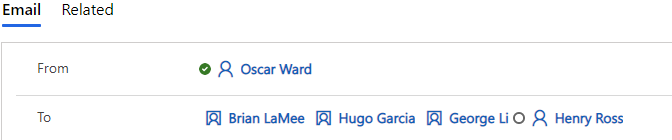

# FAQs about email tracking 

This article provides information about frequently asked question about tracking email items using Dynamics 365 App for Outlook.

## 1. Replies and Forwards of an email that is part of a tracked conversation in Dynamics 365

### Example A

- User A sends an email to multiple recipients, including contacts and other Dynamics 365 users.

- User B replies to this thread.

- Contact A also replies to this thread.

- User B replies to the thread, but removes Contact A as a recipient.

- They don't want the replies automatically tracked.

In this case, it will automatically track because it identifies the
ConversationIndex and In-Reply-To values as an email that is part of a
thread.

To have this email untracked, the user would have to manually untrack
the reply with the App for Outlook as well as any replies to this
because the master email is still tracked.

An administrator can change the
[*OrgDbOrgSetting*](https://support.microsoft.com/en-us/help/2691237/orgdborgsettings-tool-for-microsoft-dynamics-crm),
**IgnoreConversationIndexAndInReplyToForCorrelation** to change this
functionality when Use correlation to track email conversations is the
only selected email correlation option. However, if Tracking Token or
Smart Matching is enabled, it will still track based on those
correlation methods. 

### Example B

- User A sends an email to multiple recipients, including contacts and other Dynamics 365 users.

- User B forwards this thread to another user for internal conversation.

- They do not want the information in this forward automatically tracked.

In this case, it will automatically track because it identifies the
ConversationIndex and In-Reply-To values as an email that is part of a
thread.

To have this email untracked, the user would have to manually untrack
the forward with the App for Outlook as well as any replies to this
because the master email is still tracked.

An administrator can change the
[*OrgDbOrgSetting*](https://support.microsoft.com/en-us/help/2691237/orgdborgsettings-tool-for-microsoft-dynamics-crm),
**IgnoreConversationIndexAndInReplyToForCorrelation** to change this
functionality when Use correlation to track email conversations is the
only selected email correlation option. However, if Tracking Token or
Smart Matching is enabled, it will still track based on those
correlation methods. \*\*link to Email Settings paragraph on this
setting.
 

### Example C

- User A sends an email to multiple recipients, including contacts and other Dynamics 365 users.

- User B forwards this thread to another user for internal conversation AND changes the subject.

- They don't want this forward or reply automatically tracked.

In this case, if the reply or forward that is changing the subject comes.

the Outlook desktop application, this will not be tracked in
Dynamics 365. This is because the In-Reply-To property is removed, by
design, when the subject is changed. However, if this reply or forward
comes from OWA, this will be expected to track, as OWA does not use MAPI
and will not remove the property. Since this is not easily detected, it
is best to assume this scenario will also track.

If you untrack a reply or forward to a thread on a tracked email thread,
and if the initial/master email is still tracked, it will continue to
track replies. If there are certain replies you do not want to track,
you will need to untrack these manually or change the
**IgnoreConversationIndexAndInReplyToForCorrelation** to prevent replies
and forwards from being tracked. 

## 2. When resolving recipient email addresses to rows in Dynamics 365, if there is more than one row in Dynamics 365 with the same email address, which row is it resolved to?

It resolves using the method below as described in this article: [How customer engagement apps associates email addresses with records](/power-platform/admin/email-message-filtering-correlation#how-customer-engagement-apps-associates-email-addresses-with-records)

If there is duplicate rows in Dynamics 365 with the same email
address, the contents of the email **From** field resolves first by
ownership and then to the first active row in the following order on
an **incoming email**:

1.  SystemUser- (Will be first UNLESS the tracking user is ALSO the
    > owner of the duplicated row, such as Contact, Account and
    > others listed below. If the tracking user does NOT own the
    > duplicated row, such as Contact, the sender email will resolve
    > to the SystemUser.)

2.  Contact

3.  Account

4.  Lead

5.  Equipment

6.  Team

7.  Business unit

8.  Email-enabled entities (for example: Queues, custom, etc.)

Email recipients will not resolve to inactive User rows in the From
field. There is a setting that can be changed to resolve to other
inactive entity rows but this does NOT include inactive Users:
[*ResolveForInactiveEntities*](https://github.com/seanmcne/OrgDbOrgSettings)\*\*link
to email settings page. Regardless of this setting, we will not resolve
to inactive User rows.

 
### Examples of resolving the sending email address

**Example 1**
- Two contacts exist with same the same email address.  
- The tracking user has access to both, but does not own either.  
 
The sender will resolve to the first created contact. This will be the
same result if the tracking user owns both contacts.  

**Example 2**
- Two contacts exist with the same email address.  
- The tracking user has access to both contacts but owns the last
created contact.  
  
The sender will resolve to the contact owned by the tracking user, even
though it was the last created.  
 

**Example 3**
- Two contacts and one account exist with the same email address  
- The tracking user owns both contacts and the account  
- The account was created before the account.  

The sender will resolve to the first created contact.

**Example 4:**
- Two contacts and 1 account exist with the same email address.  
- The tracking user does not own either contact, but does own the
account. 
 
The sender will resolve to the account.

**Incoming Recipient Examples:**

Here's **additional points** on how it resolves recipient rows
in the **To or CC field** of an **incoming email**:

- If there is an **inactive** user in the recipients line, the Dynamics
365 App for Outlook may show that the user matches the email, but when
you track, the promotion will not resolve to that email for the inactive
user and it will show up in red as unresolved. It will not resolve to
inactive users regardless of the **ResolveForInactiveEntities** setting.

- If the email address is tied to an active user, it will display that in
the Dynamics 365 App for Outlook recipients pane, but it will still
resolve to each active Dynamics 365 row with that email address once
it is promoted. If the **ResolveForInactiveEntities** setting is True,
it will also resolve to inactive entity rows except Users.

- The Dynamics 365 App for Outlook will only show one of these rows in
the recipients pane, but in Dynamics 365, it will resolve to all rows
with that email address on incoming emails as long as **Set To,cc,bcc
fields to unresolved values if multiple matches are found** is set to No
in System Settings

Here are some **additional points** on how the **To or CC field**
resolves on a **tracked sent item**:

- If the user is active and there is a contact, it will resolve to both
rows, although it will show resolved to the user in the Dynamics 365
App for Outlook. It will resolve to all active rows that match that
email address or also inactive rows if you have enabled
**ResolveForInactiveEntities**. You can see below it resolves to an
Account, User, Contact and Lead.

- If the User is Inactive, it may appear that the row is found/resolved
in the Dynamics 365 App for Outlook, however, when the item promotes
into Dynamics 365, it will show up as unresolved.

## 3. If a Contact has multiple email address fields populated, which email will receive the email when sent directly from Dynamics 365?

By default, Contact has three email address fields available.
emailaddress1, emailaddress2, and emailaddress3. When you are creating
an email directly in Dynamics 365 and you select a Contact name in the
TO line, it will only use the emailaddress1 field. If this field is
empty, the email will fail to send.

## 4. A user receives a reply to a previously tracked email and chooses to reply back before it shows as tracked in the Dynamics 365 App for Outlook.

Replying to emails before it is tracked will still track during the next
sync cycle of the user's mailbox.

An external contact sends an email to more than one Dynamics 365 user
and this row is tracked.

- External Contact sends an email to User A and User B.

- User A sets regarding to Account A.

- The Email is created in Dynamics 365 with Regarding of Account A.

- User B goes to this Email from their Outlook calendar. They will see
that this row is tracked.

A Dynamics 365 user sends and tracks an email to another user or group
of users in Dynamics 365.

- Internal User sends an email to User A and User B and tracks before
sending.

- User A nor User B track this received email. 

Only the Sent email from User A will appear in Dynamics 365. The system
identifies Sent and Incoming as separate emails. Therefore, either User
A or User B would need to track the Incoming email for this to appear in
Dynamics 365. 

## 5. Multiple row types exist in Dynamics 365 with the same email addresses 

-   Henry Ross is a user inside Dynamics, and on the User form, the
    email data field of "Primary Email" has the value
    [henryross@dynamicsmailapp.onmicrosoft.com
    ](mailto:Bob@dynamicsmailapp.onmicrosoft.com).

-   There is an Opportunity row named "RossOpp" with the email data
    field of "Email" set to [henryross@dynamicsmailapp.onmicrosoft.com
    ](mailto:Bob@dynamicsmailapp.onmicrosoft.com).

-   There is a Case row named "RossCase" with the email data field of
    "Email" set to [henryross@dynamicsmailapp.onmicrosoft.com
    ](mailto:Bob@dynamicsmailapp.onmicrosoft.com).

-   There is a Contact row named "Brian LaMee" set to primary email
    of <brian@blueyonderairlines.com> with the email data field of
    "Contact Approver" set to [henryross@dynamicsmailapp.onmicrosoft.com
    ](mailto:Bob@dynamicsmailapp.onmicrosoft.com).

-   There is another Contact row named "George Li" set to primary
    email of <georgeli@alpineskihouse.com> with the email data field of
    "Contact Approver" set to [henryross@dynamicsmailapp.onmicrosoft.com
    ](mailto:Bob@dynamicsmailapp.onmicrosoft.com).

-   There is another Contact row named "Hugo Garcia" set to primary
    email of <hugo@litware.com> with the email data field of "Contact
    Approver" set to [henryross@dynamicsmailapp.onmicrosoft.com
    ](mailto:Bob@dynamicsmailapp.onmicrosoft.com).

-   The system setting **Set To,cc,bcc fields as unresolved values if
    multiple matches are found in Incoming Emails** is set to No.

-   There is an email in Henry's mailbox where
    [henryross@dynamicsmailapp.onmicrosoft.com](mailto:Bob@dynamicsmailapp.onmicrosoft.com)
    is on the To: and CC: line.

If this email is promoted into Dynamics 365, the promoted email in
Dynamics 365 will show the following values:

To: Brian LaMee; Hugo Garcia; George Li; Henry Ross

> [!div class="mx-imgBorder"] 
>

**Email addresses do not resolve to rows only in the default email
address fields**. If you have a custom Single Line of Text field with
Email format on a Contact row, you may see some interesting results.

 

