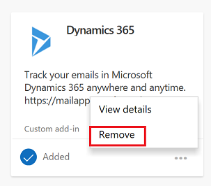

# Remove Dynamics 365 App for Outlook

Follow these steps to remove  Dynamics 365 App for Outlook.

1. In Outlook go to **Home** and then select **Get Add-ins**.  

   > [!div class="mx-imgBorder"] 
   >   

2. On the Add-ins page, select **My add-ins**. 

   > [!div class="mx-imgBorder"] 
   >   

3. Go to the **Dynamics 365** add-in and select  **More actions** > **Remove**. 

   > [!div class="mx-imgBorder"] 
   >   
