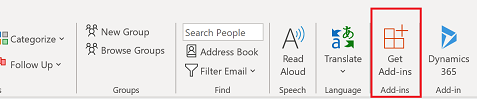
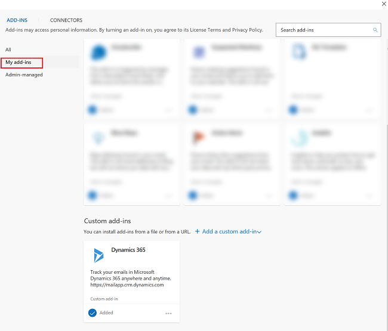

# Disable or remove Dynamics 365 App for Outlook

If you no longer using App for Oulook, you can disable or remove the add-in. 

1. In the Outlook **Home** ribbon, select **Get Add-ins**.  

     

2. On the Add-ins for Outlook page, select **My add-ins**. 

     

3. Go to the **Dynmics 365** add-in and then select  More and then do one of the following:

   - To disable the app, in the Dynamics 365 row, clear the **Turned on** check box.  

   - To remove the app, select **Remove**. 
