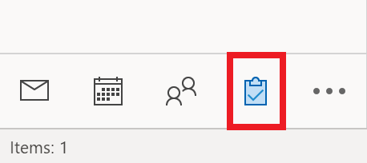
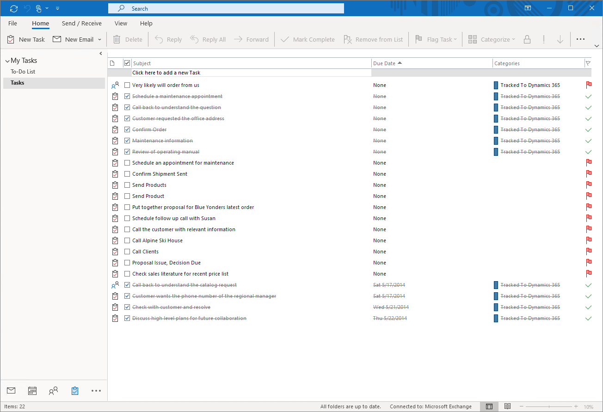

# Track a task to Dynamics 365

Track your tasks in Microsoft Outlook to your Dynamics 365 app. You can only track a task using category based tracking. 

1. Navigate to your tasks in Microsoft Outlook.

   > [!div class="mx-imgBorder"] 
   >  
   
3. Right-click on the task that you want to track and then select **Categorize** > **Track to Dynamics 365**.

The task will be created in your Dynamics 365 when  the synchronization occurs.

   > [!div class="mx-imgBorder"] 
   >   
