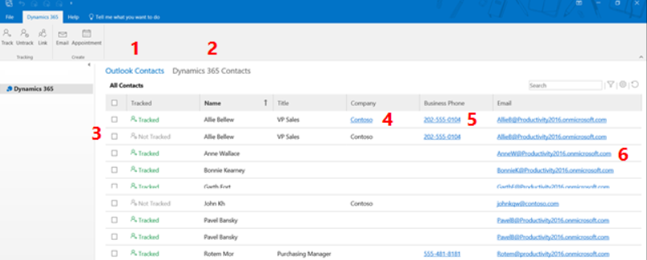
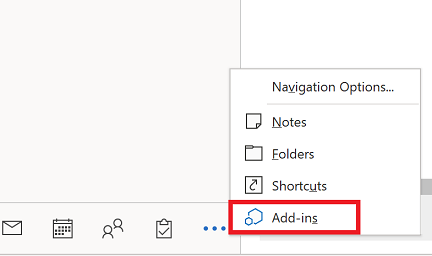

# Track contacts

Access your Outlook contacts and Dynamics 365 contacts and see which contacts are tracked. You can also link a Outlook contact to an account in your Dynamics 365 app.

To use this add-in option your admin must enable your Dynamics 365 mailbox for appointments, contacts, and tasks.

   > [!div class="mx-imgBorder"] 
   >   
 
Legend
1. **Outlook Contacts**: View all your Outlook contacts. The same contacts are displayed in the default contacts view in Dynamics 365.
2. **Dynamics 365 Contacts**: View all your Dynamics 365 contacts.
3. **Tracked**: See whether a contact is tracked or not, or whether tracking status is pending.
4. **Company**: Select to open a Dynamics 365 account record.
5. **Business Phone**: Select the number to dial the number.
6. **Email**: Select to view detail about the email address and compose a new email.

## Access contacts

To access your contacts, from the Outlook navigation pane, select More  and then select **Add-ins**.

   > [!div class="mx-imgBorder"] 
   >   
