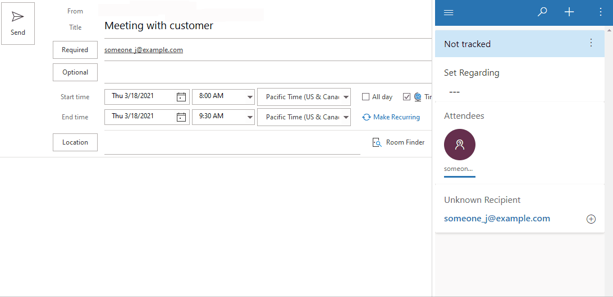
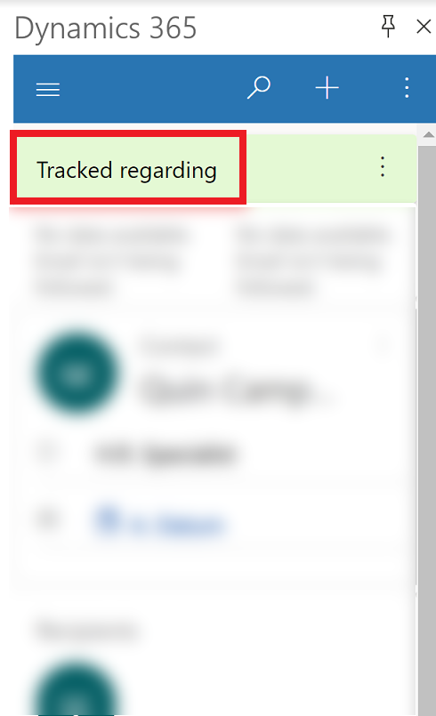
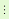
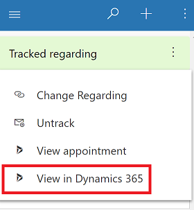
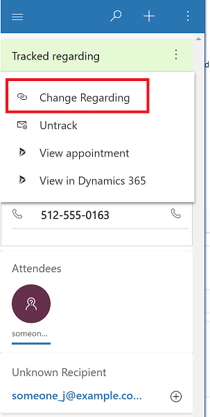
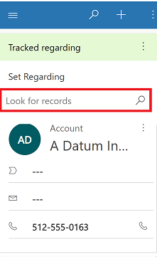
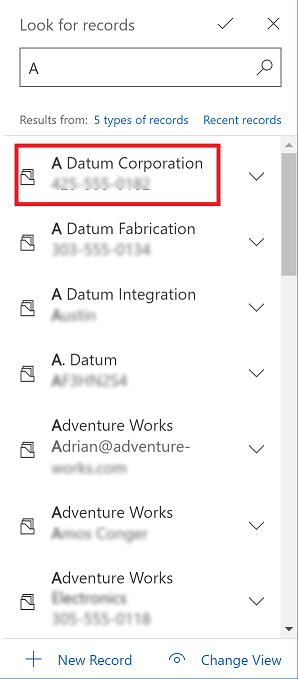
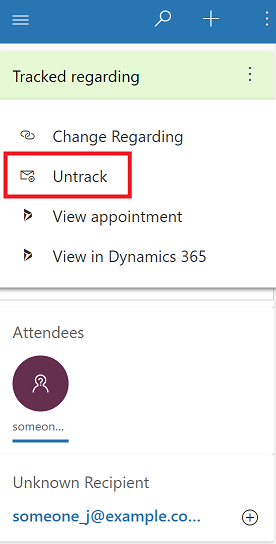

# Link an email message or appointment to a specific row in your app

Use **Set Regarding** in Dynamics 365 App for Outlook to associate an email message or appointment to a specific row in your app. When you link an email message or appointment to a specific account, opportunity, or case row and the system populates the regarding lookup for the email or appointment and tracks it in your app.

## Link an email message or appointment

1. Open an email or appointment that you want to associate to a row in your app. 

2. Select **Dynamics 365** to open the **Dynamics 365** pane.  

   > [!div class="mx-imgBorder"] 
   >   

3. In the **Set Regarding** textbox, type in your search text and select the row to associate the email or appointment with.

    > [!div class="mx-imgBorder"] 
    > 
    
    > [!NOTE]
    > For information on how to use search to look for a row, see [Use the lookup column on a row](/powerapps/user/lookup-field.md).
   
4. When the item is successfully tracked and linked to the selected row, you'll see a **Tracked regarding** message.

   > [!div class="mx-imgBorder"] 
   >  

## View a linked email or appointment in your app

You can easily open your app and see the meeting or appointment that you've linked.

- Next to **Tracked regarding**, select **More commands**  > **View in Dynamics 365**.
   > [!div class="mx-imgBorder"] 
   >   

## Change the row an email or appointment is linked to

You can change the row an email or appointment is linked to using the **Change Regarding** feature.

1. Open the email or appointment that you want to link to a different row.
2. Select **Dynamics 365** to open the **Dynamics 365** pane.  

   > [!div class="mx-imgBorder"] 
   >   

3. Next to **Tracked regarding**, select **More commands**  > **Change Regarding**.

   > [!div class="mx-imgBorder"] 
   > 

4. In the **Set Regarding** textbox, enter search text. 

   > [!div class="mx-imgBorder"] 
   > 
   
5. When a related row appears, select the row to link the email or appointment to.

   > [!div class="mx-imgBorder"] 
   > 

## Untrack a linked email or appointment 

- Next to **Tracked regarding**, select **More commands**  > **Untrack**.
  > [!div class="mx-imgBorder"] 
  >   

