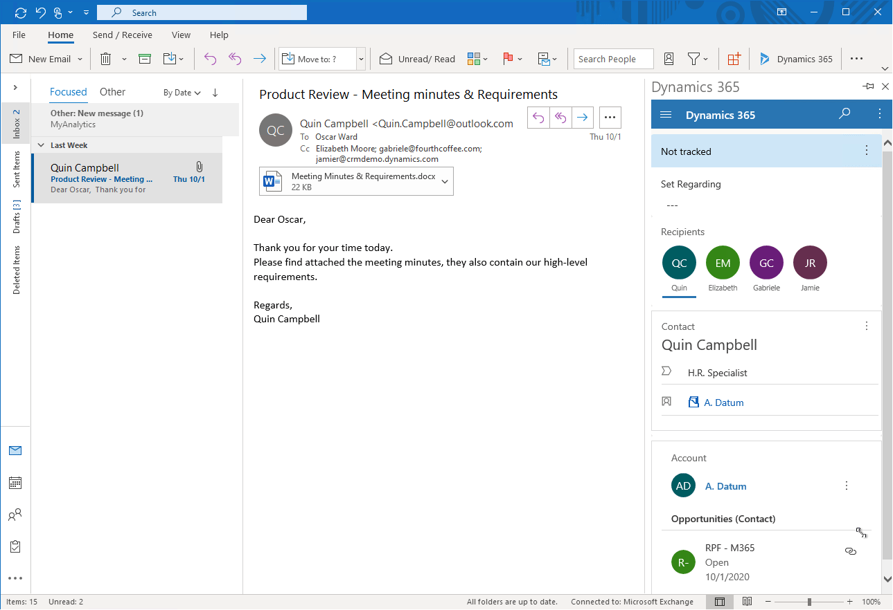

# Track an email or appointment without linking it to a specific row 

Use **Track without Regarding** in Dynamics 365 app for Outlook to track an email message or appointment without linking it to a specific row in your app.

1. Open an email or appointment that you want to associate to a row in your app. 

2. Select **Dynamics 365** to open the **Dynamics 365** pane.  

   > [!div class="mx-imgBorder"] 
   >   

3. Next to **Not tracked**, select **More commands** > **Track without Regarding**.

   > [!div class="mx-imgBorder"] 
   > 
   
4. The status of the meeting invitation changes to **Processing, please wait** for both the user and the delegated user. Don't close the Outlook item until the status changes to **Track pending**. If you close it too early, then the item may not track successfully. Once the email has finished synchronizing in Microsoft Dataverse, the status of the meeting invitation changes to **Tracked** for both the user and the delegated user.

### View the linked item using Track without Regarding in your app 

1. To see the item in your app, next to **Tracked regarding**, select **More commands**  > **View in Dynamics 365**.

   > [!div class="mx-imgBorder"] 
   >   

2. The item is created as an email activity in  Dynamics 365 and isn't linked to a specific row.

   > [!div class="mx-imgBorder"] 
   > 
