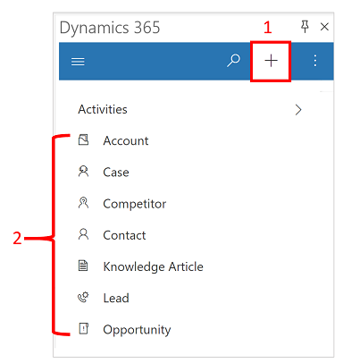
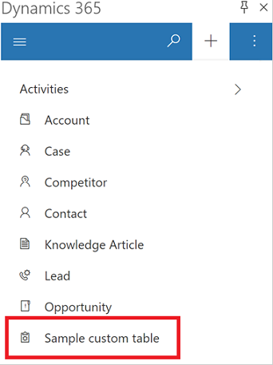
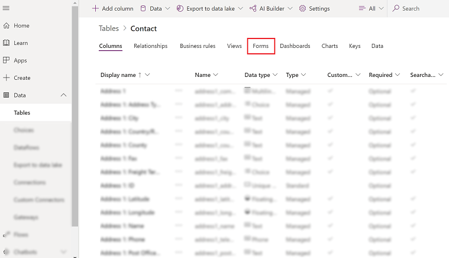
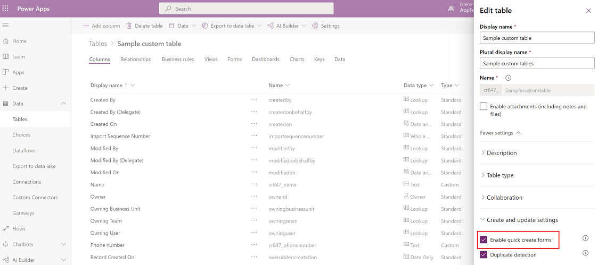

# Customize which tables appear in quick create  

An app maker can enable a table or a custom table to appear in the create **New** menu (quick create) in Dynamics 365 App for Outlook. 

|Before: Quick create menu  |After: Quick create menu with custom table added |
|---------|---------|
|      |       |

To enable a table to appear in **New** (quick create) menu, follow these steps:

1 Sign in to [Power Apps](https://make.powerapps.com).

 
2. On the left nav, select **Data** to expand it and then select **Tables**.  

   > [!div class="mx-imgBorder"]
   > 
   
  
3. Select a table such as **Contact** and then select the **Forms** tab.

   > [!div class="mx-imgBorder"]
   > 

3. Select a table.

4. On the command bar, select **Settings**. 

   > [!div class="mx-imgBorder"]
   >

5. Expand **More settings** > **Create and update settings** and then select the checkbox for **Enable quick create forms**.

   > [!div class="mx-imgBorder"]
   >

6. Select **Done** and then **Save Table**.

[!INCLUDE[footer-include](../includes/footer-banner.md)]
