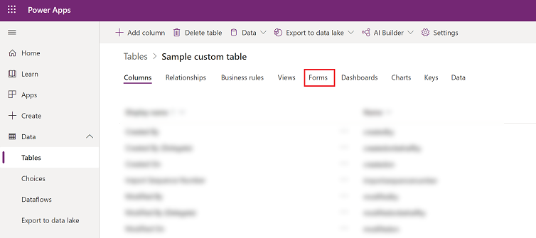
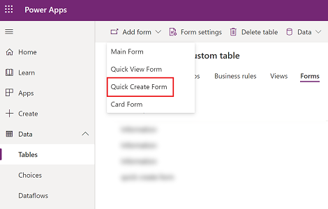
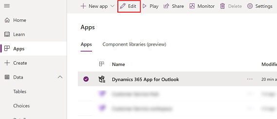
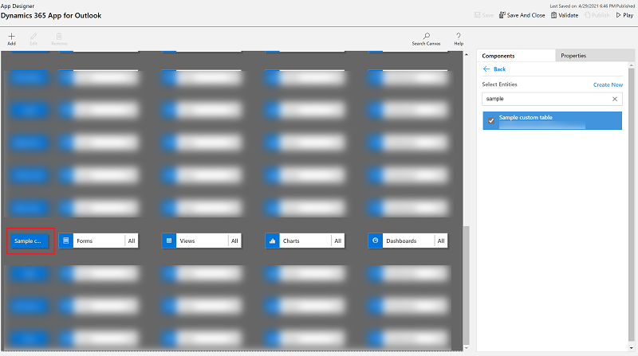

# Add a table to the quick create menu

An app maker can enable a table or a custom table to appear in the create **New** menu (quick create) in Dynamics 365 App for Outlook. 

|Before: Quick create menu  |After: Quick create menu with custom table added |
|---------|---------|
|      |       |

## Step 1: Enable a table to appear in **New** (quick create) menu

1. Sign in to [Power Apps](https://make.powerapps.com).

2. On the left nav, select **Data** to expand it and then select **Tables**.  

   > [!div class="mx-imgBorder"]
   > 
   
  
3. Select a table then on the command bar, select **Settings**. 

   > [!div class="mx-imgBorder"]
   > 

4. Expand **More settings** > **Create and update settings** and then select the checkbox for **Enable quick create forms**.

   > [!div class="mx-imgBorder"]
   > 

5. Select **Done** and then **Save Table**.

## Step 2: Create a quick create form  
  
1. Sign in to [Power Apps](https://make.powerapps.com).

2.  On the left navigation pane, expand **Data**, and then select **Tables**. Select the table that you enabled for **Enable quick create forms**, and then select the **Forms** tab.  

   > [!div class="mx-imgBorder"]
   > 

3.  On the toolbar, select **Add form** > **Quick Create Form**. 

   > [!div class="mx-imgBorder"]
   > 

4.  In the form designer, drag any columns from the **Column Explorer** into the sections on the form.  
  
5.  When you're done, select **Save** and then **Publish**.
  
## Step 3 (optional): Verify the custom table is added to the app designer

This step is only necessary if you're adding a custom table that you created to the quick create form.

1. Sign in to [Power Apps](https://make.powerapps.com).
2. On the left navigation pane, select **Apps**.
3. From the list of apps select **Dynamics 365 App for Outlook** and then select **Edit**.

   > [!div class="mx-imgBorder"]
   > 

4. In the app designer, choose table and browse to find your custom table.

   > [!div class="mx-imgBorder"]
   > 

5. Select **Save** and then **Publish** the app.

[!INCLUDE[footer-include](../includes/footer-banner.md)]
