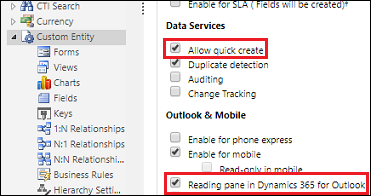
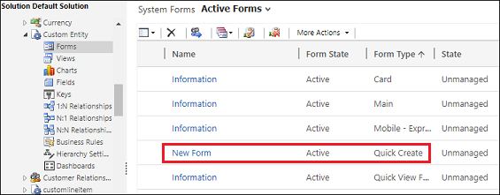
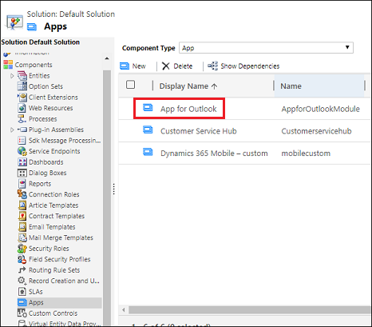
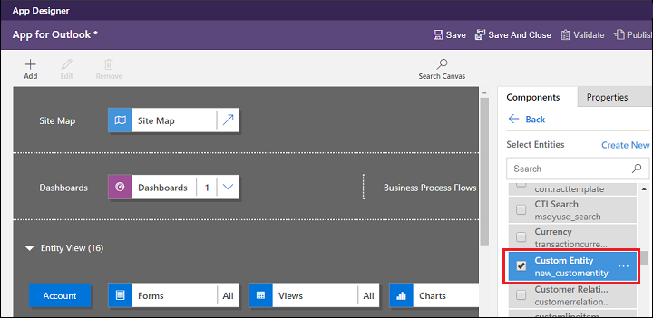

# Customize which tables appear in quick create  

An app maker can enable a table or custom table that you create to appear in the create **New** menu (quick create menu) in Dynamics 365 App for Outlook. 

In the **Before** you can see 

|**Before**  |**After** |
|---------|---------|
|      |       |

Legend:

1. **New** (quick create) button.
2. Tables that are enabled for quick create.
3. App maker has enanbled a custom table to appear in the quick create menu.

1. In your app, go to **Settings** > **Customizations** > **Customize the System**.
2. Choose the custom entity. Under **Data Services**, enable **Allow quick create**. Under **Outlook & Mobile**, enable **Enable for mobile**.

   
3. Verify the custom entity has a quick create form. Chose **Forms** and browse for form type **Quick Create**. Create a quick create form if needed.

   
4. Verify the custom entity is added to the app designer. Choose **Apps**, and then open **App for Outlook**.

   
5. In the app designer, choose **Entities** and browse to find your custom entity.

   

[!INCLUDE[footer-include](../includes/footer-banner.md)]
