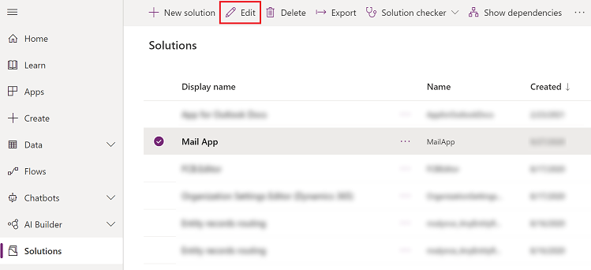
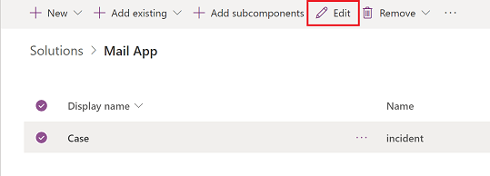
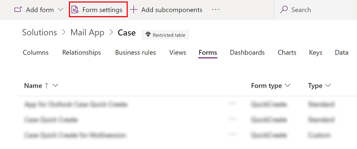
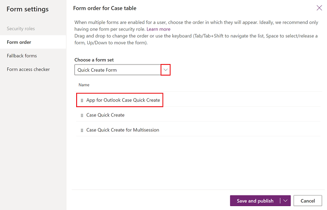

# Customize App for Outlook to auto populate data from an Outlook item to a quick create case table 

Use the quick create form in App for Outlook to auto populate information from an Outlook item to the quick create form for the Case entity. You can only enable the quick create option for the case entity. 

These fields that will be populated automatically:

|                                                                                                |                                                                                              |                                                                                      |
|------------------------------------------------------------------------------------------------|----------------------------------------------------------------------------------------------|--------------------------------------------------------------------------------------|
|                                          **Outlook item field**                                           |  | **Quick Create Case form field** |
|                             Currently selected contact's account (if known)                                |                                             Mapped to ->                                              |                                         Customer                                          |
|                            Email subject                            |                                              Mapped to ->                                              |                                         Case Title                                          |
|                              Email sender                              |                                             Mapped to ->                                              |                                         Contact                                          |
|                              Email                                |                                               Mapped to ->                                               |                                         Origin                                          |
|                                   Email body                                     |                                              Mapped to ->                                              |                                          Description                                        |

## Enable quick create for a case table

1. Sign in to [Power Apps](https://make.powerapps.com).
2. On the left nav, select **Solution**.
3. Select an existing unmanaged solution or create a new one.
4. On the command bar select. **Edit**.

   > [!div class="mx-imgBorder"]
   > 
   
5. Select **Case** table and on the command bar, select **Edit**.

   > [!div class="mx-imgBorder"]
   > 

6. Select the **Forms** tab and on the command bar select **Form settings**.

   > [!div class="mx-imgBorder"]
   > 

6. On the left select **Form order** and then select **Quick Create Form** from the dropdown menu. Move **App for OUtlook Case Quick Create** to the top of the list. 

   > [!div class="mx-imgBorder"]
   > 
   
7. Select **Save and publish**.

## Use quick create to create a case 

1. Open an email item that you want to create a case entity for and then select the **Dynamics 365** button. 
2. On the **Dynamics 365** pane, select  **Quick Create** > **Case**.

    The information from the Outlook item will auto populate in the case form.

3. When you're done, select **Save and Close**. 

[!INCLUDE[footer-include](../includes/footer-banner.md)]
