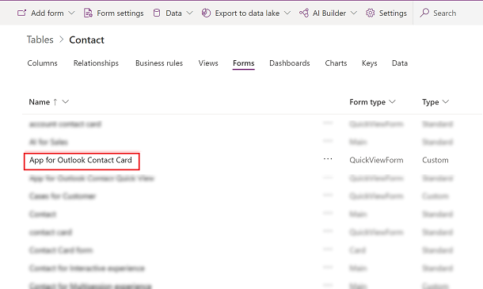
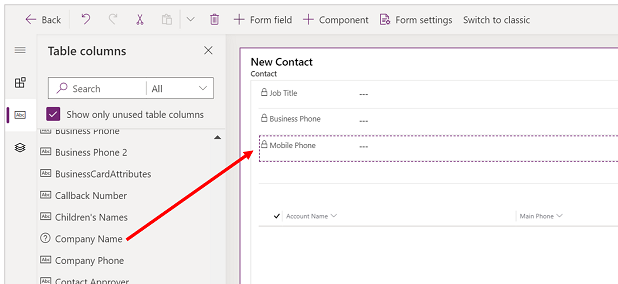
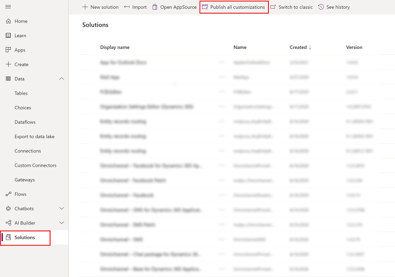
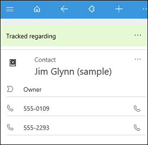
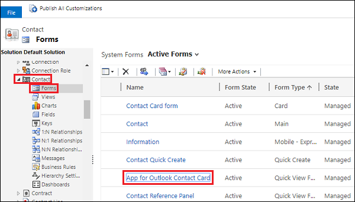
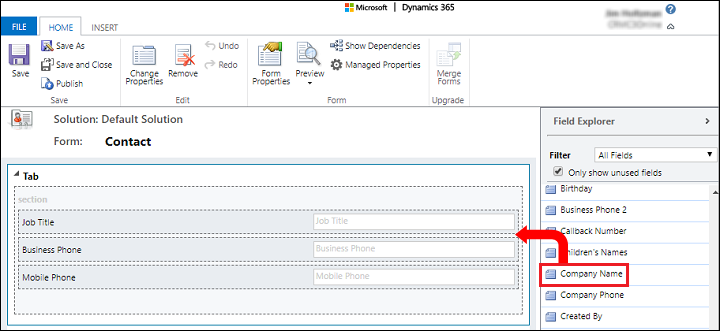
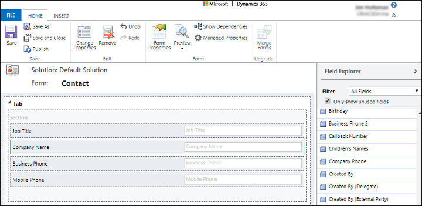
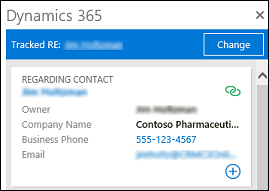

# Customize the track regarding card 

As an admin, you may want to change the form a user see when they track an email or appointment using [**Track without Regarding**](user/track-without-set-regarding.md) or [**Set Regarding**](user/track-message-or-appointment.md). For example, you might want to replace  **Mobile Phone** with **Company Name** on the contact card.

To change the fields that appear, follow these steps:

1. Sign in to [Power Apps](https://make.powerapps.com).

  
2. On the left nav, select **Data** to expand it and then select **Tables**.  

   > [!div class="mx-imgBorder"]
   > 
   
  
3. Select a table such as **Contact** and then select the **Forms** tab.

   > [!div class="mx-imgBorder"]
   > 

4. Select the **App for Outlook Contact Card** form.

   > [!div class="mx-imgBorder"]
   > 

5. Drag **Company Name** above **Mobile Phone**.

   > [!div class="mx-imgBorder"]
   > 

  > [!NOTE]
  > Only the first three fields appear in the track regarding card. Although, a related sub-grid can be added to the quick view form, but it doesn't render within the **Track Regarding** card.

7. Select **Save** > **Publish** and then close the form editor.
8. On the solution page, **Publish All Customizations** and then close the solutions page.

   > [!div class="mx-imgBorder"]
   > 

To change the fields that appear, follow these steps:

1. In your app, go to **Settings** > **Customizations** > **Customize the System**.
2. Expand **Entities** and choose an entity such as **Contact**.
3. Expand the entity and select **Forms**, then select the **App for Outlook Contact Card** form.

   

4. Drag **Company Name** above **Business Phone**.

   

   

   > [!NOTE]
   > The first three fields appear in the track regarding card.

5. Select **Save**, **Publish**, and then close the form editor.
6. On the solution page, **Publish All Customizations**. 
7. Close the solutions page.

After completing the above, right-click in the track regarding card, and then choose **Reload**. It will take a few minutes for the synchronization to complete and the change to appear.

 
The company name now appears after the contact name in the Contact card.

[!INCLUDE[footer-include](../includes/footer-banner.md)]
