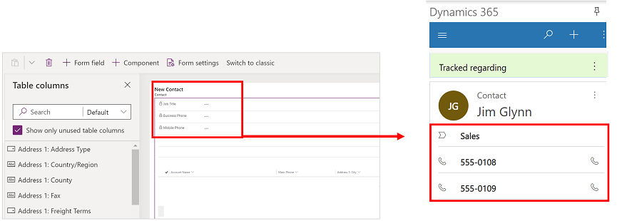
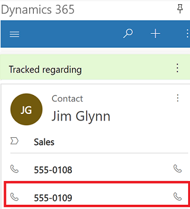
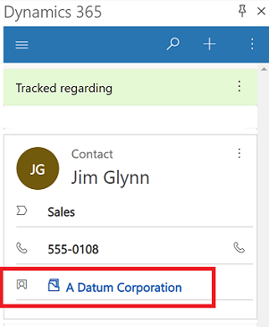

# Customize the track regarding contact card 

An app maker can modify the columns on a contact card that is used to track an email or appointment using [**Set Regarding**](user/track-message-or-appointment.md). 

To modify these columns, an app  maker needs to edit the **App for Outlook Contact Card** form.

In the example below, the **App for Outlook Contact Card** form has three columns titled **Job Title**, **Business Phone**, and **Mobile Phone**. These are also the same columns a user sees on the contact card.

   > [!div class="mx-imgBorder"]
   > 

To replace the **Mobile Phone** column with **Company Name** instead, you need to update the **App for Outlook Contact Card** form.

   > [!div class="mx-imgBorder"]
   > 

To modify columns that appear on the contact card, follow these steps:

1. Sign in to [Power Apps](https://make.powerapps.com).

 
2. On the left nav, select **Data** to expand it and then select **Tables**.  

   > [!div class="mx-imgBorder"]
   > 
   
  
3. Select a table such as **Contact** and then select the **Forms** tab.

   > [!div class="mx-imgBorder"]
   > 

4. Select the **App for Outlook Contact Card** form.

   > [!div class="mx-imgBorder"]
   > 

5. In the form designer drag **Company Name** above **Mobile Phone**. It's important to note, that only the first three columns appear in the track regarding contact card. Although a related subgrid can be added to the quick view form, but it doesn't render within the **Track Regarding** contact card.

   > [!div class="mx-imgBorder"]
   > 

7. Select **Save** > **Publish** and then close the form editor.
8. On the solutions page, select **Publish All Customizations** and then close the solutions page.

   > [!div class="mx-imgBorder"]
   > 

After completing the above, right-click in the track regarding card, and then choose **Refresh**. It will take a few minutes for the synchronization to complete and the changes to appear. Once synchronization is complete, the company name now appears at the bottom instead of the mobile phone number.

   > [!div class="mx-imgBorder"]
   > 

[!INCLUDE[footer-include](../includes/footer-banner.md)]
