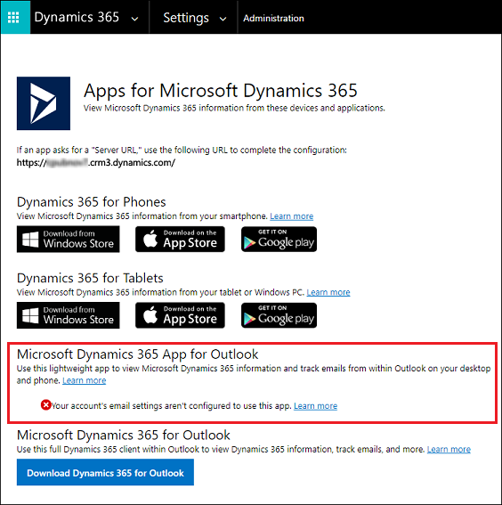

# Deploy Dynamics 365 App for Outlook  

> [!IMPORTANT]
>
> - The latest release of [!INCLUDE[pn_ms_dyn_crm_app_for_outlook](../includes/pn-ms-dyn-crm-app-for-outlook.md)] works with customer engagement apps in Dynamics 365 (Dynamics 365 Sales, Dynamics 365 Customer Service, Dynamics 365 Field Service, Dynamics 365 Marketing, and Dynamics 365 Project Service Automation), [Dynamics 365 Customer Engagement (on-premises), version 9](https://docs.microsoft.com/dynamics365/customerengagement/on-premises/overview), and [Microsoft Dataverse](https://docs.microsoft.com/powerapps/maker/common-data-service/data-platform-intro).
> - App for Outlook uses Microsoft Edge browser when you are using Windows 10 (version 1903 or later) OS and Outlook Click-2-Run client that’s updated to the current channel, Monthly Enterprise channel, or Semi-annual Enterprise channel (16.0.13127.20508 or later). For other combination of Windows and Outlook, App for Outlook uses Microsoft Internet Explorer browser.
> - Multi-factor authentication with [!INCLUDE[pn_crm_app_for_outlook_short](../includes/pn-crm-app-for-outlook-short.md)] and Server Side Synchronization is supported only in an online-only configuration. It is not a supported scenario for Dynamics 365 Customer Engagement (on-premises) or Microsoft Exchange on-premises.
>
> - [!INCLUDE[pn_crm_app_for_outlook_short](../includes/pn-crm-app-for-outlook-short.md)] is not supported on [Microsoft 365 shared mailbox](https://support.office.com/article/open-and-use-a-shared-mailbox-in-outlook-d94a8e9e-21f1-4240-808b-de9c9c088afd).
>
> - [!INCLUDE[pn_crm_app_for_outlook_short](../includes/pn-crm-app-for-outlook-short.md)] is not supported in configurations that have Dynamics 365 apps and Microsoft 365 (Exchange Online) in different tenants.
> 
> - Windows 7 had reached [end of life](https://www.microsoft.com/en-us/windows/windows-7-end-of-life-support-information) and is no longer a supported client OS for Dynamics 365 App for Outlook.

People can use [!INCLUDE[pn_ms_dyn_crm_app_for_outlook](../includes/pn-ms-dyn-crm-app-for-outlook.md)] to tap the power of [!INCLUDE[pn_microsoftcrm](../includes/pn-microsoftcrm.md)] while using [!INCLUDE[pn_Outlook_short](../includes/pn-outlook-short.md)] on the desktop, web, or tablet. For example, view information about email or appointment recipients, or link an [!INCLUDE[pn_Outlook_short](../includes/pn-outlook-short.md)] email or appointment  to a [!INCLUDE[pn_microsoftcrm](../includes/pn-microsoftcrm.md)] record such as an opportunity, account, or case. To learn more about what [!INCLUDE[pn_ms_dyn_crm_app_for_outlook](../includes/pn-ms-dyn-crm-app-for-outlook.md)] offers, see the [Dynamics 365 App for Outlook User Guide](../outlook-app/dynamics-365-app-outlook-user-s-guide.md).  

## FAQs

There are two ways to install [!INCLUDE [pn-ms-office](../includes/pn-ms-office.md)]: using a Windows Installer (MSI) version or a Click-to-Run (C2R) version of [!INCLUDE [pn-office-shortest](../includes/pn-office-shortest.md)]. You might have issues accessing [!INCLUDE[pn_microsoftcrm](../includes/pn-microsoftcrm.md)] in the Add-ins area of [!INCLUDE[pn_Outlook_short](../includes/pn-outlook-short.md)] if you don't have the necessary updates for your installation version. For more information, see [Issue when trying to access Dynamics 365 apps within the Add-ins area of Outlook](https://support.microsoft.com/help/3211586/error-message-0x8006ffff-occurs-when-you-access-dynamics-365-within-th).

The Outlook App is not enabled on [Microsoft Dataverse](/powerapps/maker/common-data-service/data-platform-intro).

For more information on FAQs, see [Frequently Asked Questions about Dynamics 365 App for Outlook](faq.md).

## Requirements  
 The following are required to use [!INCLUDE[pn_crm_app_for_outlook_short](../includes/pn-crm-app-for-outlook-short.md)]:  
 
 
 |  |  |
|---------|---------|
|**Email Server**     |  <ul><li>Exchange Server 2013 CU 14 or greater</li>   <li>Exchange Server 2016</li>  <li>Exchange Online</li></ul>       |
|**Email Client**     |  <ul><li>Outlook 2019 </li> <li>Outlook 2016 (MSI) version 16.0.4266.1001 or higher (on Windows 8.1 (with extended support) or higher client OS with Internet Explorer 11 installed) </li>   <li>Outlook 2016 (C2R) version 16.0.93330.2073 or higher (on Windows 8.1 (with extended support) or higher client OS with Internet Explorer 11 installed)</li>  <li>Outlook 2013 (MSI) version 15.0.5023.1000 or higher (on Windows 8.1 (with extended support) or higher client OS with Internet Explorer 11 installed)</li>   <li>Outlook for MAC</li>  <li>Outlook for iOS (with Exchange Online, on Apple iPhone 6S or higher, running iOS version 8 or higher)</li>   <li>Outlook for Android (with Exchange Online, on Android phones running Android 4.4,5.0,6.0, or 7.0)</li></ul>  **Note** Support for 2013 versions of Microsoft 365 ProPlus ended February 28, 2017        |
|**Browser (Outlook Web Access)**     | <li>Microsoft Edge (with Exchange on premise 2016 or higher and Exchange Online)</li>  <li>Internet Explorer 11 (with Exchange on premise 2016 or higher and Exchange Online)</li>  <li>Google Chrome (Compose mode supported with Exchange on premise 2016 or higher and Exchange Online)</li>    <li>Mozilla Firefox (Compose mode supported with Exchange on premise 2016 or higher and Exchange Online)</li>       |

> [!NOTE]
> Support for 2013 versions of Office 365 ProPlus ended on February 28, 2017. [!INCLUDE[proc_more_information](../includes/proc-more-information.md)] [See here.](https://support.microsoft.com/help/3199744/support-for-the-2013-versions-of-office-365-proplus-ends-february-28-2)    

- Customer engagement apps in Dynamics 365 (Dynamics 365 Sales, Dynamics 365 Customer Service, Dynamics 365 Field Service, Dynamics 365 Marketing, and Dynamics 365 Project Service Automation), [Dynamics 365 Customer Engagement (on-premises), version 9](https://docs.microsoft.com/dynamics365/customerengagement/on-premises/overview), and [Microsoft Dataverse](https://docs.microsoft.com/powerapps/maker/common-data-service/data-platform-intro).

- Synchronization of incoming email through server-side synchronization. [!INCLUDE[proc_more_information](../includes/proc-more-information.md)] [Set up server-side synchronization of email, appointments, contacts, and tasks](../admin/set-up-server-side-synchronization-of-email-appointments-contacts-and-tasks.md)  

- [!INCLUDE[pn_crm_app_for_outlook_short](../includes/pn-crm-app-for-outlook-short.md)] is an [!INCLUDE [pn-outlook](../includes/pn-outlook.md)] add-in that uses [!INCLUDE [pn-exchange-web-services-ews](../includes/pn-exchange-web-services-ews.md)] to interact with [!INCLUDE [pn-microsoft-exchange](../includes/pn-microsoft-exchange.md)]. This requires OAuth be enabled on [!INCLUDE [pn-microsoft-exchange](../includes/pn-microsoft-exchange.md)]. For more information regarding this dependency, see [Authentication and permission considerations for the makeEwsRequestAsync method](https://docs.microsoft.com/outlook/add-ins/web-services#authentication-and-permission-considerations-for-the-makeewsrequestasync-method).

- On Windows clients, Internet Explorer 11 should be installed and enabled but not necessarily the default browser. For more information about this dependency, see [Requirements for running Office Add-ins](https://docs.microsoft.com/office/dev/add-ins/concepts/requirements-for-running-office-add-ins#client-requirements-windows-desktop-and-tablet).

- Required security role access as described below

> [!NOTE]
>  Supported configurations and requirements for [!INCLUDE[pn_dyn_365](../includes/pn-dyn-365.md)] features are listed throughout our documentation. Specific configurations not documented should be  considered unsupported.  

### Provide security role access
Dynamics 365 App for Outlook is an App Module in version 9. The minimum set of privileges required to run App for Outlook are packaged as a security role called **Dynamics 365 App for Outlook User** which is bound to the App. You need to add users to this role in order for them to access Dynamics 365 App for Outlook. In order to achieve this, follow the steps below:

1.  From the main menu navigate to **Settings** > **Security** > **Users**.

2.  Select the users from the list and then click **Manage Roles**.

3.  In the dialog that appears, apply the **Dynamics 365 App for Outlook User** security role to the users.

This will ensure that the users have the basic privileges needed to access App for Outlook. Other security privileges on top of the basic privileges, related to the user's role, will light up more features. For example, if a user has create privilege on Lead entity, in addition to **Dynamics 365 App for Outlook User** security role, they would see an email resolve to a Lead entity where applicable.

> [!NOTE]
>  The security role **Dynamics 365 App for Outlook User** is available from Build 9.1.0.4206. If a user doesn’t have this security role or its underlying privileges, they’ll receive the following error: 
> “You haven't been authorized to use this app. Check with your system administrator to update your settings.”

### Supported configurations with Microsoft Exchange  
 As of the [!INCLUDE[pn_crm_8_2_0_both](../includes/pn-crm-8-2-0-both.md)] you can use the app with any combination of [!INCLUDE[pn_crm_online_shortest](../includes/pn-crm-online-shortest.md)] or [!INCLUDE[pn_crm_op_edition](../includes/pn-crm-onprem.md)] and [!INCLUDE[pn_Exchange_Online](../includes/pn-exchange-online.md)] or [!INCLUDE[pn_Exchange_Server_short](../includes/pn-exchange-server-short.md)] (on-premises), including hybrid configurations. This means you can use [!INCLUDE[pn_crm_app_for_outlook_short](../includes/pn-crm-app-for-outlook-short.md)] in any of the following configurations:  

|                                                                           |                                                                                                                                                                                |
|---------------------------------------------------------------------------|--------------------------------------------------------------------------------------------------------------------------------------------------------------------------------|
| [!INCLUDE[pn_crm_online_shortest](../includes/pn-crm-online-shortest.md)] |                                                       [!INCLUDE[pn_Exchange_Online](../includes/pn-exchange-online.md)]                                                        |
| [!INCLUDE[pn_crm_online_shortest](../includes/pn-crm-online-shortest.md)] | [!INCLUDE[pn_Exchange_Server_short](../includes/pn-exchange-server-short.md)] (on-premises), version 15.0.1236.3.32 (Cumulative Update 14 for Exchange Server 2013) or greater |
|        [!INCLUDE[pn_crm_op_edition](../includes/pn-crm-onprem.md)]        | [!INCLUDE[pn_Exchange_Server_short](../includes/pn-exchange-server-short.md)] (on-premises), version 15.0.1236.3.32 (Cumulative Update 14 for Exchange Server 2013) or greater |
|        [!INCLUDE[pn_crm_op_edition](../includes/pn-crm-onprem.md)]        |                                                       [!INCLUDE[pn_Exchange_Online](../includes/pn-exchange-online.md)]                                                        |

<!--
> [!NOTE]
>  If you use [!INCLUDE[pn_crm_op_edition](../includes/pn-crm-onprem.md)], you'll need to authenticate with IFD authentication as described below.  
-->

### Feature support per client

|                                                                                                  |                                                  |                                                                                                                                  |                                                              |                                            |
|--------------------------------------------------------------------------------------------------|--------------------------------------------------|----------------------------------------------------------------------------------------------------------------------------------|--------------------------------------------------------------|--------------------------------------------|
|                                                                                                  | Received email (view information and track) | Compose email (view information, track,  and add templates,  knowledge base articles,  and sales literature) | Appointments and meetings  (view information and track) | Contacts (view information and track) |
|          [!INCLUDE [pn-outlook-2016](../includes/pn-outlook-2016.md)] (desktop client)           |                     O and M                      |                                                       O and M1                                                        |                     O and M1                      |      O3  and M2      |
| [!INCLUDE [pn-ms-outlook-2013-short](../includes/pn-ms-outlook-2013-short.md)]  (desktop client) |                     O and M                      |                                                       O and M1                                                        |                     O and M1                      |                                            |
|                                 Outlook for Mac (desktop client)                                 |                     O and M                      |                                                                                                                                  |                                                              |                                            |
|             [!INCLUDE [pn-outlook-web-app](../includes/pn-outlook-web-app.md)] (OWA)4             |                     O and M                      |                                                       O and M1                                                        |                     O and M1                      |                                            |
|                                  Mobile Outlook app5                                  |                        O                         |                                                                                                                                  |                                                              |                                            |

(O)nline: [!INCLUDE [pn-crm-online](../includes/pn-crm-online.md)], [!INCLUDE [pn-exchange-online](../includes/pn-exchange-online.md)]  with both in the **same** tenant (Multi-tenant configuration of [!INCLUDE [pn-crm-online](../includes/pn-crm-online.md)] and [!INCLUDE [pn-exchange-online](../includes/pn-exchange-online.md)] being in different tenants is not supported)  
(M)ixed: [!INCLUDE [pn-crm-online](../includes/pn-crm-online.md)], Exchange Server 2013/2016

(1) Tracking email and tracking appointments in compose mode requires Exchange Server 2013 CU14 (not supported in OWA) or [!INCLUDE [pn-exchange-server-2016-short](../includes/pn-exchange-server-2016-short.md)].  

(2) Tracking contacts is supported only on Exchange Server 2016 CU3 and Outlook 2016 16.0.6741.1000 C2R version or later. 
Or, Outlook 2016 MSI version 16.0.4444.1000 or higher with the following KBs installed. For more information, see these KB articles:
  - [KB3118330](https://support.microsoft.com/help/3118330/october-4,-2016,-update-for-office-2016-kb3118330)
  - [KB3118374](https://support.microsoft.com/help/3118374/october-4,-2016,-update-for-office-2016-kb3118374)
  - [KB3118375](https://support.microsoft.com/help/3118375/october-4,-2016,-update-for-outlook-2016-kb3118375)
  - [KB3115500](https://support.microsoft.com/help/3115500/october-4,-2016,-update-for-office-2016-kb3115500)   

(3) Supported only on Outlook 2016 16.0.7426.1049 or later. 

(4) Not supported on mobile Outlook Web Access. 

(5) Supported on iPhones 6S or higher, with iOS 8 or higher.

### Supported browsers for Outlook on the web  
 You can use Dynamics 365 App for Outlook with Outlook on the web on the following browsers: 

-   Internet Explorer 11, or Microsoft Edge 
  
     The following configuration is supported:  
  
    -   Protected Mode is enabled for **Internet** security zone. To enable Protected Mode: in IE 11, go to **Tools** > **Internet options** > **Security tab** > **Internet**.  
  
    -   Protected Mode is enabled for **Local intranet**  security zone. To enable Protected Mode: in IE 11, go to **Tools** > **Internet options** > **Security tab** > **Local intranet**.  
  
    -   Your Dynamics 365 apps URL is in the **Local intranet** security zone list of trusted websites. In IE 11, go to **Tools** > **Internet options** > **Security tab** > **Local intranet** > **Sites** > **Advanced**.  
  
-   Google Chrome (latest version) on Windows 
  
-   Firefox (latest version) on Window 
  
-   Apple Safari (version 9 or version 10) on Mac or on OSX

### Supported servers  
 The [server requirements for using Office Add-ins](https://dev.office.com/docs/add-ins/overview/requirements-for-running-office-add-ins) are [!INCLUDE[pn_Exchange_Server_2013_short](../includes/pn-exchange-server-2013-short.md)], [!INCLUDE[pn_exchange_server_2016_short](../includes/pn-exchange-server-2016-short.md)], or [!INCLUDE[pn_Exchange_Online](../includes/pn-exchange-online.md)].  

### Supported languages  
[!INCLUDE[pn_crm_app_for_outlook_short](../includes/pn-crm-app-for-outlook-short.md)] supports the following languages:  

||||  
|-|-|-|  
|Bulgarian (Bulgaria) - 1026|Hebrew - 1037|Portuguese (Brazil) - 1046|  
|Chinese (People's Republic of China) - 2052|Hindi (India) - 1081|Portuguese (Portugal) - 2070|  
|Chinese (Taiwan) - 1028|Hungarian - 1038|Romanian - 1048|  
|Croatian (Croatia) - 1050|Indonesian - 1057|Russian - 1049|  
|Czech (Czech Republic) - 1029|Italian - 1040|Serbian - 2074|  
|Danish - 1030|Japanese - 1041|Slovak - 1051|  
|Dutch - 1043|Kazakh - 1087|Slovenian - 1060|  
|English - 1033|Korean - 1042|Spanish - 3082|  
|Estonian - 1061|Latvian - 1062|Swedish - 1053|  
|Finnish - 1035|Lithuanian - 1063|Thai - 1054|  
|French - 1036|Malaysian - 1086|Turkish - 1055|  
|German - 1031|Norwegian - 1044|Ukrainian - 1058|  
|Greek - 1032|Polish - 1045|Vietnamese - 1066|  

   

## Deploy Dynamics 365 App for Outlook  
 After setting up [!INCLUDE[cc_server_side_synch](../includes/cc-server-side-synch.md)], you can push [!INCLUDE[pn_crm_app_for_outlook_short](../includes/pn-crm-app-for-outlook-short.md)] to some or all users, or you can have users install it themselves as needed.  

<!--
> [!NOTE]
>  If you're on [!INCLUDE[pn_dyn_365_op](../includes/pn-dyn-365-op.md)], see the section below:  [To deploy to Dynamics 365 apps (on-premises) users](#BKMK_DeployOnprem)  
--> 

#### To push the app to users  

1. Go to **Settings** > **Dynamics 365 App for Outlook**.  

2. In the **Getting Started with Dynamics 365 App for Outlook** screen, under **Add for Eligible Users** (you may have to click **Settings** if you’re opening this screen for the second or subsequent time), select the **Automatically add the app to [!INCLUDE[pn_Outlook_short](../includes/pn-outlook-short.md)]** check box if you want to have users get the app automatically. 
If a user's email is synchronized through [!INCLUDE[cc_server_side_synch](../includes/cc-server-side-synch.md)], you won’t have to do anything more to push the app to them.  

3. Do one of the following:  

   -   To push the app to all eligible users, click **Add App for All Eligible Users**.  

   -   To push the app to certain users, select those users in the list, and then click **Add App to Outlook**.  

   > [!TIP]
   >  If the list shows that a user is pending or hasn’t been added, you can click the **Learn more** link next to the user to find more information about status.  

4. When you’re done, click **Save**.  

5. Make sure to add users to the security role **Dynamics 365 App for Outlook User** as described in the **Provide security role access** section above.

#### To have users install the app themselves  

1. Users click the **Settings** button , and then click **Apps for Dynamics 365 apps**.  

2. In the **Apps for Dynamics 365 apps** screen, under **[!INCLUDE[pn_crm_app_for_outlook_short](../includes/pn-crm-app-for-outlook-short.md)]**, users click **Add app to [!INCLUDE[pn_Outlook_short](../includes/pn-outlook-short.md)]**.  

> [!NOTE]
>  Users can also disable or remove the add-in themselves, if needed. For more information, see the [Dynamics 365 App for Outlook User’s Guide](../outlook-app/dynamics-365-app-outlook-user-s-guide.md).  
  
   

## To deploy to Dynamics 365 apps (on-premises) users  
 Follow these steps if you're using Dynamics 365 apps (on-premises).  

-   Configure your Dynamics 365 apps server for Internet-facing deployment. See [Configure IFD for Microsoft Dynamics 365 apps](https://technet.microsoft.com/library/dn609803.aspx).  

-   If you're connecting to Exchange on-premises, configure the OAuth provider and register client apps. See [Configure Windows Server 2012 R2 for Dynamics 365 apps that use OAuth](https://technet.microsoft.com/library/hh699726.aspx).  

 
## Troubleshooting installation problems  

1. If you don't see [!INCLUDE[pn_crm_app_for_outlook_short](../includes/pn-crm-app-for-outlook-short.md)] when you click the **Settings** button , check that you've enabled the feature.

2. If you or your users have trouble installing [!INCLUDE[pn_crm_app_for_outlook_short](../includes/pn-crm-app-for-outlook-short.md)], it may be because their [!INCLUDE[pn_Exchange](../includes/pn-exchange.md)] mailbox is currently linked to another Microsoft Dataverse environment or Customer Engagement (on-premises) organization. An [!INCLUDE[pn_Exchange](../includes/pn-exchange.md)] mailbox (email address) can only synchronize appointments, contacts, and tasks with one organization, and a user that belongs to that organization can only synchronize appointments, contacts, and tasks with one [!INCLUDE[pn_Exchange](../includes/pn-exchange.md)] mailbox.  You can overwrite the setting stored in [!INCLUDE[pn_Exchange](../includes/pn-exchange.md)] if you want to change the primary synchronizing organization. For more information, see [this KB article.](https://support.microsoft.com/en-gb/help/3211627/incomingemailrejected-error-when-attempting-to-install-dynamics-365-app-for-outlook)

   

## Explore the User Guide and train your users  
 To learn how to use [!INCLUDE[pn_crm_app_for_outlook_short](../includes/pn-crm-app-for-outlook-short.md)], see the [Dynamics 365 App for Outlook User Guide](../outlook-app/dynamics-365-app-outlook-user-s-guide.md).  

### See also  
 [Dynamics 365 App for Outlook User Guide](../outlook-app/dynamics-365-app-outlook-user-s-guide.md)   
 [Read more about supported clients in this blog: Dynamics 365 App for Outlook Support Matrix](https://blogs.msdn.microsoft.com/crm/2016/12/13/dynamics-365-app-for-outlook-support-matrix/)   
 [Set up server-side synchronization of email, appointments, contacts, and tasks](../admin/set-up-server-side-synchronization-of-email-appointments-contacts-and-tasks.md)   

<!-- 2. If you see the message Your account's email settings aren't configured to use this app, you need to [Set up server-side synchronization of email, appointments, contacts, and tasks](../admin/set-up-server-side-synchronization-of-email-appointments-contacts-and-tasks.md).

   
-->

[!INCLUDE[footer-include](../includes/footer-banner.md)]
