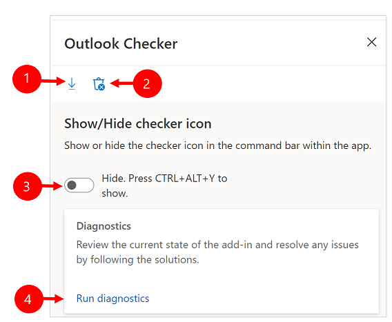
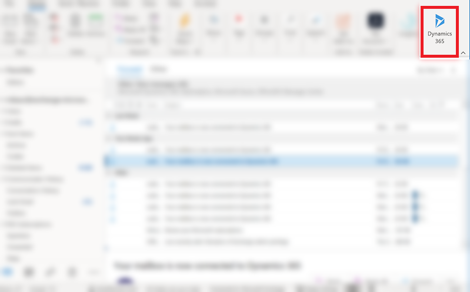
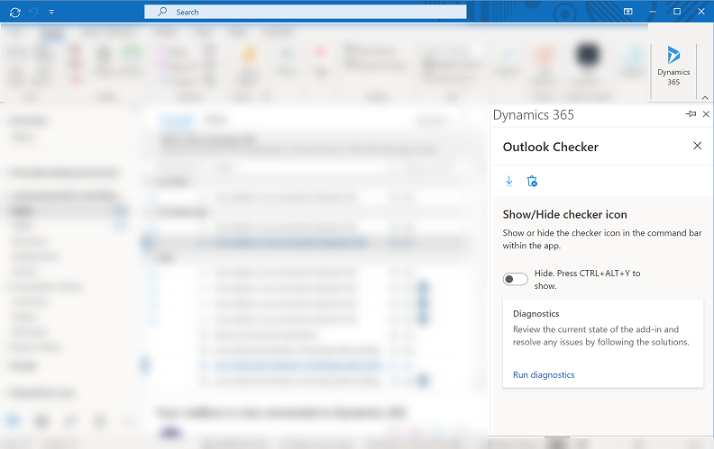
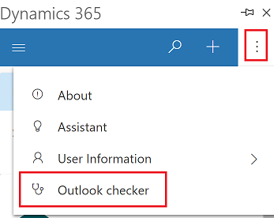
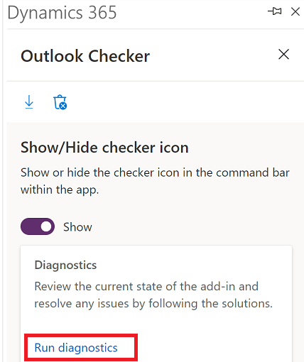
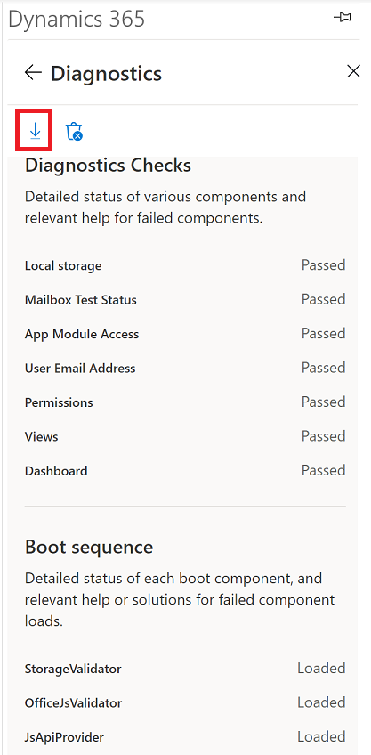

# Run the App for Outlook checker to troubleshoot and resolve potential issues

Use the Outlook Checker to run a diagnostic check and scan for potential issues for Dynamics 365 App for Outlook. If you run into an issue, you can send the log files to your administrator to help troubleshoot the problem.

   > [!div class="mx-imgBorder"] 
   > 
   
 Legend:
 
 1. **Export logs**: After you run the checker, export the error logs and send the log files to your support team or admin for further troubleshooting.
 2. **Clear cache**: Clears any errors in the App for Outlook cache. Cache will rebuild the next time you sign in. 
 3. **Hide or Show**: Move the toggle to **Show** to add the **Outlook Checker** on the command bar. If the toggle is set to **Hide**, press **ALT**+**CTRL**+**Y** on your keyboard to bring up the **Outlook Checker**.
 4. **Run diagnostics**: Runs the diagnostics checker and scans for potential issues. 
 
 
## Run the access checker

1. In Microsoft Outlook, select **Dynamics 365** to open the Dynamics 365 pane.

    > [!div class="mx-imgBorder"] 
    > 
    
    
2. Select the **Dynamics 365** pane and then press **ALT**+**CTRL**+**Y** on your keyboard to bring up the **Outlook Checker**.
3. Use the **Show** or **Hide** toggle to show or hide the checker icon in the command bar.
  
    > [!div class="mx-imgBorder"] 
    >  

    When you set the toggle to **Show**, the checker icon is added to the command bar and the **Search** button  will move under **More commands** .
   
    > [!div class="mx-imgBorder"] 
    > 
     
    
4. Select **Run diagnostics** to run the checker.

    > [!div class="mx-imgBorder"] 
    > 
    
5. The checker will show a detailed status of all the components. If you run into issues, select the **Export logs** icon to export the log files and send them to your administrator.

    > [!div class="mx-imgBorder"] 
    > 
    
## Common issues

1. If you don't have sufficient privileges to use Dynamics 365 App for Outlook, see [A privilege error occurs when attempting to use Dynamics 365 App for Outlook](https://go.microsoft.com/fwlink/p/?linkid=2135239).

2. If you deactivated one of the views used by Dynamics 365 App for Outlook and get an error, see [The view is not available error message](https://go.microsoft.com/fwlink/p/?linkid=213547).

3. If  **Track** and **Set Regarding** options are missing, see [Track and Set Regarding options are missing in Dynamics 365 App for Outlook](https://go.microsoft.com/fwlink/p/?linkid=2137902).

[!INCLUDE[footer-include](../includes/footer-banner.md)]
