# Dynamics 365 App for Outlook User Guide  

[!INCLUDE[cc-applies-to-update-9-0-0](../includes/cc_applies_to_update_9_0_0.md)]

> [!IMPORTANT]
> The latest release of [!INCLUDE[pn_ms_dyn_crm_app_for_outlook](../includes/pn-ms-dyn-crm-app-for-outlook.md)], works with [!INCLUDE [pn-crm-9-0-0-online](../includes/pn-crm-9-0-0-online.md)] or later only. For a prior release that works with earlier versions of [!INCLUDE[pn_microsoftcrm](../includes/pn-microsoftcrm.md)], see [Deploy Dynamics 365 App for Outlook](https://technet.microsoft.com/library/dn946901.aspx).

Use [!INCLUDE[pn_ms_dyn_crm_app_for_outlook](../includes/pn-ms-dyn-crm-app-for-outlook.md)] to tap the power of [!INCLUDE[pn_crm_shortest](../includes/pn-crm-shortest.md)] while you’re using [!INCLUDE[pn_Outlook_short](../includes/pn-outlook-short.md)] on the desktop, web, or phone. When [!INCLUDE[pn_crm_app_for_outlook_short](../includes/pn-crm-app-for-outlook-short.md)] is installed, depending on which version of  the app you have installed, you'll see a **[!INCLUDE[pn_crm_shortest](../includes/pn-crm-shortest.md)]** pane or window next to a selected [!INCLUDE[pn_Outlook_short](../includes/pn-outlook-short.md)] email message, or when you're composing an email message or setting up a meeting or appointment.  
  
 For example, when you open an email message, view information from [!INCLUDE[pn_crm_shortest](../includes/pn-crm-shortest.md)] about the email recipients. Or with a single click, link an [!INCLUDE[pn_Outlook_short](../includes/pn-outlook-short.md)] email message or appointment to a specific [!INCLUDE[pn_crm_shortest](../includes/pn-crm-shortest.md)] record. When you link an email message or appointment to a [!INCLUDE[pn_crm_shortest](../includes/pn-crm-shortest.md)] record, the [!INCLUDE[pn_Outlook_short](../includes/pn-outlook-short.md)] record appears as an activity for that record in [!INCLUDE[pn_crm_shortest](../includes/pn-crm-shortest.md)].  
  
 <!--[Watch a short video (1:35) about Dynamics 365 App for Outlook.](https://go.microsoft.com/fwlink/p/?linkid=829982)  -->

## Known issues

For known issues with this version of [!INCLUDE[pn_crm_app_for_outlook_short](../includes/pn-crm-app-for-outlook-short.md)], see the [Dynamics 365 Customer Engagement Readme](../admin/readme-9.md).

## Prerequisites  
 Your [!INCLUDE[pn_crm_shortest](../includes/pn-crm-shortest.md)] system administrator can make [!INCLUDE[pn_crm_app_for_outlook_short](../includes/pn-crm-app-for-outlook-short.md)] available to your organization or you can add it yourself if:  
  
-   You have the **Use [!INCLUDE[pn_crm_app_for_outlook_short](../includes/pn-crm-app-for-outlook-short.md)]** security privilege.  
  
-   Your organization synchronizes mailboxes with server-side synchronization.  
  
 For more information, and for information on supported devices, browsers, and [!INCLUDE[pn_Outlook_short](../includes/pn-outlook-short.md)] versions, see [Deploy Dynamics 365 App for Outlook](deploy-dynamics-365-app-for-outlook.md).  

## Add the app to Outlook  
 After the prerequisites have been met, you can add the app directly from [!INCLUDE[pn_crm_shortest](../includes/pn-crm-shortest.md)].  
  
1.  Click the **Settings** button , and then click **Apps for [!INCLUDE[pn_crm_shortest](../includes/pn-crm-shortest.md)]**.  
  
2.  On the **Apps for [!INCLUDE[pn_crm_shortest](../includes/pn-crm-shortest.md)]** page, under **[!INCLUDE[pn_crm_app_for_outlook_short](../includes/pn-crm-app-for-outlook-short.md)]**, click **[!INCLUDE[pn_crm_app_for_outlook_short](../includes/pn-crm-app-for-outlook-short.md)]**.  
  
    > [!NOTE]
    > If you have trouble installing  the app, see the troubleshooting section in [Deploy Dynamics 365 App for Outlook](deploy-dynamics-365-app-for-outlook.md).  

## Disable or remove the Outlook app  
  
1.  In [!INCLUDE[pn_Outlook_short](../includes/pn-outlook-short.md)], click **File**, and then click **Manage Add-ins**.  
  
      
  
    This opens the **Office 365** dialog box where you can see all your [!INCLUDE[pn_Outlook_short](../includes/pn-outlook-short.md)] add-ins. If you click the [!INCLUDE[pn_crm_shortest](../includes/pn-crm-shortest.md)] row, you can see which [!INCLUDE[pn_crm_shortest](../includes/pn-crm-shortest.md)] instance the app is connected to.  
  
2.  Do one of the following:  
  
    -   To disable the app, in the [!INCLUDE[pn_crm_shortest](../includes/pn-crm-shortest.md)] row, clear the **Turned on** check box.  
  
    -   To remove the app, select the [!INCLUDE[pn_crm_shortest](../includes/pn-crm-shortest.md)] row, and then click the Minus button.  
  
## Terminology

|Term  |Definition  |
|---------|---------|
|Set regarding     |Track and link the email or appointment to an existing record in Dynamics 365.|
|Tracking      |Create a copy of the email or appointment in Dynamics 365.   |

## Use the app for the first time  
 To display [!INCLUDE[pn_crm_shortest](../includes/pn-crm-shortest.md)] data after you’ve added the app:  
  
1.  Select an existing email message in your Inbox, or create a new email message or appointment.  
  
2.  On the ribbon, click the **[!INCLUDE[pn_crm_shortest](../includes/pn-crm-shortest.md)]** button.  
  
      
   
    -Or-

    In [!INCLUDE [pn-ms-outlook-web-access-short](../includes/pn-ms-outlook-web-access-short.md)], click the **[!INCLUDE[pn_crm_shortest](../includes/pn-crm-shortest.md)]** button in the email pane.

    

    The **[!INCLUDE[pn_crm_shortest](../includes/pn-crm-shortest.md)]** pane appears on the right side of the screen and shows information about the recipients.  

**Notes:**  
  
If the recipient is a [!INCLUDE[pn_crm_shortest](../includes/pn-crm-shortest.md)] user (as opposed to a contact or lead), it’s indicated above their name:  

  
  
If the recipient isn’t known to [!INCLUDE[pn_crm_shortest](../includes/pn-crm-shortest.md)], click (+) and then select **Add as contact** or **Add as lead**. See: [Add an email recipient as a contact or lead](#add-an-email-recipient-as-a-contact-or-lead).

## A quick tour of the interface

Much has changed in the app for [!INCLUDE[pn-crm-9-0-0-online](../includes/pn-crm-9-0-0-online.md)]. Here's what you see when you first open [!INCLUDE[pn_crm_app_for_outlook_short](../includes/pn-crm-app-for-outlook-short.md)].

The **[!INCLUDE[pn_crm_shortest](../includes/pn-crm-shortest.md)]** pane appears under the menu bar and shows information about the recipients.  
  

|Element  |Description  |
|---------|---------|
|1     |The Dynamics 365 record this email is linked to.       |
|2     |Summary information about the recipient.           |
|3     |Summary information about the recipient's account.|
|4     |Shows if the email message or meeting is linked to a record and if it's being tracked.         |
|5     |Click to set or change linking and tracking. You can also choose to view your email in [!INCLUDE[pn-crm-9-0-0-online](../includes/pn-crm-9-0-0-online.md)].         |
|6     |Click to add an activity. |
|7 & 8     |Click and then select **Set Regarding** to link to the record.         |

|Element  |Description  |
|---------|---------|
|1     |Your last activity with the recipient.      |
|2 & 3   |Recent records for the recipient.           |
|4     |Click for options related to list of activities.         |
|5     |Click for options related to the activity.  The options vary by activity.       |
|6 & 8    |Click for options related to the list of records.    |
|7 & 9     |Click for options related to the record.     

Let's go over the individual elements in the menu bar.

|Element  |Description  |
|---------|---------|
||Choose **Menu** > **Home** > **Dashboards**  to go to the main page.  Choose **Menu** > **Recent** to see Favorites and recently used records.|
||Choose **Home** to see the initial view.|
||Choose **Back** to return to the last thing you viewed.|
||Choose **Quick Create** to create a new record such as an account or contact. See <a href="https://docs.microsoft.com/en-us/dynamics365/customer-engagement/outlook-app/dynamics-365-app-outlook-user-s-guide#CreateRecord">Create a new record</a>|
||Choose **Search** to search any Dynamics 365 records. |
||Choose **Insights** to view the most important and relevant information in relation to what you are doing right now.  See [Gain insights into your activities with relationship assistant](#gain-insights-into-your-activities-with-relationship-assistant)|
||Choose **Documents** to add email templates, sales literature, or knowledge base articles.  See [Add an email template when you create an email message](#add-an-email-template-when-you-create-an-email-message) and [Add sales literature or a knowledge base article when you create an email message](#add-sales-literature-or-a-knowledge-base-article-when-you-create-an-email-message)|

## Experience App for Outlook as a pinnable taskpane

If you're running Outlook 2016 for Windows (build 7668.2000 or later), App for Outlook will appear as a pinnable vertical [taskpane](https://docs.microsoft.com/outlook/add-ins/add-in-commands-for-outlook#launching-a-task-pane) to the right of an open message or appointment in Outlook. For more information, see [Implement a pinnable taskpane in Outlook](https://docs.microsoft.com/outlook/add-ins/pinnable-taskpane). 

## Add an email recipient as a contact or lead
One of the first things you might want to do when you receive a customer email, is add the person as a contact or lead to [!INCLUDE[pn_crm_shortest](../includes/pn-crm-shortest.md)]. In the **[!INCLUDE[pn_crm_shortest](../includes/pn-crm-shortest.md)]** pane, click (+) and then select **Add as contact** or **Add as lead**.

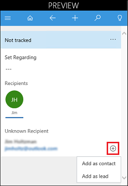

> [!NOTE]
> If the sender of the email is unknown to [!INCLUDE[pn_crm_shortest](../includes/pn-crm-shortest.md)], when you add the contact or lead, the email is automatically tracked in [!INCLUDE[pn_crm_shortest](../includes/pn-crm-shortest.md)] and set regarding this contact or lead. To stop tracking, you can manually untrack the regarding email. 

## Link an email message or meeting to a specific Dynamics 365 record  
You can link an email message or meeting to a specific [!INCLUDE[pn_crm_shortest](../includes/pn-crm-shortest.md)] record, such as an account, opportunity, or case. This also tracks the email or meeting in [!INCLUDE[pn_crm_shortest](../includes/pn-crm-shortest.md)].

1. Create or select an email or meeting.

2. Click the **[!INCLUDE[pn_crm_shortest](../includes/pn-crm-shortest.md)]** button in the email pane.

3. Click **Set Regarding** (---).

   

4. Enter search text. A list of related records appears.

   

5. Use the left and right arrows to narrow search to cases, invoices, etc., and then select a record to automatically track the email or meeting, and link it to the record indicated in the **[!INCLUDE[pn_crm_shortest](../includes/pn-crm-shortest.md)]** pane. 

### Find a different record to link to  

1. Find the record to link in a list or using Search. 

2. In Tracked regarding, click (...) > **Change Regarding**.
  
   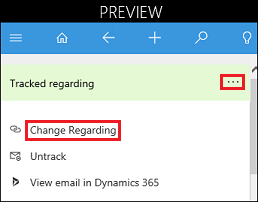

3. Click **Set Regarding** (---).

   

4. Enter search text. A list of related records appears.

   

5. Use the left and right arrows to find related cases, invoices, etc., and then select a record to automatically track the email or meeting, and link it to the record indicated in the **[!INCLUDE[pn_crm_shortest](../includes/pn-crm-shortest.md)]** pane. 

### Create a new record  
  
1.  Click **Quick Create**, and then select the type of record you want to create.  
  
   
  
2.  Fill in the information in the form.  
  
   
  
3.  Click **Save**.  

### View the linked email in Dynamics 365

1. Find the linked record in a list or using Search. 

2. In Tracked regarding, click (...) > **View email in Dynamics 365**.
  
   

  
### Untrack the regarding record  

1. Find the record to link in a list or using Search. 

2. In Tracked regarding, click (...) > **Untrack**.
  
   

## Track signed S/MIME emails
[!INCLUDE [pn-dyn-365-app-outlook](../includes/pn-dyn-365-app-outlook.md)] can track S/MIME signed emails in Outlook Desktop and Outlook Web App (OWA). This is enabled on Click-to-Run [!INCLUDE [pn-outlook-2016](../includes/pn-outlook-2016.md)] build 16.0.8730.1000 or later. To determine your Outlook version, go to **File** > **Office Account** > **About Outlook**.

## Customize the track regarding card

The admin can change what's displayed in the card that appears when you track the regarding email. For example, you might want to replace **Job Title** with **Business Phone** in the Contact card.

To change the fields that appear, follow these steps:

1. In [!INCLUDE[pn_crm_shortest](../includes/pn-crm-shortest.md)], go to **Settings** > **Customizations** > **Customize the System**.
2. Expand **Entities** and choose an entity such as **Contact**.
3. Expand the entity and select **Forms**, then select the **App for Outlook Contact Card** form.

   
4. Drag **Business Phone** below **Account Name**. Drag **Job Title** below **Mobile Phone**.

   | | |  |
   |---------|---------|---------|
   |     |         |         |

   > [!NOTE]
   > The first three fields appear in the track regarding card.
5. Choose **Save**, **Publish**, and then close the form editor.
6. On the solution page, choose **Components** > **Prepare Client Customizations**. 

   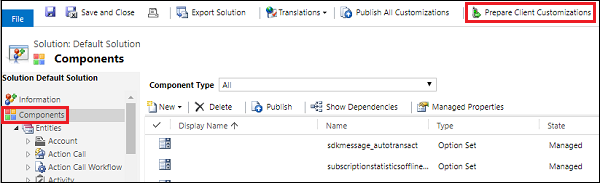
7. Close the solutions page.

After completing the above, right-click in the track regarding card, and then choose **Reload**. It might take some time for the synchronization to complete and the change to appear.

 
The business phone number replaces job title in the Contact card.

## Compose an email message and link it to a Dynamics 365 record  
Create an email message and then follow the steps in [Link an email message or meeting to a specific Dynamics 365 record](#link-an-email-message-or-meeting-to-a-specific-dynamics-365-record).

## Gain insights into your activities with relationship assistant

The relationship assistant is designed to deliver the most important and relevant information in relation to what you are doing right now. The assistant works by analyzing all of the data at its disposal and generating a collection of action cards, each of which includes a message summarizing what the card is about, plus a set of links for taking action. The assistant sorts the cards by priority and filters them for your current context.

Some of what the assistant can do for you:

- reminds you of upcoming activities
- evaluates your communications and suggests when it might be time to reach out to a contact that’s been inactive for a while
- identifies email messages that may be waiting for a reply from you
- alerts you when an opportunity is nearing its close date

When you start your day by signing in to Dynamics 365, the assistant draws your attention to your most important items and tasks, drawn from all areas of the application.

To access the assistant, on the nav bar, click .

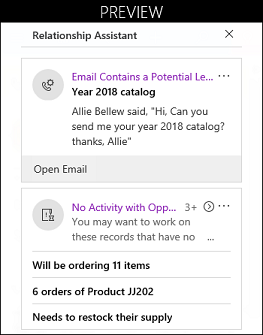

<!--
## Monitor an email message after you send it  

 You can monitor an email message after you send it to see the number of times that the message is viewed, opened, replied to, or forwarded. For a monitored email message, you can also see the last activity related to the email message, or view all activity related to the message.  
  
 ### Monitor an email message  

1.  Create an email message as you normally would in [!INCLUDE[pn_Outlook_short](../includes/pn-outlook-short.md)].  
  
2.  Track the email message or link it to a record in [!INCLUDE[pn_crm_shortest](../includes/pn-crm-shortest.md)]. You can’t monitor an email message unless you track it or link it (set a regarding record).  
  
3.  In the **[!INCLUDE[pn_crm_shortest](../includes/pn-crm-shortest.md)]** pane, click **Follow**, and then click **Follow this email**.  
  
   
  
    > [!NOTE]
    >  Any recipients that can’t be followed will be displayed at the bottom of the **[!INCLUDE[pn_crm_shortest](../includes/pn-crm-shortest.md)]** pane.  
  
4.  Send the message in [!INCLUDE[pn_Outlook_short](../includes/pn-outlook-short.md)].  
  
    > [!IMPORTANT]
    >  Do not edit the email message or change the recipients after you follow it. If you edit an email message after it’s followed, you may inadvertently delete the monitoring information or you may inadvertently add recipients who shouldn’t be followed.  

 
### Remove the monitoring for an email message  

1.  Select the monitored email message.  
  
2.  Click **Unfollow**.  -->

## Add an email template when you create an email message  
If you frequently send the same type of email, you can save time by using an email template. When you use an email template, [!INCLUDE[pn_dyn_365_app_outlook](../includes/pn-dyn-365-app-outlook.md)] automatically inserts the [!INCLUDE[pn_crm_shortest](../includes/pn-crm-shortest.md)] information such as contacts or set regarding information in the email message.  
  
For example, you could use a Thank you template to save time whenever you want to send a thank you message to a customer.  
  
  
  
> [!NOTE]
> You must have the appropriate permissions to add email templates.  
  
### Add an email template  
  
1.  Create an email message as you normally would in [!INCLUDE[pn_Outlook_short](../includes/pn-outlook-short.md)].  
  
2.  At the top of the **[!INCLUDE[pn_crm_shortest](../includes/pn-crm-shortest.md)]** pane, click **Document** > **Add Template**.  
  
    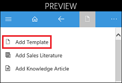  
  
3.  Select the record type (entity). The default is the set regarding record. Then, click **Select**. 
  
    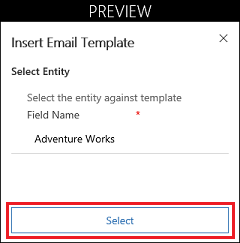  

4.  Start a search for the template you want. Under **Search Template**, click (---).
  
    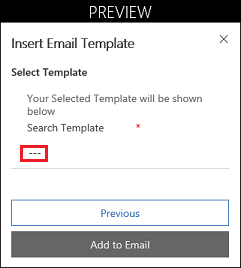  
  
5.  Search for and select the template you want. 

    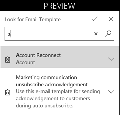  

6.  Accept the selected email template.

    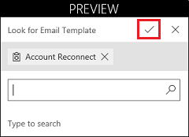  

7.  Click **Add to Email** to add the template to your email.

    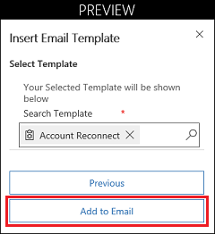  

The template text appears in your email.

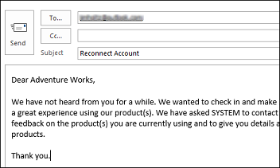  

For information on creating email templates in [!INCLUDE[pn_crm_shortest](../includes/pn-crm-shortest.md)], see [Create templates for email](../admin/create-templates-email.md).  
   
## Add sales literature or a knowledge base article when you create an email message  

 When you're working with a customer, you might want to send them some sales literature or a knowledge base article.  
> [!NOTE]
> You must have the appropriate permissions to add sales literature or knowledge base articles to an email message.
  
1.  Create an email message as you normally would in [!INCLUDE[pn_Outlook_short](../includes/pn-outlook-short.md)].  
  
2.  At the top of the **[!INCLUDE[pn_crm_shortest](../includes/pn-crm-shortest.md)]** pane, click **Document**. 
  
    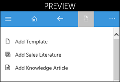  

3.  Select **Add Sales Literature** or **Add Knowledge Article**, and then follow the steps to add or insert the literature or article.

## Add a phone call, appointment, or task activity to Dynamics 365  

1. For the record you have linked and are tracking, in Tracked regarding, click (...) > **Add Activity**.
 
   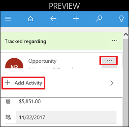

2. Select an activity.

   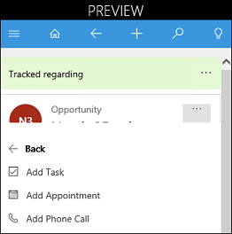
  
3. Fill in the information in the form. 
  
4. Click **Save**.  

## Track Outlook contacts in Dynamics 365  
 You can track [!INCLUDE[pn_Outlook_short](../includes/pn-outlook-short.md)] contacts in [!INCLUDE[pn_crm_shortest](../includes/pn-crm-shortest.md)] by using the [!INCLUDE[pn_crm_shortest](../includes/pn-crm-shortest.md)] add-in, an [!INCLUDE[pn_Outlook_short](../includes/pn-outlook-short.md)] solution module.   The add-in is automatically installed when you install [!INCLUDE[pn_crm_app_for_outlook_short](../includes/pn-crm-app-for-outlook-short.md)]. You can access it as described below.  
  
> [!NOTE]
>  [Delegated users](https://support.office.com/article/Allow-someone-else-to-manage-your-mail-and-calendar-9684B670-7588-4EEA-8717-9E5799047540) can not use [!INCLUDE[pn_crm_app_for_outlook_short](../includes/pn-crm-app-for-outlook-short.md)] to track emails.
  
 Using the add-in, you can:  
  
-   View a list of [!INCLUDE[pn_MS_Office](../includes/pn-ms-office.md)] contacts or [!INCLUDE[pn_crm_shortest](../includes/pn-crm-shortest.md)] contacts, and see which contacts are tracked  
  
-   Link contacts to accounts in [!INCLUDE[pn_crm_shortest](../includes/pn-crm-shortest.md)]  
  
-   Open the [!INCLUDE[pn_crm_shortest](../includes/pn-crm-shortest.md)] contact or account record with a single click  
  
 When the [!INCLUDE[pn_crm_shortest](../includes/pn-crm-shortest.md)] add-in is installed, you’ll see a new **[!INCLUDE[pn_crm_shortest](../includes/pn-crm-shortest.md)]** tab on the [!INCLUDE[pn_Outlook_short](../includes/pn-outlook-short.md)] ribbon. Click the tab to see information about contacts.  
  
   
 
 |Element  |Description  |
 |---------|---------|
 |1     |Click to see all your [!INCLUDE[pn_Outlook_short](../includes/pn-outlook-short.md)] contacts (contacts displayed in your default contacts view in [!INCLUDE[pn_crm_shortest](../includes/pn-crm-shortest.md)]).       |
 |2     |Click to see all your [!INCLUDE[pn_crm_shortest](../includes/pn-crm-shortest.md)] contacts.   |
 |3|See whether a contact is tracked or not, or whether tracking status is pending.  |
 |4|Open a [!INCLUDE[pn_crm_shortest](../includes/pn-crm-shortest.md)] account record.  |
 |5|Click to call.  |
 |6|Click to email.  |
 
  
> [!NOTE]
> To use the add-in your admin must enable your [!INCLUDE[pn_crm_shortest](../includes/pn-crm-shortest.md)] mailbox for appointments, contacts, and tasks.  
  
### Access the add-in  
  
In the lower-left corner of the [!INCLUDE[pn_Outlook_short](../includes/pn-outlook-short.md)] window, click the **Dynamics 365 add-in**.
  
  
  
### See the Dynamics 365 contact card for a contact  
  
1.  In the contacts list, select the check box next to the contact. The contact details appear on the right side of the screen.  
  
   
  
### Track or untrack a contact  
  
1.  Click the **[!INCLUDE[pn_Outlook_short](../includes/pn-outlook-short.md)] Contacts** tab.  
  
2.  In the contacts list, select the check box next to the appropriate contact(s).  
  
3.  On the ribbon, click **Track** or **Untrack**.  
  
   
  
    > [!IMPORTANT]
    >  Do not navigate outside the page while tracking or untracking the contact. Otherwise, it won’t be tracked or untracked.  
  
### Link a contact to an account or change the account that a contact is linked to  
  
1.  Click the **[!INCLUDE[pn_Outlook_short](../includes/pn-outlook-short.md)] Contacts** tab.  
  
    > [!NOTE]
    >  You can’t select a contact listed under the **[!INCLUDE[pn_crm_shortest](../includes/pn-crm-shortest.md)] Contacts** tab.  
  
2.  In the contacts list, select the check box next to the appropriate contact.  
  
3.  On the ribbon, click **Link**.  
  
4.  Do one of the following:  
  
    -   On the right side of the screen, select the account to link to, and then click **Link** at the bottom of the screen.  
  
     -Or-  
  
    1.  To create a new account, on the right side of the screen, click **New** at the bottom of the screen.  
  
    2.  Enter the new account name.  
  
    3.  Click **Save**.  
  
    4.  Click the **Refresh** button.  
  
    > [!NOTE]
    >  If the contact isn’t already tracked, the contact will be tracked immediately and will be linked to the account. The account record will be synchronized in the next synchronization cycle.  
  
### Send email or schedule an appointment  
  
1.  Click  the **[!INCLUDE[pn_crm_shortest](../includes/pn-crm-shortest.md)] Contacts** tab, or the **Outlook Contacts** tab, and then select the check box next to the appropriate contact(s).  
  
2.  On the ribbon, click **Email** or **Appointment**.  
  
     Regardless of which tab you selected in step 1, the email, task, or appointment will be sent from [!INCLUDE[pn_MS_Outlook_Short](../includes/pn-ms-outlook-short.md)], not [!INCLUDE[pn_crm_shortest](../includes/pn-crm-shortest.md)].  
  
### Search for a contact  
  
-   Enter a value in the search box. You can search for data stored in the **Full name**, **Company**, **Department**, and **Business address** fields. You can’t search for data stored in the **Tracking status**, **Business phone**, or **Email** fields.  
  
### Filter by all contacts, tracked contacts, or untracked contacts  

1.  Click the arrow next to the view drop-down.  
  
2.  Select the view you want.  
  
   

## Add a custom entity to Quick create

Follow these steps to enable a custom entity to appear in Quick create.

 

1. In [!INCLUDE[pn_crm_shortest](../includes/pn-crm-shortest.md)], go to **Settings** > **Customizations** > **Customize the System**.
2. Choose the custom entity. Under **Data Services**, enable **Allow quick create**. Under **Outlook & Mobile**, enable **Enable for mobile**.

   
3. Verify the custom entity has a quick create form. Chose **Forms** and browse for form type **Quick Create**. Create a quick create form if needed.

   
4. Verify the custom entity is added to the app designer. Choose **Apps**, and then open **App for Outlook**.

   
6. In the app designer, choose **Entities** and browse to find your custom entity.

   

## Enable a custom entity to appear in the Regarding lookup

1. In [!INCLUDE[pn_crm_shortest](../includes/pn-crm-shortest.md)], go to **Settings** > **Customizations** > **Customize the System**.
2. Choose the custom entity. Under **Communication & Collaboration**, enable **Activities**, and then choose **Save** > **Publish** on the **Home** tab.

   

## Search on custom field in Regarding lookup

To have [!INCLUDE[pn_crm_app_for_outlook_short](../includes/pn-crm-app-for-outlook-short.md)] Regarding lookup search on custom fields, that field must be added to the entity’s lookup view view.

1. In [!INCLUDE[pn_crm_shortest](../includes/pn-crm-shortest.md)], go to **Settings** > **Customizations** > **Customize the System**.
2. Choose an entity, then choose **Views**.
3. Open **Account Lookup View**.

   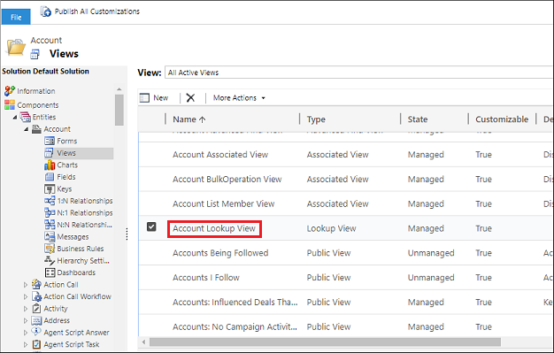
4. Enable the custom field, and then choose **OK**.

   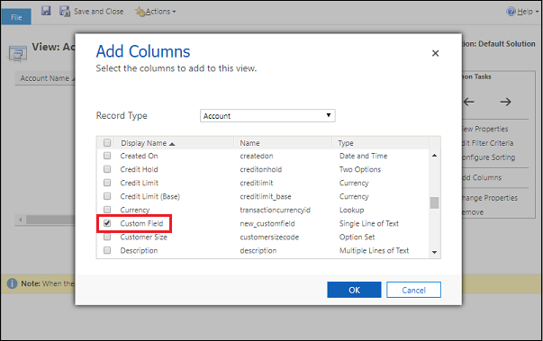
5. Choose **Save** > **Publish** on the **Home** tab.
 
### See also  
 [Deploy Dynamics 365 App for Outlook](deploy-dynamics-365-app-for-outlook.md)   
 [Set up server-side synchronization (admins)](../admin/set-up-server-side-synchronization-of-email-appointments-contacts-and-tasks.md)   
 
