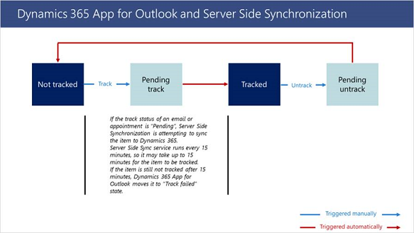

# Dynamics 365 App for Outlook User Guide  

Use [!INCLUDE[pn_ms_dyn_crm_app_for_outlook](../includes/pn-ms-dyn-crm-app-for-outlook.md)] to tap the power of your Dynamics 365 apps while you’re using [!INCLUDE[pn_Outlook_short](../includes/pn-outlook-short.md)] on the desktop, web, or phone. When [!INCLUDE[pn_crm_app_for_outlook_short](../includes/pn-crm-app-for-outlook-short.md)] is installed, depending on which version of  the app you have installed, you'll see a **Dynamics 365** pane or window next to a selected [!INCLUDE[pn_Outlook_short](../includes/pn-outlook-short.md)] email message, or when you're composing an email message or setting up a meeting or appointment.  

> [!IMPORTANT]
> - The latest release of [!INCLUDE[pn_ms_dyn_crm_app_for_outlook](../includes/pn-ms-dyn-crm-app-for-outlook.md)] works with customer engagement apps in Dynamics 365 (Dynamics 365 Sales, Dynamics 365 Customer Service, Dynamics 365 Field Service, Dynamics 365 Marketing, and Dynamics 365 Project Service Automation), [Dynamics 365 Customer Engagement (on-premises), version 9](https://docs.microsoft.com/dynamics365/customerengagement/on-premises/overview), and [Microsoft Dataverse](https://docs.microsoft.com/powerapps/maker/common-data-service/data-platform-intro).
> - For a prior release that works with earlier versions of Dynamics 365 apps, see [Deploy Dynamics 365 App for Outlook](https://technet.microsoft.com/library/dn946901.aspx).

 For example, when you open an email message, view information from your Dynamics 365 app about the email recipients. Or with a single click, link an [!INCLUDE[pn_Outlook_short](../includes/pn-outlook-short.md)] email message or appointment to a specific Dynamics 365 record. When you link an email message or appointment to a Dynamics 365 record, the [!INCLUDE[pn_Outlook_short](../includes/pn-outlook-short.md)] record appears as an activity for that record in Dynamics 365 apps.  

 <!--[Watch a short video (1:35) about Dynamics 365 App for Outlook.](https://go.microsoft.com/fwlink/p/?linkid=829982)  -->

## FAQs

For more information on FAQs, see [Frequently Asked Questions about Dynamics 365 App for Outlook](faq.md).

## Prerequisites  
 Your system administrator can make [!INCLUDE[pn_crm_app_for_outlook_short](../includes/pn-crm-app-for-outlook-short.md)] available to your organization or you can add it yourself if:  

- You have the **Use [!INCLUDE[pn_crm_app_for_outlook_short](../includes/pn-crm-app-for-outlook-short.md)]** security privilege.  

- Your organization synchronizes mailboxes with server-side synchronization.  

  For more information, and for information on supported devices, browsers, and [!INCLUDE[pn_Outlook_short](../includes/pn-outlook-short.md)] versions, see [Deploy Dynamics 365 App for Outlook](deploy-dynamics-365-app-for-outlook.md).  

## Add the app to Outlook  
 After the prerequisites have been met, you can add the app directly from Dynamics 365 app.  

1. Select the **Settings** button , and then click **Apps for Dynamics 365**.  

2. On the **Apps for Dynamics 365** page, under **[!INCLUDE[pn_crm_app_for_outlook_short](../includes/pn-crm-app-for-outlook-short.md)]**, click **[!INCLUDE[pn_crm_app_for_outlook_short](../includes/pn-crm-app-for-outlook-short.md)]**.  

   > [!NOTE]
   > If you have trouble installing  the app, see the troubleshooting section in [Deploy Dynamics 365 App for Outlook](deploy-dynamics-365-app-for-outlook.md).  

## Disable or remove the Outlook app  

1. In [!INCLUDE[pn_Outlook_short](../includes/pn-outlook-short.md)], click **File**, and then click **Manage Add-ins**.  

     

   This opens the **Microsoft 365** dialog box where you can see all your [!INCLUDE[pn_Outlook_short](../includes/pn-outlook-short.md)] add-ins. If you click the Dynamics 365 row, you can see which instance the app is connected to.  

2. Do one of the following:  

   - To disable the app, in the Dynamics 365 row, clear the **Turned on** check box.  

   - To remove the app, select the Dynamics 365 row, and then click the Minus button.  

## Terminology

|Term  |Definition  |
|---------|---------|
|Set regarding     |Track and link the email or appointment to an existing record in Dynamics 365 apps.|
|Tracking      |Create a copy of the email or appointment in Dynamics 365 apps.   |

## Use the app for the first time  
 To display Dynamics 365 data after you’ve added the app:  

1. Select an existing email message in your Inbox, or create a new email message or appointment.  

2. On the ribbon, click the **Dynamics 365** button.  

     

   -Or-

   In [!INCLUDE [pn-ms-outlook-web-access-short](../includes/pn-ms-outlook-web-access-short.md)], click the **Dynamics 365** button in the email pane.

   

   The **Dynamics 365** pane appears on the right side of the screen and shows information about the recipients.  

**Notes:**  

If the recipient is a Microsoft Dataverse or Customer Engagement (on-premises) user (as opposed to a contact or lead), it’s indicated above their name:  

  

If the recipient isn’t known to Dynamics 365, click (+) and then select **Add as contact** or **Add as lead**. See: [Add an email recipient as a contact or lead](#add-an-email-recipient-as-a-contact-or-lead).

## A quick tour of the interface

Much has changed in the app for Dynamics 365 apps. Here's what you see when you first open [!INCLUDE[pn_crm_app_for_outlook_short](../includes/pn-crm-app-for-outlook-short.md)].

The **Dynamics 365** pane appears under the menu bar and shows information about the recipients.  

| Element |                                                                         Description                                                                         |
|---------|-------------------------------------------------------------------------------------------------------------------------------------------------------------|
|    1    |                                                      The Dynamics 365 apps record this email is linked to.                                                       |
|    2    |                                                          Summary information about the recipient.                                                           |
|    3    |                                                     Summary information about the recipient's account.                                                      |
|    4    |                                   Shows if the email message or meeting is linked to a record and if it's being tracked.                                    |
|    5    | Click to set or change linking and tracking. You can also choose to view your email in Dynamics 365. |
|    6    |                                                                  Click to add an activity.                                                                  |
|  7 & 8  |                                               Click and then select **Set Regarding** to link to the record.                                                |

|Element  |Description  |
|---------|---------|
|1     |Your last activity with the recipient.      |
|2 & 3   |Recent records for the recipient.           |
|4     |Click for options related to list of activities.         |
|5     |Click for options related to the activity.  The options vary by activity.       |
|6 & 8    |Click for options related to the list of records.    |
|7 & 9     |Click for options related to the record.     

Let's go over the individual elements in the menu bar.

|Element  |Description  |
|---------|---------|
||Choose **Menu** > **Home** > **Dashboards**  to go to the main page.  Choose **Menu** > **Recent** to see Favorites and recently used records.|
||Choose **Home** to see the initial view.|
||Choose **Back** to return to the last thing you viewed.|
||Choose **Quick Create** to create a new record such as an account or contact. See <a href="https://docs.microsoft.com/dynamics365/outlook-app/dynamics-365-app-outlook-user-s-guide#CreateRecord">Create a new record</a>|
||Choose **Search** to search any Dynamics 365 apps records. |
||Choose **Insights** to view the most important and relevant information in relation to what you are doing right now.  See [Gain insights into your activities with relationship assistant](#gain-insights-into-your-activities-with-relationship-assistant)|
||Choose **Documents** to add email templates, sales literature, or knowledge base articles.  See [Add an email template when you create an email message](user/email-template.md) and [Add sales literature or a knowledge base article when you create an email message](user/add-literature-or-kb.md)|

## Experience App for Outlook as a pinnable taskpane

If you're running Outlook 2016 for Windows (click to run build 7668.2000 or later), App for Outlook will appear as a pinnable vertical [taskpane](https://docs.microsoft.com/outlook/add-ins/add-in-commands-for-outlook#launching-a-task-pane) to the right of an open message or appointment in Outlook.Pinning App for Outlook helps you by showing the relevant Dynamics 365 information faster. This will not only give you quick access to App for Outlook but also improves the home page load performance by 30% or more.

### Create a new record  

1. Click **Quick Create**, and then select the type of record you want to create.  

     

2. Fill in the information in the form.  

     

3. Click **Save**.  

### View the linked email in Dynamics 365 apps

1. Find the linked record in a list or using Search. 

2. In Tracked regarding, click (...) > **View email in Dynamics 365 apps**.

   

### Untrack the regarding record  

1. Find the record to link in a list or using Search. 

2. In Tracked regarding, click (...) > **Untrack**.

   

 ### Monitor an email message  

1.  Create an email message as you normally would in [!INCLUDE[pn_Outlook_short](../includes/pn-outlook-short.md)].  

2.  Track the email message or link it to a record in Dynamics 365. You can’t monitor an email message unless you track it or link it (set a regarding record).  

3.  In the **Dynamics 365** pane, click **Follow**, and then click **Follow this email**.  

   

    > [!NOTE]
    >  Any recipients that can’t be followed will be displayed at the bottom of the **Dynamics 365** pane.  

4.  Send the message in [!INCLUDE[pn_Outlook_short](../includes/pn-outlook-short.md)].  

    > [!IMPORTANT]
    >  Do not edit the email message or change the recipients after you follow it. If you edit an email message after it’s followed, you may inadvertently delete the monitoring information or you may inadvertently add recipients who shouldn’t be followed.  

### Remove the monitoring for an email message  

1.  Select the monitored email message.  

2.  Click **Unfollow**.  -->
  

## Track Outlook contacts in Dynamics 365 apps  
 You can track [!INCLUDE[pn_Outlook_short](../includes/pn-outlook-short.md)] contacts by using the [Dynamics 365 add-in, an [!INCLUDE[pn_Outlook_short](../includes/pn-outlook-short.md)] solution module.   The add-in is automatically installed when you install [!INCLUDE[pn_crm_app_for_outlook_short](../includes/pn-crm-app-for-outlook-short.md)]. You can access it as described below.  

 Using the add-in, you can:  

- View a list of [!INCLUDE[pn_MS_Office](../includes/pn-ms-office.md)] contacts or Dynamics 365 contacts, and see which contacts are tracked  

- Link contacts to accounts in Dynamics 365  

- Open the Dynamics 365 contact or account record with a single click  

  When the Dynamics 365 add-in is installed, you’ll see a new **Dynamics 365** tab on the [!INCLUDE[pn_Outlook_short](../includes/pn-outlook-short.md)] ribbon. Click the tab to see information about contacts.  

    

  | Element |                                                                                                   Description                                                                                                   |
  |---------|-----------------------------------------------------------------------------------------------------------------------------------------------------------------------------------------------------------------|
  |    1    | Click to see all your [!INCLUDE[pn_Outlook_short](../includes/pn-outlook-short.md)] contacts (contacts displayed in your default contacts view in Dynamics 365. |
  |    2    |                                                           Click to see all your Dynamics 365 contacts.                                                           |
  |    3    |                                                                 See whether a contact is tracked or not, or whether tracking status is pending.                                                                 |
  |    4    |                                                               Open a Dynamics 365 account record.                                                                |
  |    5    |                                                                                                 Click to call.                                                                                                  |
  |    6    |                                                                                                 Click to email.                                                                                                 |

> [!NOTE]
> To use the add-in your admin must enable your Dynamics 365 mailbox for appointments, contacts, and tasks.  

### Access the add-in  

In the lower-left corner of the [!INCLUDE[pn_Outlook_short](../includes/pn-outlook-short.md)] window, click the **Dynamics 365 apps add-in**.

  

### See the Dynamics 365 apps contact card for a contact  

1. In the contacts list, select the check box next to the contact. The contact details appear on the right side of the screen.  

     

### Track or untrack a contact  

1. Click the **[!INCLUDE[pn_Outlook_short](../includes/pn-outlook-short.md)] Contacts** tab.  

2. In the contacts list, select the check box next to the appropriate contact(s).  

3. On the ribbon, click **Track** or **Untrack**.  

     

   > [!IMPORTANT]
   >  Do not navigate outside the page while tracking or untracking the contact. Otherwise, it won’t be tracked or untracked.  

### Link a contact to an account or change the account that a contact is linked to  

1. Click the **[!INCLUDE[pn_Outlook_short](../includes/pn-outlook-short.md)] Contacts** tab.  

   > [!NOTE]
   >  You can’t select a contact listed under the **Dynamics 365 Contacts** tab.  

2. In the contacts list, select the check box next to the appropriate contact.  

3. On the ribbon, click **Link**.  

4. Do one of the following:  

   - On the right side of the screen, select the account to link to, and then click **Link** at the bottom of the screen.  

     -Or-  

   1.  To create a new account, on the right side of the screen, click **New** at the bottom of the screen.  

   2.  Enter the new account name.  

   3.  Click **Save**.  

   4.  Click the **Refresh** button.  

   > [!NOTE]
   >  If the contact isn’t already tracked, the contact will be tracked immediately and will be linked to the account. The account record will be synchronized in the next synchronization cycle.  

### Send email or schedule an appointment  

1. Click  the **Dynamics 365 Contacts** tab, or the **Outlook Contacts** tab, and then select the check box next to the appropriate contact(s).  

2. On the ribbon, click **Email** or **Appointment**.  

    Regardless of which tab you selected in step 1, the email, task, or appointment will be sent from [!INCLUDE[pn_MS_Outlook_Short](../includes/pn-ms-outlook-short.md)], not Dynamics 365.  

### Search for a contact  

-   Enter a value in the search box. You can search for data stored in the **Full name**, **Company**, **Department**, and **Business address** fields. You can’t search for data stored in the **Tracking status**, **Business phone**, or **Email** fields.  

### Search for a Dynamics 365 apps contact  

1. Switch to the **Dynamics 365 Contacts** tab on the top of screen to view the list of all your active Dynamics 365 contacts. 
2. Enter a value in the search box. You can search for data stored in the **Full name**, **Title**, **Department**, and **Business address** fields. 

You can’t search for data stored in any of the other fields like **Business phone**, **Account** or **Email**.

     

### Filter by all contacts, tracked contacts, or untracked contacts  

1. Click the arrow next to the view drop-down.  

2. Select the view you want.  

     
   
## Track appointments from another person in your organization

You can track appointments from another person in your Dynamics 365 apps organization using Dynamics 365 App for Outlook. To enable this capability, you need to enable the OrgDBOrgSetting in your organization. Dynamics 365 apps provides the OrgDBOrgSettings tool that gives administrators the ability to implement specific updates that were previously reserved for registry implementations.

1. Follow the instructions [in this article](https://support.microsoft.com/help/2691237/orgdborgsettings-tool-for-microsoft-dynamics-crm) for steps to extract the tool.
2. After extracting the tool, enable the *OrgDBOrgSetting TrackAppointmentsFromNonOrganizer*.

You can also use [this tool](https://github.com/seanmcne/OrgDbOrgSettings/releases/) to edit the *OrgDBOrgSetting TrackAppointmentsFromNonOrganizer*.

After the *OrgDBOrgSetting* is enabled, when you open Dynamics 365 App for Outlook on an appointment created by another user in your organization, you can track the appointment. You will no longer see the banner blocking you from tracking the calendar item.

 

## Synchronization and tracking 

The Dynamics 365 App for Outlook tracks and synchronizes your mail and calendar data between Outlook (Exchange) and Dynamics 365 apps. Server Side Synchronization is an asynchronous service that runs in the background approximately every 15 minutes to synchronize items between Exchange and Dynamics 365 apps. In most scenarios, the Outlook item is immediately created in Dynamics 365 apps. However, in some cases, Server Side Synchronization service is used to promote the item to Dynamics 365 apps and keep it synchronized, which may take up to 15 minutes. The below table provides a brief explainer of the behavior.

In most cases items are immediately tracked, aside from when an email is in compose mode and recurring appointments.

   > [!NOTE]
   > Server Side Synchronization is used to promote emails when Microsoft Outlook includes images in email signatures as attachments.

If the Dynamics 365 App for Outlook uses Server Side Synchronization to track an item to Dynamics 365 apps, the track status of the item will be “Pending”.

   > [!NOTE]
   > For manually tracked items, App for Outlook only synchronize pre-definded fields between Outlook (Exchange) and Dynamics 365 apps. Any [Field level synchronization settings](https://docs.microsoft.com/power-platform/admin/what-fields-synchronized-outlook) will have no effect while tracking the items manually from App for Outlook.
   
### See also  
 [Deploy Dynamics 365 App for Outlook](deploy-dynamics-365-app-for-outlook.md)   
 [Set up server-side synchronization (admins)](../admin/set-up-server-side-synchronization-of-email-appointments-contacts-and-tasks.md)   

[!INCLUDE[footer-include](../includes/footer-banner.md)]
