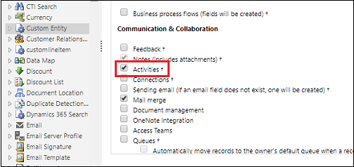

# Customize the Regarding lookup to add or remove entities

1. In your Dynamics 365 app, go to **Settings** > **Customizations** > **Customize the System**.
2. Choose the custom entity. Under **Communication & Collaboration**, enable **Activities**, and then choose **Save** > **Publish** on the **Home** tab.

   
   
    > [!NOTE]
   > To add a custom entity, see [Filter entities and views that appear in Dynamics 365 App for Outlook](https://docs.microsoft.com/dynamics365/customer-engagement/outlook-app/filter-entities-and-views).

[!INCLUDE[footer-include](../includes/footer-banner.md)]