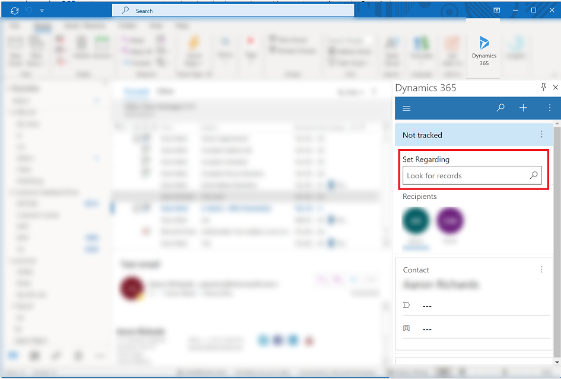
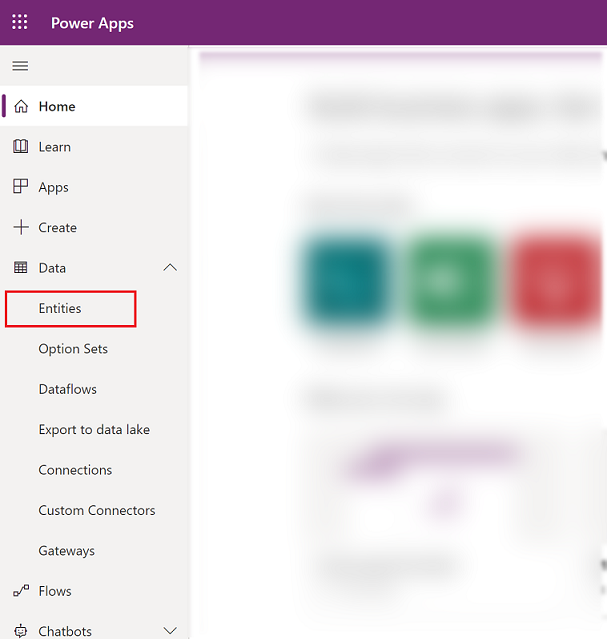
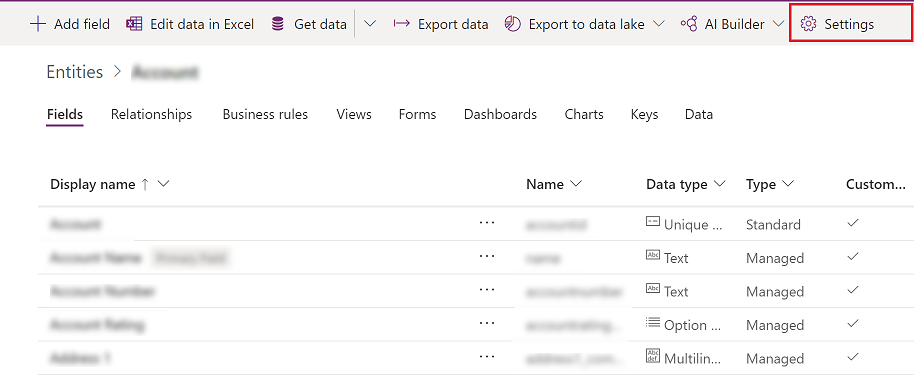

# Use Set Regarding lookup for an entity (table) 

In App for Outlook **Set Regarding** lets you link an email message, appointment, or task to a specific app record. To use **Set Regarding**, you need to enable activities for the entity (table).

   > [!div class="mx-imgBorder"]
   >

1. Sign in to [Power Apps](https://make.powerapps.com).

  
2. On the left nav select **Data** to expand it and then select **Tables**.  

   > [!div class="mx-imgBorder"]
   >
   
  
3. Choose an entity (table).

4. On the command bar, select **Settings**. 

   > [!div class="mx-imgBorder"]
   >

5. Expand **Collaboration**, and select **Enable for activities**. and then choose **Done**. 

   > [!div class="mx-imgBorder"]
   >
   
   > [!NOTE]
   > Once enabled this setting can't be disabled. If prompted, select **Okay** to confirm.
   
6.  Select **Save Table** > and then publish the entity (table).

[!INCLUDE[footer-include](../includes/footer-banner.md)]

See also

[Filter entities and views that appear in Dynamics 365 App for Outlook](https://docs.microsoft.com/dynamics365/customer-engagement/outlook-app/filter-entities-and-views).

