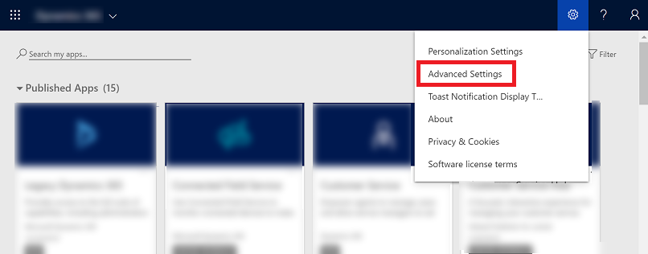
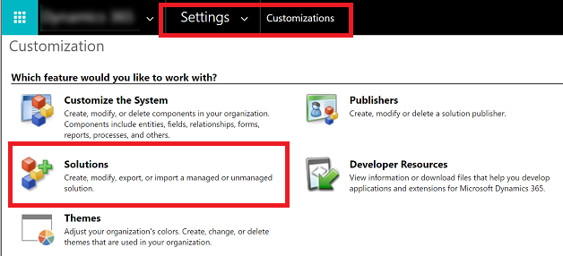
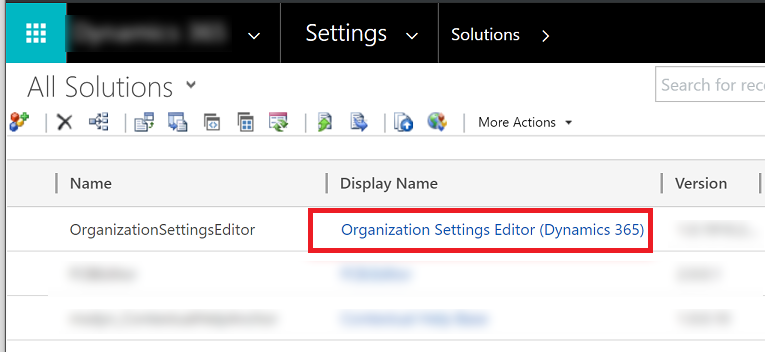
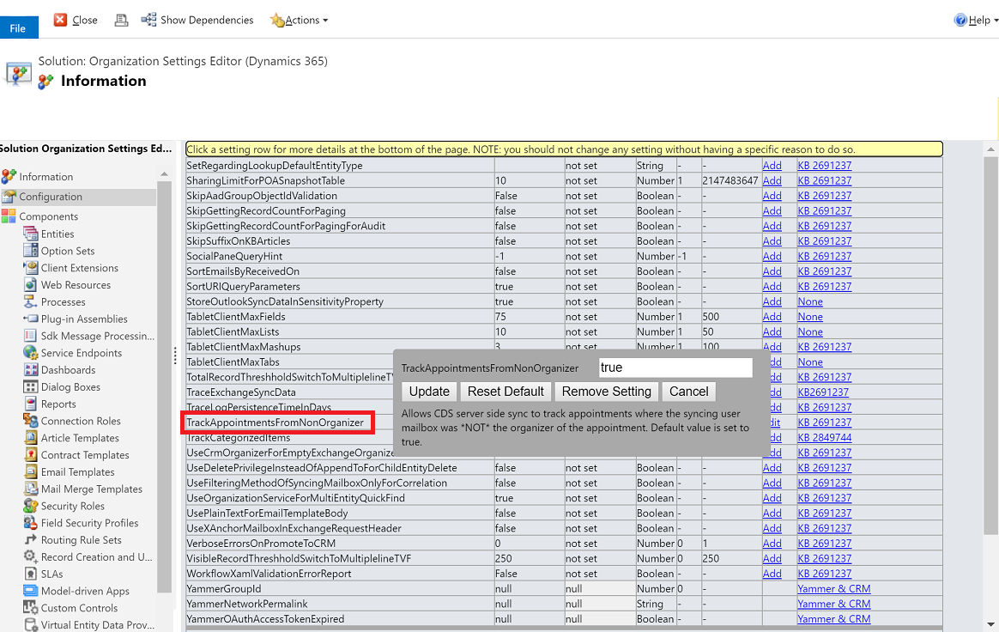

# Set up delegate access 

Set up delegate access to allow someone to track information in your Dynamics 365 apps using Dynamics 365 App for Outlook. When you set up delegate access it gives someone permission to act on your behalf. For example, you might want an assistant to create and respond to email or meeting requests for you and then track the information in Dynamics 365 apps using the Dynamics 365 App for Outlook.

## Prerequisites

- Exchange Online and Microsoft Outlook C2R (Click-to-Run) build 16.0.12130.20272 or later. To check which channel you need to be on for this version, see [Update history for Microsoft 365 Apps](/officeupdates/update-history-office365-proplus-by-date). 
- Configure delegate access in Microsoft Outlook. At a minimum, a delegated user must have at least **Editor** permission on the delegated mailbox.  For more information, see [Allow someone else to manage your mail and calendar](https://support.office.com/article/allow-someone-else-to-manage-your-mail-and-calendar-41c40c04-3bd1-4d22-963a-28eafec25926).
- Both manager and delegate user must have Dynamics 365 App for Outlook. For more information, see [Deploy Dynamics 365 App for Outlook](deploy-dynamics-365-app-for-outlook.md). 
- Make sure this Skype URL is whitelisted: [https://config.edge.skype.com](https://config.edge.skype.com/). Otherwise, Outlook C2R will not allow delegate access to work with shared calendars. For more information, see [Microsoft 365 URLs and IP address ranges](/office365/enterprise/urls-and-ip-address-ranges#skype-for-business-online-and-microsoft-teams). 

## Enable delegate access

To enable delegate access, you need to enable the **OrgDBOrgSettings** in your organization. Microsoft Dataverse apps provide the **OrgDBOrgSettings** tool that gives administrators the ability to implement specific updates that were previously reserved for registry implementations. For more information, see [Environment database settings](/power-platform/admin/environment-database-settings.md). After extracting the tool, enable **OrgDBOrgSettings TrackAppointmentsFromNonOrganizer** and **DelegateAccessEnabled**.

You can also use [this tool](https://github.com/seanmcne/OrgDbOrgSettings/releases/) to edit **OrgDBOrgSettings TrackAppointmentsFromNonOrganizer** and **DelegateAccessEnabled**.

1.	Sign in as an admin to Dynamics 365 at [https://home.dynamics.com](https://home.dynamics.com).
2.	On the home page, go to [**Settings** > **Advanced Settings**](/power-platform/admin/admin-settings#app-settings).

    > [!div class="mx-imgBorder"] 
    >  

3. From the main menu, go to **Settings** > **Customizations** and then select **Solutions**.

    > [!div class="mx-imgBorder"] 
    >  
    
4. On the **All Solutions** screen, select **Organization Settings Editor (Dynamics 365)**.

    > [!div class="mx-imgBorder"] 
    >  
    
5. On the **Solution Organization Settings Editor** screen, find the **TrackAppointmentsFromNonOrganizer** and **DelegateAccessEnabled** settings and set both to **True** (if not already set to True) and then select **Update**.
  
    > [!div class="mx-imgBorder"] 
    >  
    

> [!IMPORTANT]
> Things to verify before enabling delegate access in App for Outlook:
> - Delegate access is set up correctly in Outlook.
> - The delegated user has at least **Editor** permissions on the delegated mailbox.
> - The Skype URL (https://config.edge.skype.com/) is whitelisted.
> - The delegated user has the correct Outlook version.
> - The organization settings are configured properly.
> - After the organization settings are configured, App for Outlook is redeployed for all users.

## FAQs about delegate access

### Are shared folders supported as part of the delegate access feature?

No, to understand the difference between shared folders and delegate access, see [Manage another person's mail and calendar items](https://support.office.com/article/Manage-another-person-s-mail-and-calendar-items-AFB79D6B-2967-43B9-A944-A6B953190AF5).
 
### Is delegate access supported using the MSI version of Outlook?

No, it is only available for the supported version of Outlook C2R. For more information, see  [Update history for Microsoft 365 Apps](/officeupdates/update-history-office365-proplus-by-date).

### See also  
[Use delegate access](./user/use-delegate-access.md) 

[!INCLUDE[footer-include](../includes/footer-banner.md)]
