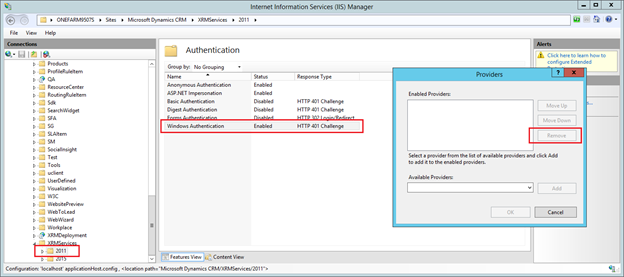
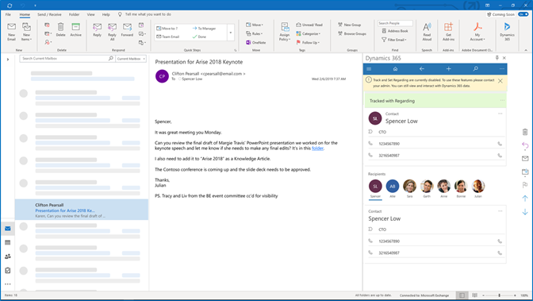

# Frequently Asked Questions about Dynamics 365 App for Outlook

## Are there any known issues?
Yes, here is the list of known issues:

- Users who are assigned a custom security role may not be able to access [!INCLUDE[pn_crm_app_for_outlook_short](../includes/pn-crm-app-for-outlook-short.md)]. We are working on a fix for this issue. In the meantime, for a workaround, see this [support article](https://support.microsoft.com/help/4078135/sorry-something-went-wrong-while-initializing-the-app-when-accessing-t). 
 

## I am having authentication issues with Dynamics 365 App for Outlook while using Dynamics 365 Customer Engagement (on-premises) and Active Directory Federation Services. What can I do to resolve it?

If you have enabled Internet-facing deployment on the Microsoft Dynamics 365 Server and Configure the AD FS and still have issues with authentication then do the following:

1. On the server open the Internet Information Services (IIS) Manager program.
2. In the left panel, expand the domain name > expand and navigate to **Sites** > **Microsoft Dynamics CRM**.
3. Expand **XRMServices** and then select **2011**.
    1. Double click on **Authentication** in the features view.
    2. Right-click on the **Windows Authentication** row and then select **Enable** if it is disabled.
    3. Right-click again on the **Windows Authentication** and then select **Providers**.
    4. For each of the listed providers, select the provider and then choose **Remove**.
    5. Close **Providers** window.
    6. Right-click again on the **Windows Authentication** and then select **Disable**.

All of the  above steps need to be completed for all included folders and files for **XRMServices** > **2011**, and for the NGA and AppWebServices folders.

> [!div class="mx-imgBorder"] 
> 

## What does this notification mean, Track and Set Regarding are currently disabled. To use these features, please contact your admin. You can still view and interact with your Dynamics 365 apps data?

When you use Dynamics 365 App for Outlook, you might see this notification, **Track and Set Regarding are currently disabled. To use these features, please contact your admin. You can still view and interact with your Dynamics 365 apps data**.

> [!div class="mx-imgBorder"] 
> 

Dynamics 365 App for Outlook leverages server-side synchronization to keep your Exchange items in sync with Dynamics 365 apps. For example, if you track a meeting in Outlook, then the App for Outlook relies on server-side synchronization to create the activity in Dynamics 365 apps and keep the two items in sync.

If server-side synchronization is inactive on your mailbox, then you will not have the ability to track and set regarding on emails and appointments.

With the recent update, instead of blocking you from using App for Outlook, you now can view your Dynamics 365 apps information such as, accounts, contacts, and activities. You can continue to create, update and manage your information since it not related to synchronization.

To fix issues with server-side synchronization, contact your administrator, who can view the status of the service and take necessary steps to address the issue.

## Dynamics 365 App for Outlook does not display the recipient picker and instead displays a different dashboard. How do I switch it back?
Dynamics 365 Dynamics 365 App for Outlook landing page is a dashboard that is configured in the App Module named “App for Outlook”. An administrator or a system customizer will need to ensure that the default dashboard is correctly set in Dynamics 365 apps. For more information, see [Limitations when customizing Dynamics 365 App for Outlook](./limitations-when-customizing-app-for-outlook.md#customizing-app-for-outlook-sitemap).

## When I open Dynamics 365 App for Outlook, I see a blue screen with errors related to Server-Side Synchronization. How do I recover from this?
Currently, Dynamics 365 App for Outlook requires Server-Side Synchronization to be successfully set up on the Exchange mailbox. Depending on the scenario, you may see one of the following messages displayed.

 -	Email account isn't configured with server-side synchronization for incoming email
 -	Email account isn’t configured with server-side sync for appointments, contacts, and tasks
 -	Your mailbox is inactive

This means that there is an issue with the Server-Side Synchronization settings on the mailbox. Make sure Server-Side Synchronization is set up correctly. Note, this requires admin privileges. For more information see, [Connect Dynamics 365 apps to Exchange Online](/power-platform/admin/connect-exchange-online). 

## When I track or set the Regarding record on an email or an appointment in Outlook, it goes into a “Pending” state. Why?
Dynamics 365 App for Outlook tracks and synchronizes your mail and calendar data between Outlook (Exchange) and Dynamics 365 via Server-Side Synchronization, which is an asynchronous service that runs in the background approximately every 15 minutes.

## As an administrator, when I go to the Dynamics 365 App for Outlook section in **Settings**, a user does not appear in the **All Eligible Users** list. 
For more information, see [A user does not appear in the All Eligible Users list within the Dynamics 365 App for Outlook area](https://support.microsoft.com/help/4345543).

## When I open Dynamics 365 App for Outlook on Outlook desktop, I see a blank page instead of the App. Why is this happening?
For more information, see [Blank page appears within Dynamics App for Outlook](https://go.microsoft.com/fwlink/p/?linkid=2007128).

> [!Note]
> If the link above does not work in Internet Explorer (IE), please try using another browser.

## Some of my appointments in Outlook and Dynamics 365 apps are canceled or deleted unexpectedly. Why is this happening?
For more information, see [An appointment is canceled or deleted unexpectedly when using Server-Side Synchronization](https://go.microsoft.com/fwlink/p/?linkid=2007027).

## I am unable to track contacts.
For more information, see [Issue when trying to access Dynamics 365 apps within the Add-ins area of Outlook](https://support.microsoft.com/help/3211586).

## I need help troubleshooting the App.
For more information, see [Troubleshooting](https://go.microsoft.com/fwlink/p/?linkid=2007025).

## The warning and error messages in Dynamics 365 apps are not in the language selected in Dynamics 365 apps. Why?
When we display diagnostic information and some labels in contact tracking module in Dynamics 365 App for Outlook, we use the Office (Outlook) display language setting and not Dynamics 365 apps language setting in order to be consistent with the host application experience.

## We have defined a web resource on a form in Unified Interface. The web resource is not displayed in the form when opened in Dynamics 365 App for Outlook. Why?
In general, web resources on Forms will not be rendered in App for Outlook as they require cookie authentication, which is currently only supported in browsers. An example of this type of JavaScript customization is XMLHttpRequest based ODATA API calls, which are not supported.

However, when scripts which do not rely on cookie authentication are used, those will be rendered on a Form in Dynamics 365 App for Outlook. An example of this is the use of XRM WebAPI.

## I am able to use Dynamics 365 App for Outlook in Outlook Web Access in the Microsoft Edge browser, but it doesn’t work in Outlook Desktop. Why?
Dynamics 365 App for Outlook needs Internet Explorer 11 or higher to be installed on your machine. If you have Internet Explorer 11 already, please also make sure your organization URL <orgname.crm.dynamics.com> is not in the Compatibility View list.

## My App for Outlook launch takes time every time I load it for mail item.
For frequently used pages, pin the app so that it will stay loaded even when you switch to other mail items. 

## User is not able to configure *Follow this email* button on the top pane in Dynamics 365 App for Outlook.
This feature is no longer available for configuration.

[!INCLUDE[footer-include](../includes/footer-banner.md)]
