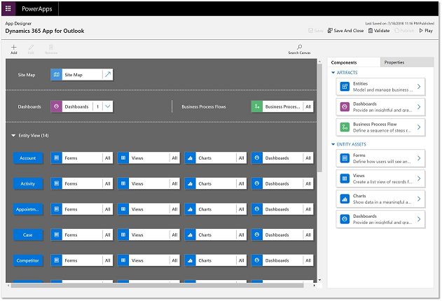

# Filter entities and views that appear in Dynamics 365 App for Outlook  

If you are a system administrator or a customizer, you can choose to expose only the required set of entities to be available to Dynamics 365 App for Outlook.You can do this through App Modules.

With the Power Apps App Designer, you can control the specific entities that appear in Dynamics 365 App for Outlook’s **Quick Create** menu and the **Regarding** lookup. This helps you get to the record you are looking for faster and also modularize business logic by exposing only the relevant entities for your users in Dynamics 365 App for Outlook.

1.  From the main menu navigate to **Settings** > **Customizations** > **Customize the System** > **Apps**. 
2.  Double-click **Dynamics 365 App for Outlook** to open the App Designer

    

3.  Choose **Add** > **Entities** and then select the entity you want to add and complete the addition by including all assets.

   

   

4.  Review the list of Views that are available for the entity and deselect the ones you do not want to be available in Dynamics 365 App for Outlook. In Dynamics 365 App for Outlook **Regarding** lookup,  you can filter results based on an entity and further, on one of the views defined for that entity.

   

5.  Save your changes and publish the customization.

> [!NOTE]
> - You can also remove entities from Dynamics 365 App for Outlook.
> - An entity must be Activities enabled for it to appear in the Regarding lookup. See [Enable a custom entity to appear in the Regarding lookup](enable-a-custom-entity-to-appear-in-the-regarding-lookup.md).
> - An entity must also be enabled for Unified Interface for it to appear in the Regarding lookup.

[!INCLUDE[footer-include](../includes/footer-banner.md)]