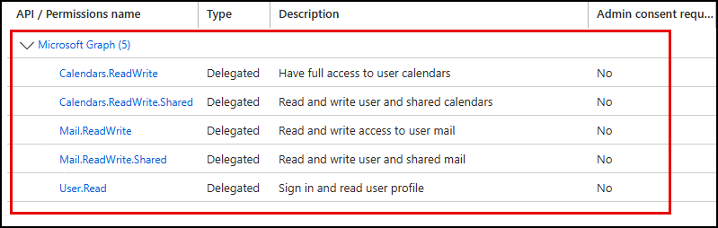

# Set up Graph API support for Dynamics 365 Mail App

This article shows you how to configure Graph API support for the Dynamics 365 Mail App by creating a custom settings solution. You create a new solution, add a settings entity, and configure the necessary fields to store your Graph API credentials. This setup lets the Mail App authenticate and communicate with Microsoft Graph services.

## Prerequisites

Before you begin, ensure you have the following:

- Administrative access to your Dynamics 365 environment
- An Azure AD app registration with the app ID
- Your Azure tenant ID
- Appropriate security permissions to create solutions and entities.

## Create 3 party App registration on the Azure tenant

1. Sign in to [Azure portal](https://ms.portal.azure.com/).
1. Go to **App registrations** and select **+ New registration** to create new app registration.
1. Fill required fields such as:
   - App name
   - Supported accounts - Accounts in this organizational directory only (Mystery Incorporated only - Single tenant)
   - Redirect URL - Replace `crm_org_domain`: SPA - `https://<crm_org_domain>/crmmailapp/msalAuth.html`
1. After you create the app registration, go to the **API permissions** section and add the corresponding permissions for Graph. You need to grant admin consent to these permissions.
   > [!div class="mx-imgBorder"] 
   > 

1. Record AppId and TenantId for the next step.

## Import D365 Mail App settings solution

Follow these steps to manually create setting entity:

### Create the Dynamics 365 Mail App settings solution

Create a new solution in your Dynamics 365 environment to house the Mail App configuration settings.

1. Go to your Dynamics 365 environment.
1. Create a new solution with the following details:
   - **Display name**: Dynamics 365 Mail App settings
   - **Name**: D365MailAppsettings
   - Add a new publisher that allows the customer to create entities with the prefix **mailapp**.
   - **Version**: 1.0.0.0

#### Add the settings entity

Add a custom entity to store the Mail App configuration values.

1. In the D365MailAppsettings solution, add a new entity.
1. Set the entity **Name** to **mailapp_setting**, **Display Name** to **MailApp Settings**, and **Plural Name** to **Settings**.

#### Configure entity fields

Add new fields in the mailapp_setting entity.

- **mailapp_name**: Stores the name of each configuration setting.
- **mailapp_settingvalue**: Stores the corresponding value for each setting.

### Add the Graph API app ID to the Dynamics 365 Mail App settings

1. To access the entity with the setting, go to `https://<org_domain>/main.aspx?pagetype=entitylist&etn=mailapp_setting`.
1. Create a new record in the mailapp_setting entity with the following values:
   - **Name**: graph_appid
   - **Setting value**: Enter the App ID from your Azure AD App registration.

### Add the AAD tenant ID to the Dynamics 365 Mail App settings

1. To access the entity with the setting, go to `https://<org_domain>/main.aspx?pagetype=entitylist&etn=mailapp_setting`.
1. Create a new record in the mailapp_setting entity with the following values:
   - **Name**: azure_tenantid
   - **Setting value**: Enter the Azure tenant ID

## Add read permission for settings for all users

Grant read permissions for the settings entity so users can access the Mail App configuration.

1. Go to **Settings** > **Security** > **Security roles**.
1. Search for **Dynamics 365 App for Outlook User** security role.
1. Switch to the custom entities settings view and search for the **MailApp Settings** entity.
1. Set **Read** permission on the org level.
1. Save changes.

## Next steps

After you complete this setup, the Dynamics 365 Mail App can authenticate by using Graph API and access Microsoft Graph services on behalf of your users.