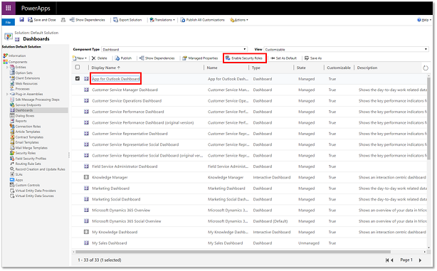
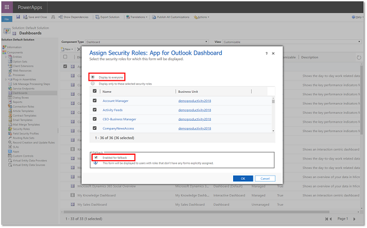
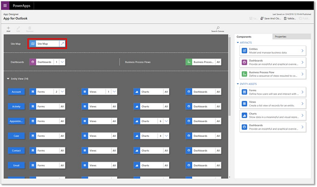
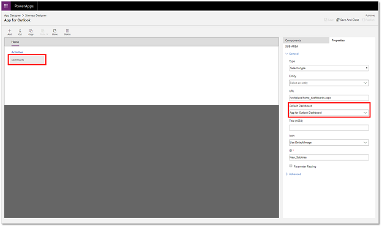
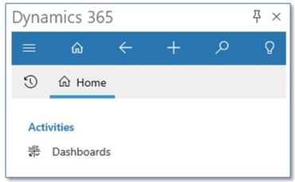
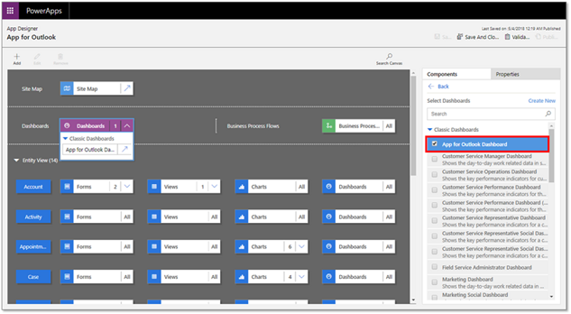

# Limitations when customizing Dynamics 365 App for Outlook

When customizing the app you make run into these limitations.

#### Customizing App for Outlook sitemap

System customizers have access to the Sitemap Designer (within the App Designer) for Dynamics 365 App for Outlook. It is one of the App Modules in version 9.0. The Dynamics 365 App for Outlook default landing page is a dashboard that is configured in the App Module. Customizations to App for Outlook sitemap are not supported at this time. If you are unable to view the Dynamics 365 App for Outlook landing page when you open App for Outlook, please follow the steps below.

1. Navigate to **Settings** > **Customizations** > **Customize the system**.
2. From the menu on the left, expand **Components** and then select **Dashboards**.
3. Select **App for Outlook Dashboard** and then select **Enable Security Roles**.

4. On the **Assign Security Roles: App for Outlook Dashboard** box select **Display to everyone** and **Enable for Fallback**.

5. Select **OK**.

This issue is also seen when the sitemap for App for Outlook has been modified i.e. the sitemap for App for Outlook has an alternate dashboard in the **Default Dashboard** field. To resolve this issue, do the following:

1. Open App for Outlook sitemap designer. Go to **Settings** > **Customizations** > **Customize the system** > **Apps** > **App for Outlook**.

2. Make sure that the App for Outlook sitemap has **Dashboard** as the first sub area and that the default dashboard is **App for Outlook Dashboard**.

#### Dashboard customization in Dynamics 365 App for Outlook

The following dashboard customizations are not supported currently.

-  In Dynamics 365 App for Outlook, you will not be able to switch dashboards by navigating to the main menu and then **Home**.
   Choosing the Dashboards option will redirect back to the default App for Outlook dashboard.

   

- Switching the default dashboard for App for Outlook in App designer

  System customizers have access to the App Designer for Dynamics 365 App for Outlook as it is one of the App Modules in version 9.0.
We recommend that you do not change the default App for Outlook dashboard as that is not a supported.

  
  
> [!Note]
> Business process flows are not supported in Dynamics 365 App for Outlook. When customizing the app, you should not explicitly select any business process flows.

[!INCLUDE[footer-include](../includes/footer-banner.md)]