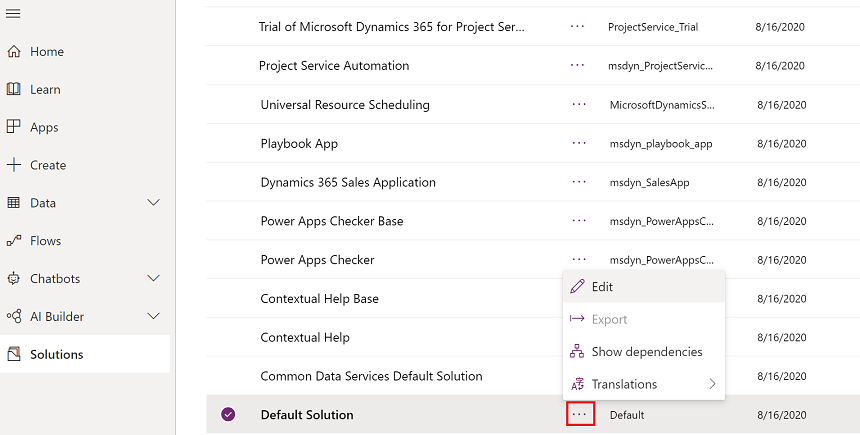
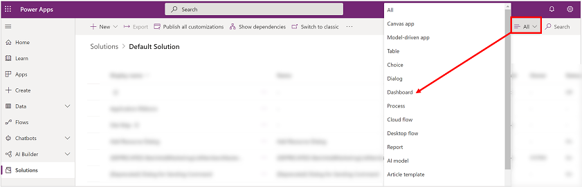
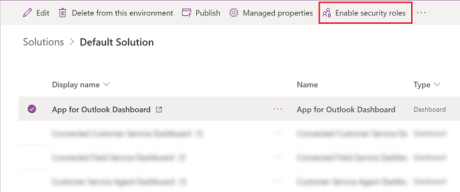
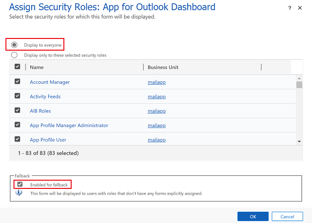

# Limitations when customizing Dynamics 365 App for Outlook

This topic covers limitations when customizing Dynamics 365 App for Outlook.

## Business process flows

Business process flows are not supported in Dynamics 365 App for Outlook. When customizing the app, you should not explicitly select any business process flows.

## Customizing App for Outlook sitemap

System customizers have access to the Sitemap Designer using the App Designer for Dynamics 365 App for Outlook. It's one of the App Modules in version 9.x. The Dynamics 365 App for Outlook default landing page is a dashboard that is configured in the App Module. If you are unable to view the Dynamics 365 App for Outlook landing page when you open App for Outlook, follow the steps below.

1. Sign in to [Power Apps](https://make.powerapps.com).
2. On the left nav, select **Solutions**.
3. Select the **Default Solution** > **More Commands** > **Edit**.

   > [!div class="mx-imgBorder"]
   > 

4. Select **All** and then select **Dashboard**.

   > [!div class="mx-imgBorder"]
   > 

5. Select **App for Outlook Dashboard** and then on the command bar select **Enable security roles**.

   > [!div class="mx-imgBorder"]
   > 

6. On the **Assign Security Role: App for Outlook Dashboard** dialog, select **Display to everyone** and **Enable for fallback**.

   > [!div class="mx-imgBorder"]
   > 

7. When you're done, select **OK**. 

This issue is also seen when the sitemap for App for Outlook has been modified. For example, the sitemap for App for Outlook has an alternate dashboard in the **Default Dashboard** field. To resolve this issue, do the following:

1. Sign in to [Power Apps](https://make.powerapps.com).
2. On the left navigation pane, select **Apps**.
3. From the list of apps select **Dynamics 365 App for Outlook** and then select **Edit**.

   > [!div class="mx-imgBorder"]
   > 

4. Select **Open the Site Map Designer** 

   > [!div class="mx-imgBorder"]
   > 

5. Select **Dashboards** and make sure that the App for Outlook sitemap has **Dashboard** as the first sub area and that the **Default Dashboard** is **App for Outlook Dashboard**.

   > [!div class="mx-imgBorder"]
   > 

[!INCLUDE[footer-include](../includes/footer-banner.md)]
