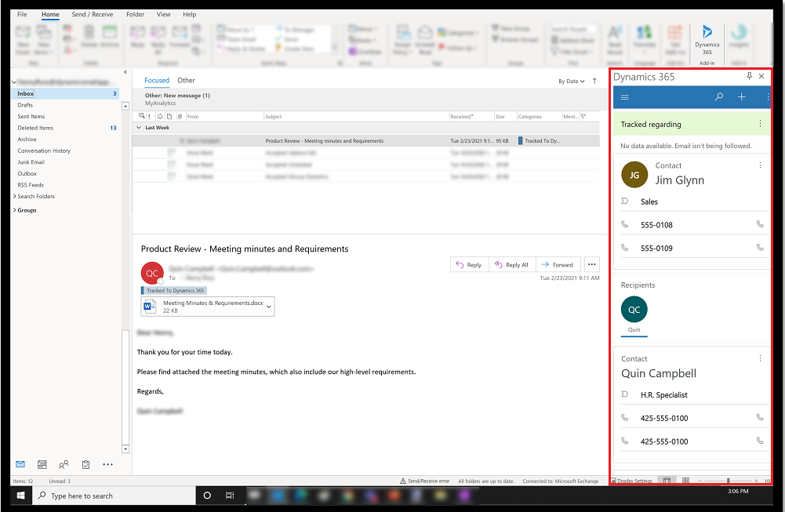

# Overview of Dynamics 365 App for Outlook

Use Dynamics 365 App for Outlook and tap the power of Dynamics 365 apps while using Outlook on the desktop, web, or mobile. You can view information about an email or appointment or link it to an opportunity, account, or case in your app.

Dynamics 365 App for Outlook works with customer engagement apps (such as [Dynamics 365 Sales](./../sales-professional/help-hub.md), [Dynamics 365 Customer Service](./../customer-service/help-hub.md), [Dynamics 365 Marketing](./../marketing/help-hub.md), [Dynamics 365 Field Service](../field-service/overview.md), and [Dynamics 365 Project Service Automation](/dynamics-365-project-operations/articles/psa/overview.md), [Dynamics 365 Customer Engagement (on-premises), version 9](../customerengagement/on-premises/overview.md), and model-driven Power Apps that run on [Microsoft Dataverse](/powerapps/maker/common-data-service/data-platform-intro).

> [!NOTE]
> : Multiplexing setup does not reduce the number of licenses required to access a Dynamics 365. For more information, see [Multiplexing Licensing Brief](https://nam06.safelinks.protection.outlook.com/?url=https%3A%2F%2Fdownload.microsoft.com%2Fdownload%2F3%2FD%2F4%2F3D42BDC2-6725-4B29-B75A-A5B04179958B%2FLicensing_Brief_PLT_Multiplexing.pdf&data=04%7C01%7Cmkaur%40exchange.microsoft.com%7C249a77ca758a40152faf08d9bf2d45b0%7C72f988bf86f141af91ab2d7cd011db47%7C1%7C0%7C637751023441383981%7CUnknown%7CTWFpbGZsb3d8eyJWIjoiMC4wLjAwMDAiLCJQIjoiV2luMzIiLCJBTiI6Ik1haWwiLCJXVCI6Mn0%3D%7C3000&sdata=AamdWzOl%2Fu0YIOgARTY%2FRa3l6AbM9xocJwOZSr7QT5Y%3D&reserved=0).

## Benefits

With Dynamics 365 App for Outlook, you can:

- Link email messages, meetings, and appointments to a row in your app. For example, link an email message to a specific account, opportunity, or case. 

- View information in the context of an email message, meeting, or appointment. 

- Synchronize contacts and related information so that Exchange and your app is always up to date.

- Add email templates, knowledge articles, and sales literature when you create an email message or set up a meeting.  
  

## Get started

Before you start using App for Outlook, review these topics:

- [System requirements, limits, and configuration](support-info-deployment.md)
- [Deploy and install Dynamics 365 App for Outlook](deploy-dynamics-365-app-for-outlook.md)
- [Basic navigation in App for Outlook](user/basic-navigation.md)
- [Supported features](user/support-matrix.md)

[!INCLUDE[footer-include](../includes/footer-banner.md)]
