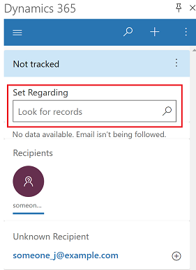
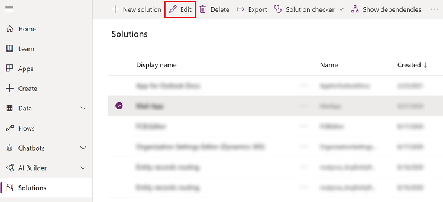
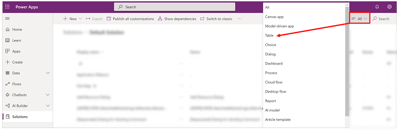
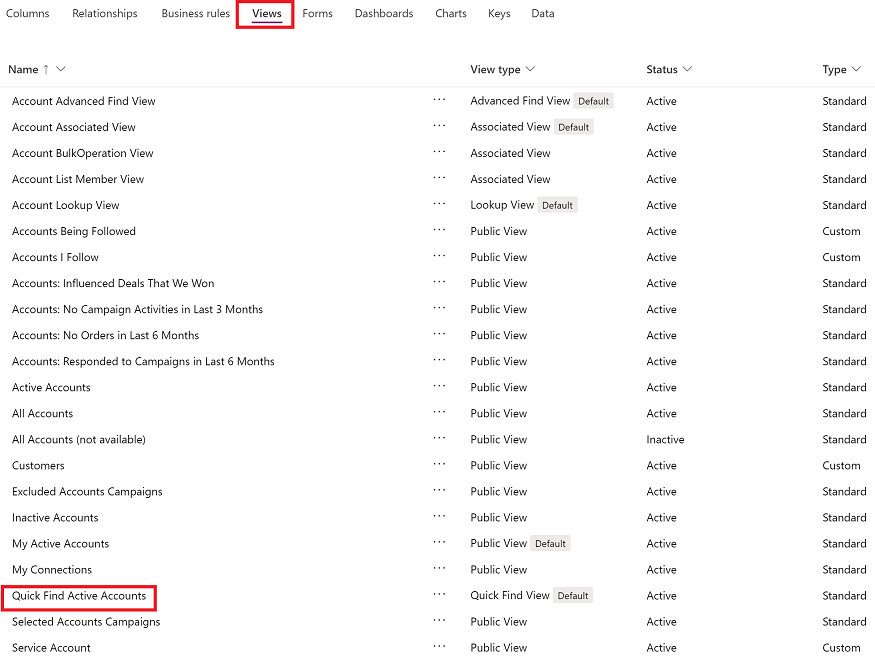

# Expand the columns which the Set Regarding lookup searches on

To have the Set Regarding lookup search on custom columns in Dynamics 365 App for Outlook, that column must be added to the table’s quick find view.

   > [!div class="mx-imgBorder"]
   > 

1. Sign in to [Power Apps](https://make.powerapps.com).
2. On the left nav, select **Solution**.
3. Select the solution that contains the table and then select **Edit** on the command bar. For more information on solutions, see [Solutions overview](/power-apps/maker/data-platform/solutions-overview).

   > [!div class="mx-imgBorder"]
   > 
   
4. On the command bar, select the **All** and then select **Table**.

   > [!div class="mx-imgBorder"]
   > 

5. Select a table such as **Account** to edit the table. 

6. Select **Views** and make sure that **Quick Find Active Accounts** view is active. If it's not, then open the view and select the necessary find columns.

   > [!div class="mx-imgBorder"]
   > 
   

  
  

[!INCLUDE[footer-include](../includes/footer-banner.md)]
