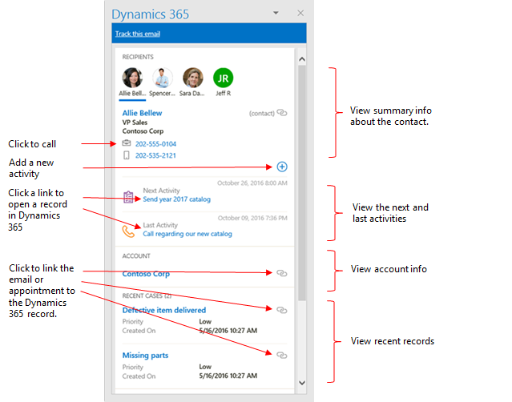
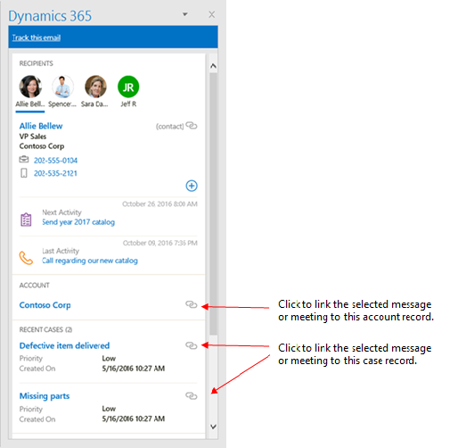
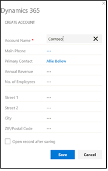
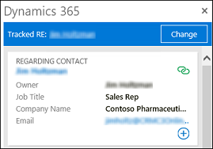
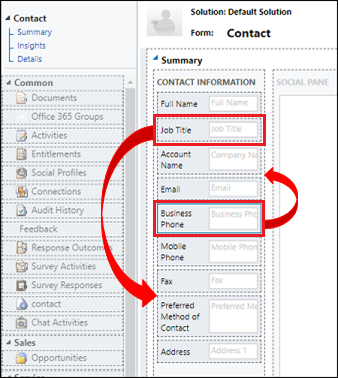
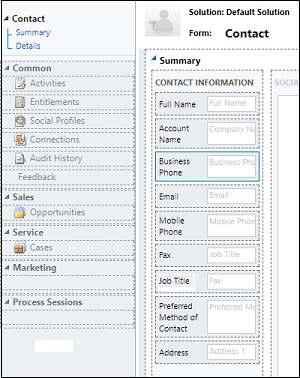
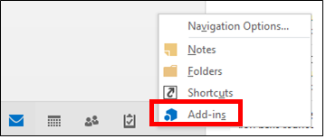
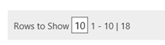
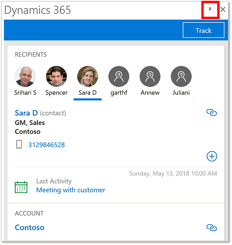

<!--from editor: This topic uses numerous "includes" files for Customer Engagement that need to be updated. Also, line 559 mentions a version of Dynamics 365 for Customer Engagement - what should that change to? Finally, there's an image (line 439, dynamics-365-app-outlook-contact-tracking-contact-card.png) that includes the name "James Bond" and "007". That needs to come out of the image - probably a trademark violation.  -->

# Dynamics 365 App for Outlook User's Guide, version 8.2 

Use [!INCLUDE[pn_ms_dyn_crm_app_for_outlook](../../includes/pn-ms-dyn-crm-app-for-outlook.md)] to tap the power of [!INCLUDE[pn_crm_shortest](../../includes/pn-crm-shortest.md)] while you’re using [!INCLUDE[pn_Outlook_short](../../includes/pn-outlook-short.md)] on the desktop, web, or phone. When  [!INCLUDE[pn_crm_app_for_outlook_short](../../includes/pn-crm-app-for-outlook-short.md)] is installed, depending on which version of  the app you have installed, you'll see a    **[!INCLUDE[pn_crm_shortest](../../includes/pn-crm-shortest.md)]** pane or window next to a selected [!INCLUDE[pn_Outlook_short](../../includes/pn-outlook-short.md)] email message, or when you're composing an email message or setting up a meeting or appointment.  
  
 For example, when you open an email message, view information from [!INCLUDE[pn_crm_shortest](../../includes/pn-crm-shortest.md)] about the email recipients. Or with a single click, link an [!INCLUDE[pn_Outlook_short](../../includes/pn-outlook-short.md)] email message or appointment to a specific [!INCLUDE[pn_crm_shortest](../../includes/pn-crm-shortest.md)] record. When you link an email message or appointment to a [!INCLUDE[pn_crm_shortest](../../includes/pn-crm-shortest.md)] record, the [!INCLUDE[pn_Outlook_short](../../includes/pn-outlook-short.md)] record appears as an activity for that record in [!INCLUDE[pn_crm_shortest](../../includes/pn-crm-shortest.md)].  
  
 [Watch a short video (1:35) about Dynamics 365 App for Outlook.](https://go.microsoft.com/fwlink/p/?linkid=829982)  
  
## Which version of the app do I have?  
 We made significant updates to the app in the [!INCLUDE[pn_crm_8_2_0_both](../../includes/pn-crm-8-2-0-both.md)]. If your screen looks like the following, you're using the version included in [!INCLUDE[pn_crm_8_2_0_both](../../includes/pn-crm-8-2-0-both.md)]:  
  
   
  
 Go to [User's Guide for the latest version (Dynamics 365 apps)](dynamics-365-app-outlook-user-s-guide-v8.md#Latest)  
  
 If your screen looks like the following, you're using the version included in [!INCLUDE[pn_crm_8_1_0_online_subsequent](../../includes/pn-crm-8-1-0-online-subsequent.md)] and [!INCLUDE[pn_crm_8_1_0_op](../../includes/pn-crm-8-1-0-op.md)]:  
  
   
  
 Go to [User's Guide for the previous version (Dynamics CRM)](dynamics-365-app-outlook-user-s-guide-v8.md#Previous)  

  
 
## User's Guide for the latest version (Dynamics 365 apps)  
 This section of this topic describes how to use the latest version of the app, available in [!INCLUDE[pn_crm_8_2_0_both](../../includes/pn-crm-8-2-0-both.md)].  
  
 **In this section:**  
  
  [What Dynamics 365 App for Outlook offers](dynamics-365-app-outlook-user-s-guide-v8.md#Overview)  
  
  [Prerequisites](dynamics-365-app-outlook-user-s-guide-v8.md#Prerequisites)  
  
  [Add the app to Outlook](dynamics-365-app-outlook-user-s-guide-v8.md#Install)  
  
  [Disable or remove the Outlook app](dynamics-365-app-outlook-user-s-guide-v8.md#Disable)  
  
  [Use the app for the first time](dynamics-365-app-outlook-user-s-guide-v8.md#Access)  
  
  [Link an email message or meeting to a specific Dynamics 365 apps record](dynamics-365-app-outlook-user-s-guide-v8.md#Track)  

  [Track signed S/MIME emails](dynamics-365-app-outlook-user-s-guide-v8.md#TrackSigned)  

  [Customize the track regarding card](dynamics-365-app-outlook-user-s-guide-v8.md#CustomizeCard)  

  [Add an email recipient as a contact or lead](dynamics-365-app-outlook-user-s-guide-v8.md#AddEmailRecipient)  
  
  [Compose an email message and link it to a Dynamics 365 apps record](dynamics-365-app-outlook-user-s-guide-v8.md#ComposeEmail)  
  
  [Monitor an email message after you send it](dynamics-365-app-outlook-user-s-guide-v8.md#EE)  
  
  [Add an email template when you create an email message](dynamics-365-app-outlook-user-s-guide-v8.md#Template)  
  
  [Add sales literature or a knowledge base article when you create an email message](dynamics-365-app-outlook-user-s-guide-v8.md#KB)  
  
  [Link an appointment to a specific Dynamics 365 apps record](dynamics-365-app-outlook-user-s-guide-v8.md#ComposeAppointment)  
  
  [Add a phone call, appointment, or task activity to Dynamics 365 apps](dynamics-365-app-outlook-user-s-guide-v8.md#Activity)  
  
  [Track Outlook contacts in Dynamics 365 apps](dynamics-365-app-outlook-user-s-guide-v8.md#Contacts)  

  [Add a pinnable task pane](dynamics-365-app-outlook-user-s-guide-v8.md#PinnableTaskpane)  
  
   

### What Dynamics 365 App for Outlook offers  
 With [!INCLUDE[pn_crm_app_for_outlook_short](../../includes/pn-crm-app-for-outlook-short.md)], you can:  
  
- View information about [!INCLUDE[pn_crm_shortest](../../includes/pn-crm-shortest.md)] contacts and leads while you’re working in [!INCLUDE[pn_Outlook_short](../../includes/pn-outlook-short.md)]. You can view this info in the context of an email message, meeting, or appointment. For example, view phone numbers, company name, last and next activities, and recent records from [!INCLUDE[pn_crm_shortest](../../includes/pn-crm-shortest.md)].  
  
- Link email messages, meetings, and appointments to a [!INCLUDE[pn_crm_shortest](../../includes/pn-crm-shortest.md)] record with a single click. For example, link an email message to a specific account, opportunity, or case.   [!INCLUDE[pn_crm_app_for_outlook_short](../../includes/pn-crm-app-for-outlook-short.md)] also supports custom entities.  
  
- Open [!INCLUDE[pn_crm_shortest](../../includes/pn-crm-shortest.md)] records directly to find or enter more detailed information.  
  
- Add a phone call, task, or appointment activity to [!INCLUDE[pn_crm_shortest](../../includes/pn-crm-shortest.md)].  
  
- Create a new [!INCLUDE[pn_crm_shortest](../../includes/pn-crm-shortest.md)] record for any entity (record type), as long as the entity has been enabled for mobile and for multi-entity search.  
  
- Add email templates, knowledge articles, and sales literature when you create an email message or set up a meeting.  
  
- Track [!INCLUDE[pn_Outlook_short](../../includes/pn-outlook-short.md)] contacts in [!INCLUDE[pn_crm_shortest](../../includes/pn-crm-shortest.md)].  
  
> [!TIP]
>  [!INCLUDE[pn_crm_app_for_outlook_short](../../includes/pn-crm-app-for-outlook-short.md)] is a [!INCLUDE[pn_MS_Office](../../includes/pn-ms-office.md)] add-in. As of the [!INCLUDE[pn_crm_8_2_0_both](../../includes/pn-crm-8-2-0-both.md)], [!INCLUDE[pn_crm_app_for_outlook_short](../../includes/pn-crm-app-for-outlook-short.md)] paired with [!INCLUDE[cc_server_side_synch](../../includes/cc-server-side-synch.md)] is the preferred way to use [!INCLUDE[pn_Outlook_short](../../includes/pn-outlook-short.md)] together with [!INCLUDE[pn_crm_shortest](../../includes/pn-crm-shortest.md)]. You may also be familiar with [!INCLUDE[pn_crm_for_outlook_short](../../includes/pn-crm-for-outlook-short.md)], which provides complete [!INCLUDE[pn_crm_shortest](../../includes/pn-crm-shortest.md)] capabilities (including offline capabilities) from [!INCLUDE[pn_Outlook_short](../../includes/pn-outlook-short.md)]. **Note that tracking activities is not supported when [!INCLUDE[pn_crm_app_for_outlook_short](../../includes/pn-crm-app-for-outlook-short.md)] and [!INCLUDE[pn_crm_for_outlook_short](../../includes/pn-crm-for-outlook-short.md)] are used together by the same user. Choose one or the other.** For more information about [!INCLUDE[pn_crm_for_outlook_short](../../includes/pn-crm-for-outlook-short.md)], see [Dynamics 365 for Outlook User's Guide](../../outlook-addin/user-guide/dynamics-365-outlook-user-s-guide.md).
  
   

### Prerequisites  
 Your [!INCLUDE[pn_crm_shortest](../../includes/pn-crm-shortest.md)] system administrator can make [!INCLUDE[pn_crm_app_for_outlook_short](../../includes/pn-crm-app-for-outlook-short.md)] available to your organization or you can add it yourself if:  
  
- You have the  **Use [!INCLUDE[pn_crm_app_for_outlook_short](../../includes/pn-crm-app-for-outlook-short.md)]** security privilege.  
  
- Your organization synchronizes mailboxes with server-side synchronization.  
  
  For more information, and for information on supported devices, browsers, and [!INCLUDE[pn_Outlook_short](../../includes/pn-outlook-short.md)] versions, see [Deploy Dynamics 365 App for Outlook (lightweight app)](/previous-versions/dynamicscrm-2016/administering-dynamics-365/dn946901(v=crm.8)).  
  
   

### Add the app to Outlook  
 After the prerequisites have been met, you can add the app directly from [!INCLUDE[pn_crm_shortest](../../includes/pn-crm-shortest.md)].  
  
1. Click the **Settings** button , and then click **Apps for [!INCLUDE[pn_crm_shortest](../../includes/pn-crm-shortest.md)]**.  
  
2. On the **Apps for [!INCLUDE[pn_crm_shortest](../../includes/pn-crm-shortest.md)]** page, under **[!INCLUDE[pn_crm_app_for_outlook_short](../../includes/pn-crm-app-for-outlook-short.md)]**, click **[!INCLUDE[pn_crm_app_for_outlook_short](../../includes/pn-crm-app-for-outlook-short.md)]**.  
  
   > [!NOTE]
   >  If you have trouble installing  the app, see the troubleshooting section in [TechNet: Deploy Dynamics 365 App for Outlook](/previous-versions/dynamicscrm-2016/administering-dynamics-365/dn946901(v=crm.8)).  
  
   

### Disable or remove the Outlook app  
  
1. In [!INCLUDE[pn_Outlook_short](../../includes/pn-outlook-short.md)], click **File**, and then click **Manage Add-ins**.  
  
      
  
    This opens the **Microsoft 365** dialog box where you can see all your [!INCLUDE[pn_Outlook_short](../../includes/pn-outlook-short.md)] add-ins. If you click the [!INCLUDE[pn_crm_shortest](../../includes/pn-crm-shortest.md)] row, you can see which [!INCLUDE[pn_crm_shortest](../../includes/pn-crm-shortest.md)] instance the app is connected to.  
  
2. Do one of the following:  
  
   - To disable the app, in the [!INCLUDE[pn_crm_shortest](../../includes/pn-crm-shortest.md)] row, clear the **Turned on** check box.  
  
   - To remove the app, select the [!INCLUDE[pn_crm_shortest](../../includes/pn-crm-shortest.md)] row, and then click the Minus button.  
  
   

### Use the app for the first time  
 To display [!INCLUDE[pn_crm_shortest](../../includes/pn-crm-shortest.md)] data after you’ve added the app:  
  
1. Select an existing email message in your Inbox, or create a new email message or appointment.  
  
2. On the ribbon, click the **[!INCLUDE[pn_crm_shortest](../../includes/pn-crm-shortest.md)]** button.  
  
      
  
    The **[!INCLUDE[pn_crm_shortest](../../includes/pn-crm-shortest.md)]** pane appears on the right side of the screen and shows information about the recipients.  
  
      
  
    **Notes:**  
  
   - If the recipient is a [!INCLUDE[pn_crm_shortest](../../includes/pn-crm-shortest.md)] user (as opposed to a contact or lead), it’s indicated next to their name:  
  
        
  
   - If the recipient isn’t known to [!INCLUDE[pn_crm_shortest](../../includes/pn-crm-shortest.md)], you can click **Add to [!INCLUDE[pn_crm_shortest](../../includes/pn-crm-shortest.md)]** to add them as a contact or lead.  
  
   

### Link an email message or meeting to a specific Dynamics 365 apps record  
 You can link an email message or meeting to a specific [!INCLUDE[pn_crm_shortest](../../includes/pn-crm-shortest.md)] record, such as an account, opportunity, or case, by clicking the **Set Regarding** button  . [!INCLUDE[pn_crm_shortest](../../includes/pn-crm-shortest.md)] automatically tracks the email or meeting, and links it to the record indicated in the **[!INCLUDE[pn_crm_shortest](../../includes/pn-crm-shortest.md)]** pane.  
  
   
  
#### To find a different record to link to:  
  
1. Click **Track this email** at the top of the **[!INCLUDE[pn_crm_shortest](../../includes/pn-crm-shortest.md)]** pane.  
  
2. Do one of the following:  
  
   - Click the record you want to link to in the list of **Pinned Records** or **Recently Used Records**.  
  
        
  
     > [!TIP]
     >  This is the same list of pinned and mostly recently used records you see in the [!INCLUDE[pn_crm_shortest](../../includes/pn-crm-shortest.md)] apps or Dynamics CRM web client.  
  
   - If you don’t see the record you’re looking for, enter a keyword in the search box, and then click the magnifying glass.  
  
#### To create a new record and link it to a Dynamics 365 apps record:  
  
1.  Click **New**, and then select the type of record you want to create.  
  
       
  
2.  Fill in the information in the form.  
  
       
  
3.  If you want, click the **Open record after saving** check box.  
  
4.  Click **Save**.  
  
#### To untrack or change the regarding record:  
  
- Click **Change** at the top of the **[!INCLUDE[pn_crm_shortest](../../includes/pn-crm-shortest.md)]** pane.  

    
 
### Track signed S/MIME emails
Dynamics 365 App for Outlook can track [S/MIME signed emails](/previous-versions/tn-archive/aa995740(v=exchg.65)) in Outlook Desktop and Outlook Web App (OWA). This is enabled on [Click-to-Run](/previous-versions/office/jj219427(v=office.15)) Outlook 2016 build 16.0.8730.1000 or later. To determine your Outlook version, go to **File** > **Office Account** > **About Outlook**.

    

### Customize the track regarding card
The admin can change what's displayed in the card that appears when you track the regarding email. For example, you might want to replace **Job Title** with **Business Phone** in the Contact card.

To change the fields that appear, follow these steps:

1. In Microsoft Dynamics 365 apps, go to **Settings** > **Customizations** > **Customize the System**.
2. Expand **Entities** and choose an entity such as **Contact**.
3. Expand the entity and select **Forms**, then select the **Contact** form.

   

4. Drag **Business Phone** below **Account Name**. Drag **Job Title** below **Mobile Phone**.

   

   

   > [!NOTE]
   > The first four fields appear in the track regarding card.

5. Choose **Save**, **Publish**, and then close the form editor.

6. On the solution page, choose **Components** > **Prepare Client Customizations**.   

   

7. Close the solutions page.

After completing the above, right-click in the track regarding card, and then select **Reload**. It might take some time for the synchronization to complete and the change to appear.

 
The business phone number replaces job title in the Contact card.

   

### Add an email recipient as a contact or lead
One of the first things you might want to do when you receive a customer email, is add the person as a contact or lead to Dynamics 365 apps. In the Dynamics 365 apps pane, click (+) and then select **Contact** or **Lead**.

> [!NOTE]
> If the sender of the email is unknown to Dynamics 365 apps, when you add the contact or lead, the email is automatically tracked in Dynamics 365 apps and set regarding this contact or lead. To stop tracking, you can manually untrack the regarding email.

   

### Compose an email message and link it to a Dynamics 365 apps record  
  
1. Create an email message as you normally would in [!INCLUDE[pn_Outlook_short](../../includes/pn-outlook-short.md)].  
  
2. Click the **[!INCLUDE[pn_crm_shortest](../../includes/pn-crm-shortest.md)]** button on the ribbon.  
  
3. Do one of the following:  
  
   - Click a **Set Regarding** button   for a particular record in the **[!INCLUDE[pn_crm_shortest](../../includes/pn-crm-shortest.md)]** pane.  
  
   - To find a different record, click **Track this email** at the top of the **[!INCLUDE[pn_crm_shortest](../../includes/pn-crm-shortest.md)]** pane as described earlier in this topic.  
  
   - To create a new record and link it at the same time, click **New**.  
  
4. If you select a different email message in your Inbox or add people to the **To**, **Cc**, or **Bcc** line, the list of recipients will be automatically refreshed in a few seconds.  
  
   

### Monitor an email message after you send it  
 You can monitor an email message after you send it to see the number of times that the message is viewed, opened, replied to, or forwarded. For a monitored email message, you can also see the last activity related to the email message, or view all activity related to the message.  
  
#### To monitor an email message  
  
1. Create an email message as you normally would in [!INCLUDE[pn_Outlook_short](../../includes/pn-outlook-short.md)].  
  
2. Track the email message or link it to a record in [!INCLUDE[pn_crm_shortest](../../includes/pn-crm-shortest.md)]. You can’t monitor an email message unless you track it or link it (set a regarding record).  
  
3. In the **[!INCLUDE[pn_crm_shortest](../../includes/pn-crm-shortest.md)]** pane, click **Follow**, and then click **Follow this email**.  
  
      
  
   > [!NOTE]
   >  Any recipients that can’t be followed will be displayed at the bottom of the **[!INCLUDE[pn_crm_shortest](../../includes/pn-crm-shortest.md)]** pane.  
  
4. Send the message in [!INCLUDE[pn_Outlook_short](../../includes/pn-outlook-short.md)].  
  
   > [!IMPORTANT]
   >  Do not edit the email message or change the recipients after you follow it. If you edit an email message after it’s followed, you may inadvertently delete the monitoring information or you may inadvertently add recipients who shouldn’t be followed.  
  
#### To remove the monitoring for an email message  
  
1.  Select the monitored email message.  
  
2.  Click **Unfollow**.  
  
   
### Add an email template when you create an email message  
 If you frequently send the same type of email, you can save time by using an email template. When you use an email template, [!INCLUDE[pn_dyn_365_app_outlook](../../includes/pn-dyn-365-app-outlook.md)] automatically inserts the [!INCLUDE[pn_crm_shortest](../../includes/pn-crm-shortest.md)] information such as contacts or set regarding information in the email message.  
  
 For example, you could use a Thank you template to save time whenever you want to send a thank you message to a customer.  
  
   
  
> [!NOTE]
>  You must have the appropriate permissions to add email templates.  
  
#### To add an email template:  
  
1. Create an email message as you normally would in [!INCLUDE[pn_Outlook_short](../../includes/pn-outlook-short.md)].  
  
2. At the top of the **[!INCLUDE[pn_crm_shortest](../../includes/pn-crm-shortest.md)]** pane, click **Templates**.  
  
      
  
3. In the **Template Regarding** list, select an option  
  
4. Select the template you want, and then click **Add to Email**.  
  
      
  
    For information on creating email templates in [!INCLUDE[pn_crm_shortest](../../includes/pn-crm-shortest.md)], see [Create templates for email](/power-platform/admin/create-templates-email).  
  
   

### Add sales literature or a knowledge base article when you create an email message  
 When you're working with a customer, you may want to send them some sales literature or a knowledge base article.  
  
> [!NOTE]
>  You must have the appropriate permissions to add sales literature or knowledge base articles to an email message.  
  
1. Start by creating an email message as you normally would in [!INCLUDE[pn_Outlook_short](../../includes/pn-outlook-short.md)].  
  
2. At the top of the **[!INCLUDE[pn_crm_shortest](../../includes/pn-crm-shortest.md)]** pane, click **Sales Lit** or **Articles**.  
  
      
  
3. Drill down in the tree structure, and then select the appropriate literature or article.  
  
4. Click **Add to Email**.  
  
  
 
### Link an appointment to a specific Dynamics 365 apps record  
  
1. Create the appointment as you normally would in [!INCLUDE[pn_Outlook_short](../../includes/pn-outlook-short.md)].  
  
2. Click the **[!INCLUDE[pn_crm_shortest](../../includes/pn-crm-shortest.md)]** button on the ribbon.  
  
3. Do one of the following:  
  
   - Click a **Set Regarding** button   for a particular record in the **[!INCLUDE[pn_crm_shortest](../../includes/pn-crm-shortest.md)]** pane.  
  
   - To find a different record, click **Track**  at the top of the **[!INCLUDE[pn_crm_shortest](../../includes/pn-crm-shortest.md)]** pane.  
  
       
  
   

### Add a phone call, appointment, or task activity to Dynamics 365 apps  
  
-   Click the **Plus sign**, and then select the type of activity you want to create.  
  
       
  
-   Fill in the information in the form.  
  
       
  
-   If you want, click the **Open record after saving** check box.  
  
-   Click **Save**.  
  
   

### Track Outlook contacts in Dynamics 365 apps  
 You can track [!INCLUDE[pn_Outlook_short](../../includes/pn-outlook-short.md)] contacts in [!INCLUDE[pn_crm_shortest](../../includes/pn-crm-shortest.md)] by using the [!INCLUDE[pn_crm_shortest](../../includes/pn-crm-shortest.md)] add-in, an [!INCLUDE[pn_Outlook_short](../../includes/pn-outlook-short.md)] solution module.   The add-in is automatically installed when you install [!INCLUDE[pn_crm_app_for_outlook_short](../../includes/pn-crm-app-for-outlook-short.md)]. You can access it as described below.  
  
> [!NOTE]
>  [Delegated users](https://support.office.com/article/Allow-someone-else-to-manage-your-mail-and-calendar-9684B670-7588-4EEA-8717-9E5799047540) can not use [!INCLUDE[pn_crm_app_for_outlook_short](../../includes/pn-crm-app-for-outlook-short.md)] to track emails. We suggest using [folder-level tracking or automatic tracking](https://www.microsoft.com/dynamics/crm-customer-center/overview-of-tracking-records-in-dynamics-365-for-outlook.aspx) for delegated users.  
  
 Using the add-in, you can:  
  
- View a list of [!INCLUDE[pn_MS_Office](../../includes/pn-ms-office.md)] contacts or [!INCLUDE[pn_crm_shortest](../../includes/pn-crm-shortest.md)] contacts, and see which contacts are tracked  
  
- Link contacts to accounts in [!INCLUDE[pn_crm_shortest](../../includes/pn-crm-shortest.md)]  
  
- Open the [!INCLUDE[pn_crm_shortest](../../includes/pn-crm-shortest.md)] contact or account record with a single click  
  
  When the [!INCLUDE[pn_crm_shortest](../../includes/pn-crm-shortest.md)] add-in is installed, you’ll see a new <strong>[!INCLUDE[pn_crm_shortest](../../includes/pn-crm-shortest.md)]</strong>tab on the [!INCLUDE[pn_Outlook_short](../../includes/pn-outlook-short.md)] ribbon. Click the tab to see information about contacts.  
  
    
  
1. Click to see all your [!INCLUDE[pn_Outlook_short](../../includes/pn-outlook-short.md)] contacts (contacts displayed in your default contacts view in [!INCLUDE[pn_crm_shortest](../../includes/pn-crm-shortest.md)]).  
  
2. Click to see all your [!INCLUDE[pn_crm_shortest](../../includes/pn-crm-shortest.md)] contacts.  
  
3. See whether a contact is tracked or not, or whether tracking status is pending.  
  
4. Open a [!INCLUDE[pn_crm_shortest](../../includes/pn-crm-shortest.md)] account record.  
  
5. Click to call.  
  
6. Click to email.  
  
> [!NOTE]
>  To use the add-in your admin must enable your [!INCLUDE[pn_crm_shortest](../../includes/pn-crm-shortest.md)] mailbox for appointments, contacts, and tasks.  
  
#### Access the add-in  
  
1. Click  the **More information** button (three dots) in the lower-left corner of the [!INCLUDE[pn_Outlook_short](../../includes/pn-outlook-short.md)] window.  
  
2. Click **Add-ins**.  
  
      
  
3. Select the **Dynamics 365 apps** add-in.  
  
#### See the Dynamics 365 apps contact card for a contact  
  
1.  In the contacts list, select the check box next to the contact. The contact details appear on the right side of the screen.  
  
       
  
#### Track or untrack a contact  
  
1. Click the **[!INCLUDE[pn_Outlook_short](../../includes/pn-outlook-short.md)] Contacts** tab.  
  
2. In the contacts list, select the check box next to the appropriate contact(s).  
  
3. On the ribbon, click **Track** or **Untrack**.  
  
      
  
   > [!IMPORTANT]
   >  Do not navigate outside the page while tracking or untracking the contact. Otherwise, it won’t be tracked or untracked.  
  
#### Link a contact to an account or change the account that a contact is linked to  
  
1. Click the **[!INCLUDE[pn_Outlook_short](../../includes/pn-outlook-short.md)] Contacts** tab.  
  
   > [!NOTE]
   >  You can’t select a contact listed under the **[!INCLUDE[pn_crm_shortest](../../includes/pn-crm-shortest.md)] Contacts** tab.  
  
2. In the contacts list, select the check box next to the appropriate contact.  
  
3. On the ribbon, click **Link**.  
  
4. Do one of the following:  
  
   - On the right side of the screen, select the account to link to, and then click **Link** at the bottom of the screen.  
  
     -Or-  
  
   1.  To create a new account, on the right side of the screen, click **New** at the bottom of the screen.  
  
   2.  Enter the new account name.  
  
   3.  Click **Save**.  
  
   4.  Click the **Refresh** button.  
  
   > [!NOTE]
   >  If the contact isn’t already tracked, the contact will be tracked immediately and will be linked to the account. If the contract isn’t already tracked, the account record will be synchronized in the next synchronization cycle.  
  
#### Send email or schedule an appointment  
  
1. Click  the **[!INCLUDE[pn_crm_shortest](../../includes/pn-crm-shortest.md)] Contacts** tab, or the **Outlook Contacts** tab, and then select the check box next to the appropriate contact(s).  
  
2. On the ribbon, click **Email** or **Appointment**.  
  
    Regardless of which tab you selected in step 1, the email, task, or appointment will be sent from [!INCLUDE[pn_MS_Outlook_Short](../../includes/pn-ms-outlook-short.md)], not [!INCLUDE[pn_crm_shortest](../../includes/pn-crm-shortest.md)].  
  
#### Search for a contact  
  
-   Enter a value in the Search box. You can search for data stored in the **Full name**, **Company**, **Department**, and **Business address** fields. You can’t search for data stored in the **Tracking** status, **Business phone**, or **Email** fields.  
  
#### Filter by all contacts, tracked contacts, or untracked contacts  
  
1.  Click the arrow next to the view drop-down.  
  
2.  Select the view you want.  
  
       
  
#### Filter contacts by column (field)  
  
1.  Click the **Filter** button .  
  
2.  Enter the text you want to filter on in the appropriate field(s).  
  
       
  
3.  Press Enter.  
  
4.  To clear the filter fields, click the **Filter** button again.  
  
    > [!NOTE]
    >  You can filter on the **Full name**, **Title**, **Company**, **Department**, and **Business address** fields. You can’t filter on the **Tracking** status, **Business phone**, or **Email** fields.  
  
#### Add or remove columns  
  
1.  Click the **Settings** button .  
  
2.  Select or clear the check boxes for the columns you want to add or remove.  
  
    > [!NOTE]
    >  You can’t remove the **Tracking** column.  
  
3.  Click the **Settings** button  again to hide the list of columns.  
  
#### Move columns  
  
-   Select the column you want to move, and then drag it to a new location.  
  
    > [!NOTE]
    >  You can’t move the **Status** column.  
  
#### Sort data  
  
-   To sort the data in ascending order, click the column heading. To change the sort order to descending, click the column heading again.  
  
    > [!NOTE]
    >  You can sort on the **Full name**, **Company**, **Department**, and **Business address** fields.  
  
#### Show the latest data  
  
-   Click the **Refresh** button .  
  
#### Set the number of records you see on the screen  
  
-   Enter the number you want at the bottom of the screen.  
  
       
 
   

### Experience App for Outlook as a pinnable taskpane
Dynamics 365 App for Outlook, version 8.2 is now available as a pinnable task pane in Outlook Desktop 2016 for Windows. If you're running Outlook 2016 for Windows (build 7668.2000 or later), Dynamics 365 App for Outlook will appear as a pinnable vertical task pane to the right of an open email message in Outlook.

.  

With Dynamics 365 App for Outlook in pinned mode, you can select an email message and view all the relevant Dynamics 365 apps details for the selected email, without having to choose the Dynamics 365 apps ribbon icon on every email. You can browse through your email list by selecting email messages to read and App for Outlook will always display the details related to the current selected email. This capability is available on Dynamics 365 for Customer Engagement, version 8.2.2.1458 or later. For more information, see [Implement a pinnable taskpane in Outlook](/outlook/add-ins/pinnable-taskpane).

 > [!NOTE]
 >  If you are version 8.2.2.1458 or higher and do not see the option to pin App in Outlook Desktop 2016 for Windows, you may need to redeploy the App. To redeploy the App, please navigate to Dynamics 365 App for Outlook under Settings. On this page, select **ADD APP FOR ALL ELIGIBLE USERS** option on top of the user grid. You can also choose to change the view to **Eligible Users with the App**, then select the users from the grid and choose **ADD APP TO OUTLOOK**. This will redeploy App for Outlook to the selected eligible users.
 
   
## User's Guide for the previous version (Dynamics CRM)  
 This section of this topic describes how to use the version of the app provided in [!INCLUDE[pn_crm_8_1_0_online_subsequent](../../includes/pn-crm-8-1-0-online-subsequent.md)] and [!INCLUDE[pn_crm_8_1_0_op](../../includes/pn-crm-8-1-0-op.md)].  
  
 **In this section:**  
  
  [What Dynamics 365 App for Outlook offers](dynamics-365-app-outlook-user-s-guide-v8.md#Overview2)  
  
  [Prerequisites for adding and using Dynamics 365 App for Outlook](dynamics-365-app-outlook-user-s-guide-v8.md#Prerequisites2)  
  
  [Add the app to Outlook](dynamics-365-app-outlook-user-s-guide-v8.md#Install2)  
  
  [Use the app for the first time](dynamics-365-app-outlook-user-s-guide-v8.md#Access)  
  
  [Track an incoming email message from an unknown sender](dynamics-365-app-outlook-user-s-guide-v8.md#Track2)  
  
  [Create an email message, and then track it](dynamics-365-app-outlook-user-s-guide-v8.md#Compose)  
  
  [Preview information about a sender that’s already stored in Dynamics 365 apps as a lead or contact](dynamics-365-app-outlook-user-s-guide-v8.md#Preview)  
  
  [Change the regarding record for a tracked email message](dynamics-365-app-outlook-user-s-guide-v8.md#ChangeRegarding)  
  
  [Open a Dynamics 365 apps record from Dynamics 365 App for Outlook](dynamics-365-app-outlook-user-s-guide-v8.md#OpenRecord)  
  
   
### What Dynamics 365 App for Outlook offers  
 [!INCLUDE[pn_ms_dyn_crm_app_for_outlook](../../includes/pn-ms-dyn-crm-app-for-outlook.md)] included in [!INCLUDE[pn_crm_8_1_0_online_subsequent](../../includes/pn-crm-8-1-0-online-subsequent.md)] and [!INCLUDE[pn_crm_8_1_0_op](../../includes/pn-crm-8-1-0-op.md)] is a lightweight  app you can use to view              [!INCLUDE[pn_crm_shortest](../../includes/pn-crm-shortest.md)] information and track email from within              [!INCLUDE[pn_Outlook_short](../../includes/pn-outlook-short.md)]. The              [!INCLUDE[pn_crm_shortest](../../includes/pn-crm-shortest.md)] data appears right in your              [!INCLUDE[pn_Outlook_short](../../includes/pn-outlook-short.md)] Inbox.  
  
 With                  [!INCLUDE[pn_crm_app_for_outlook_short](../../includes/pn-crm-app-for-outlook-short.md)], you can:  
  
- Tap the power of                          [!INCLUDE[pn_crm_shortest](../../includes/pn-crm-shortest.md)] while working in the familiar                          [!INCLUDE[pn_Outlook_short](../../includes/pn-outlook-short.md)] environment.  
  
- Track incoming or outgoing email wherever you are, as long as you have access to a browser.  
  
- Track email or view                          [!INCLUDE[pn_crm_shortest](../../includes/pn-crm-shortest.md)] data from a desktop computer or phone.  
  
- Link an incoming or outgoing email record to an existing record in                          [!INCLUDE[pn_crm_shortest](../../includes/pn-crm-shortest.md)]. For example, you might want to link an email message to a specific account or opportunity.  
  
- Convert an email message into a new                          [!INCLUDE[pn_crm_shortest](../../includes/pn-crm-shortest.md)] record.  
  
- Find out whether an email message is already tracked, and change the regarding record (the                          [!INCLUDE[pn_crm_shortest](../../includes/pn-crm-shortest.md)] record the message is linked to).  
  
- Create                          [!INCLUDE[pn_crm_shortest](../../includes/pn-crm-shortest.md)] contact records for people on the                          **From** list that aren’t already included in the                          [!INCLUDE[pn_crm_shortest](../../includes/pn-crm-shortest.md)] database. You can also create new                          [!INCLUDE[pn_crm_shortest](../../includes/pn-crm-shortest.md)] records for any entity (record type), as long as the entity has been enabled for mobile and for multi-entity search.  
  
- Preview information about contacts and leads stored in                          [!INCLUDE[pn_crm_shortest](../../includes/pn-crm-shortest.md)]. For example, you can find a phone number or company name for a contact or lead, or preview the last and next activities for a contact or lead.  
  
- Open                          [!INCLUDE[pn_crm_shortest](../../includes/pn-crm-shortest.md)] records directly to find or enter more detailed information.  
  
   
### Prerequisites for adding and using Dynamics 365 App for Outlook  
 Your                  [!INCLUDE[pn_crm_shortest](../../includes/pn-crm-shortest.md)] system administrator can deploy                  [!INCLUDE[pn_crm_app_for_outlook_short](../../includes/pn-crm-app-for-outlook-short.md)] to your organization or you can add it yourself as long as you have the required security privileges (the                  **Use Dynamics 365 App for Outlook** privilege) and if your organization synchronizes incoming email with                  [!INCLUDE[cc_server_side_synch](../../includes/cc-server-side-synch.md)]. The system will let you know if these prerequisites have not been met when you attempt to add the app. If you’re an admin, and you want to learn about deploying the app, see                  [Deploy Dynamics 365 App for Outlook (lightweight app)](/previous-versions/dynamicscrm-2016/administering-dynamics-365/dn946901(v=crm.8)).  
  
   
### Add the app to Outlook  
 After the prerequisites have been met, you can add the app directly from                  [!INCLUDE[pn_crm_shortest](../../includes/pn-crm-shortest.md)].  
  
1. Click the                                  **Settings** button                                  , and then click                                  **Apps for Dynamics 365 apps**.  
  
2. On the                                  **Apps for Dynamics 365 apps** page, under                                  **[!INCLUDE[pn_crm_app_for_outlook_short](../../includes/pn-crm-app-for-outlook-short.md)]**, click                                  **Add app to Outlook**.  
  
   
### Access the app for the first time  
 Once the app is installed, it appears as a                  **Dynamics**  **[!INCLUDE[pn_crm_shortest](../../includes/pn-crm-shortest.md)]** tab in the                  [!INCLUDE[pn_Outlook_short](../../includes/pn-outlook-short.md)] reading pane. Just click the tab to access your                  [!INCLUDE[pn_crm_shortest](../../includes/pn-crm-shortest.md)] data.  
  
   
  
 If you don’t see the                  **Dynamics**    **[!INCLUDE[pn_crm_shortest](../../includes/pn-crm-shortest.md)]** tab, you need to enable the app.  
  
**If you’re using desktop**    **[!INCLUDE[pn_Outlook_short](../../includes/pn-outlook-short.md)]:**  
  
1. Click                          **File > Manage Apps**.  
  
2. Sign in, click                          **General > Manage add-ins**, and then select the check box for                          **Dynamics**       **[!INCLUDE[pn_crm_shortest](../../includes/pn-crm-shortest.md)]**.  
  
**If you’re using**      **[!INCLUDE[pn_outlook_web_app](../../includes/pn-outlook-web-app.md)]:**  
  
3. Click the                          **Settings** button                          ** > Manage add-ins**.  
  
4. Click                          **General > Manage add-ins**, and then select the                          **Turned on** check box for                          **Dynamics**       **[!INCLUDE[pn_crm_shortest](../../includes/pn-crm-shortest.md)]**.  
  
     
  
   
### Track an incoming email message from an unknown sender  
  
1. Select the email message in your Inbox, and then click the **Dynamics**  **[!INCLUDE[pn_crm_shortest](../../includes/pn-crm-shortest.md)]** tab.  
  
    When an email message is from an unknown sender (the sender isn’t already a contact or lead in                                  [!INCLUDE[pn_crm_shortest](../../includes/pn-crm-shortest.md)]), you’ll see the following screen:  
  
      
  
2. Click                                  **Create new contact**.  
  
3. The                                  **First Name**,                                  **Last Name**, and                                  **Email** fields are already filled in for you. The                                  **Phone Number** field will be filled in if it’s available.  
  
    In the                                  **Create Contact** form, fill in other fields (as much or as little as you like), and then click                                  **Save** when you’re done entering info, or click                                  **Edit** to open the                                  [!INCLUDE[pn_crm_shortest](../../includes/pn-crm-shortest.md)] contact form to enter more details.  
  
      
  
   > [!NOTE]
   >  If you want to enter information for a lead instead of a contact, don’t fill in any information in the                                      **Create Contact** form. You can track the email regarding a new lead instead, as described below.  
  
    When you click                                  **Save** in the                                  **Create Contact** form, the app displays contact card information, as well as empty sections for                                  **Next Activity**,                                  **Last Activity**, and the first two lists on the contact form. By default, these lists are                                  **Case Associated View** and                                  **Opportunity Associated View**. These sections are empty because the contact doesn’t have any related records in                                  [!INCLUDE[pn_crm_shortest](../../includes/pn-crm-shortest.md)] yet.  
  
      
  
4. To track the email, click                                  **Track**.  
  
      
  
5. Do one of the following:  
  
   - If you don’t want to link the email message to an existing                                          [!INCLUDE[pn_crm_shortest](../../includes/pn-crm-shortest.md)] record, click                                          **Or, track without setting a regarding record**.  
  
        
  
   - To link the email message to an existing record in                                          [!INCLUDE[pn_crm_shortest](../../includes/pn-crm-shortest.md)], in the search box, enter a keyword (for example, a company name), click                                          **Lookup**, and then select one of the records in the resulting list.  
  
        
  
      When you select a record, the record appears next to                                          **To be tracked regarding**. To open the record in                                          [!INCLUDE[pn_crm_shortest](../../includes/pn-crm-shortest.md)], click the link.  
  
        
  
     > [!NOTE]
     >  When you click                                              **Track**, tracking with                                              [!INCLUDE[pn_crm_shortest](../../includes/pn-crm-shortest.md)] should take place right away. If syncing doesn’t occur after a few minutes, ask your administrator to verify that server-side synchronization is working for sending email from                                              [!INCLUDE[pn_crm_shortest](../../includes/pn-crm-shortest.md)].  
  
   - To create a new record in                                          [!INCLUDE[pn_crm_shortest](../../includes/pn-crm-shortest.md)] (for example, to create a lead record instead of a contact record) and link it to the email activity record:  
  
     1. Click                                                  **New** button") next to any enabled entity.  
  
     2. In the quick create form, fill out the fields.  
  
     3. Click                                                  **Save** to save the record if you’re done adding information. To enter more detailed information, click **Save and edit in** **[!INCLUDE[pn_crm_shortest](../../includes/pn-crm-shortest.md)]**.  
  
     > [!NOTE]
     >  The entities shown on the tracking page have been enabled for mobile and enabled for multi-entity search. For more information on enabling entities, see                                              [TechNet: Entities and Dynamics 365 apps for phones and Dynamics 365 apps for tablets](/previous-versions/dynamicscrm-2016/administering-dynamics-365/dn531128(v=crm.8)#BKMK_PhoneEntities).  
  
   
### Create an email message, and then track it  
 You can also track outgoing email. When you create an email message, the                  **Dynamics**    **[!INCLUDE[pn_crm_shortest](../../includes/pn-crm-shortest.md)]** pane appears on the right side of the screen.  
  
> [!NOTE]
>  Tracking email in compose mode is temporarily unavailable for                      [!INCLUDE[pn_ms_outlook_2013_short](../../includes/pn-ms-outlook-2013-short.md)] or                      [!INCLUDE[pn_outlook_2016](../../includes/pn-outlook-2016.md)].                  For more information, see [Can’t track emails in CRM App for Outlook](https://support.microsoft.com/help/3163174/can-t-track-emails-in-crm-app-for-outlook).  
> 
>  [Delegated users](https://support.office.com/article/Allow-someone-else-to-manage-your-mail-and-calendar-9684B670-7588-4EEA-8717-9E5799047540) can not use [!INCLUDE[pn_crm_app_for_outlook_short](../../includes/pn-crm-app-for-outlook-short.md)] to track emails. We suggest using [folder-level tracking or automatic tracking](https://www.microsoft.com/dynamics/crm-customer-center/overview-of-tracking-records-in-dynamics-365-for-outlook.aspx) for delegated users.  
  
##### Track an email message that you create  
  
1. Click                                  **Track this email?** at the top of the                                  **Dynamics**      **[!INCLUDE[pn_crm_shortest](../../includes/pn-crm-shortest.md)]** pane.  
  
2. If the name you enter on the                                  **To** or                                  **CC** line doesn’t match a contact record in the Dynamics 365 apps database, click                                  **Create new contact** to create a contact record in                                  [!INCLUDE[pn_crm_shortest](../../includes/pn-crm-shortest.md)].  
  
   
### Preview information about a sender that’s already stored in Dynamics 365 apps as a lead or contact  
  
- Select the email message in your Inbox, and then click the                          **Dynamics**      **[!INCLUDE[pn_crm_shortest](../../includes/pn-crm-shortest.md)]** tab.  
  
   The information you’ll see includes:  
  
  -   Contact information about the person (lead or contact) the email message is from  
  
  -   Next and last activities  
  
  -   Other related records, which include records from lists on the associated entity’s main form  
  
  > [!NOTE]
  >  The related records you see may vary based on whether your system has been customized.                              [!INCLUDE[pn_crm_app_for_outlook_short](../../includes/pn-crm-app-for-outlook-short.md)] displays two records from each view. If you want to see all records related to a contact or lead, click the contact or lead name in the contact card.  
  
     
  
   
### Change the regarding record for a tracked email message  
  
1. Open the email message, and then click the                                  **Dynamics**       **[!INCLUDE[pn_crm_shortest](../../includes/pn-crm-shortest.md)]** tab.  
  
2. Click                                  **Change**.  
  
      
  
3. Do one of the following:  
  
   - To untrack the record, click                                                                                   **Or track without setting a regarding record**.  
  
   - To select a different                                          [!INCLUDE[pn_crm_shortest](../../includes/pn-crm-shortest.md)] record, enter a keyword (for example, a company name) in the search box, click                                          **Lookup**, and then select a record from the results list.  
  
   - To create a new record in                                          [!INCLUDE[pn_crm_shortest](../../includes/pn-crm-shortest.md)] and link it to the email activity record:  
  
     1. Click                                                  **New** button") next to any enabled entity.  
  
     2. In the quick create form, fill out the fields.  
  
     3. Click                                                  **Save** to save the record if you’re done adding information. To enter more detailed information, click                                                  **Save and edit in**   
         **[!INCLUDE[pn_crm_shortest](../../includes/pn-crm-shortest.md)]**.  
  
   
### Open a Dynamics 365 apps record from Dynamics 365 App for Outlook  
 You can open                  [!INCLUDE[pn_crm_shortest](../../includes/pn-crm-shortest.md)] forms directly for contacts and other records. To open                  [!INCLUDE[pn_crm_shortest](../../includes/pn-crm-shortest.md)] records, click any of the following links:  
  
-   The name of the lead or contact  
  
-   The                          **Pop Out** button                            
  
-   The name of the regarding record (once the email has been tracked)  
  
-   Any record or activity tile  
  

[!INCLUDE[footer-include](../../includes/footer-banner.md)]