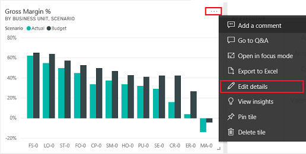
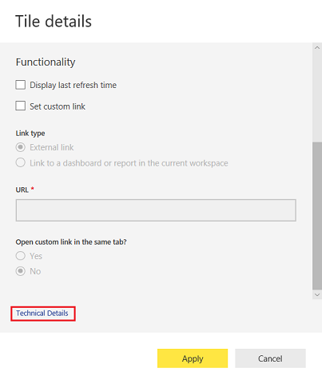
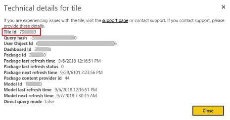

# Add a Power BI report or dashboard to a webpage in portal

You can add a Power BI report or dashboard to a webpage in portal by using the [powerbi](dynamics-entity-tags.md#powerbi) Liquid tag. You can add the tag in the Copy field on a web page or in the Source field on a web template.

For example: 

```
```

> [!NOTE]
> Before adding the secure Power BI report or dashboard to a webpage in portal, you must share it with the required users. More information: [Share Power BI workspace](https://docs.microsoft.com/en-us/power-bi/service-how-to-collaborate-distribute-dashboards-reports#collaborate-with-coworkers-in-an-app-workspace) and [Share Power BI dashboard and report](https://docs.microsoft.com/en-us/power-bi/service-share-dashboards).

## Get the path of a dashboard or report

1.	Sign in to [Power BI](https://powerbi.microsoft.com/).

2.	Open the dashboard or report you want to embed in your portal.

3.	Copy URL from the address bar.

    > [!div class="mx-imgBorder"]
    > 

## Get the ID of a dashboard tile

1.	Sign in to [Power BI](https://powerbi.microsoft.com/).

2.	Open the dashboard from which you want to embed a tile in your portal.

3.	Point to the tile, select **More options**, and then select **Edit details**.

    > [!div class="mx-imgBorder"]
    > 

4.	In the Tile details pane, select **Technical details**.

    > [!div class="mx-imgBorder"]
    > 

5.	Copy the tile ID.

    > [!div class="mx-imgBorder"]
    > 


