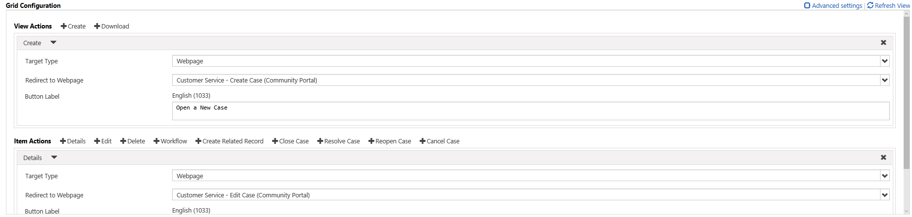
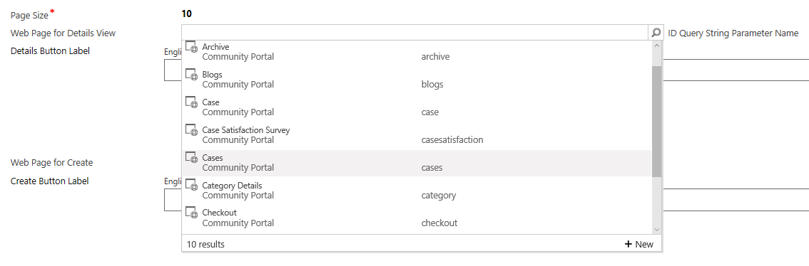
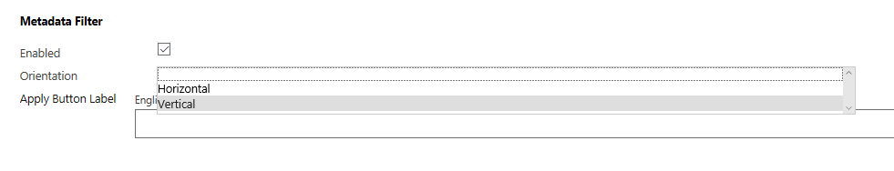
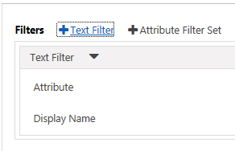
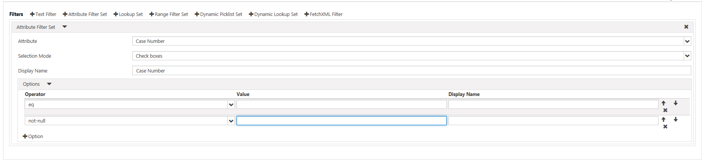
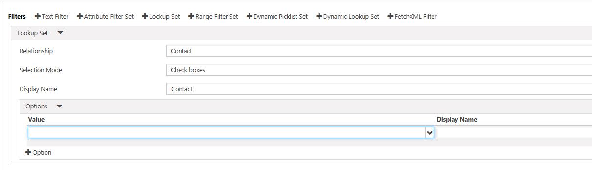
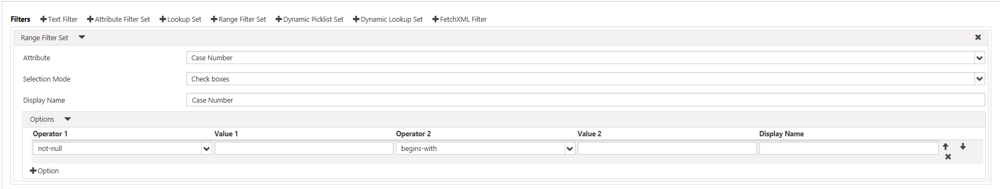
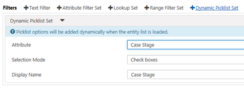
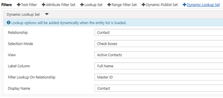
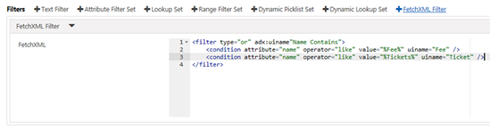

# Add a webpage to render a list of records
Entity List is a data-driven configuration that provides you with the ability to add a webpage that will render a list of records without the need for a developer to surface the grid in the portal. Using Entity List, you can expose [!INCLUDE[pn-dynamics-crm](../includes/pn-dynamics-crm.md)] records for display on portals.

The grid supports sorting and will be paginated if the number of records is larger than the Page Size specified. If the Web Page for Details View has been specified, each record will contain a link to the page and the ID of the record will be appended to the Query String along with the ID Query String Parameter Name. The Entity List also supports multiple views. If more than one view has been specified, a drop-down will rendered to allow the user to toggle between the various views.

The data can also be filtered by the current portal user, the current portal user's Parent Customer, and the current portal website. If a value exists for both filter conditions Portal User Attribute and Account Attribute, the portal will render a drop-down to allow the user to view 'My' data or his/her Parent Customer account's data.

## Add an entity list to your portal

The Entity List contains relationships to webpages and various properties in order to control the initialization of the list of records within the portal. The relationship to Web Page allows dynamic retrieval of the list definition for a given page node within the website. To view existing Entity Views or to create new Entity Views, navigate to **Portals** &gt; **Entity Lists**

> [!Note]
> A Entity List must be associated with a Web Page for a given website for the list to be viewable within the site.

The Web Pages associated with the Entity List can be viewed by clicking the **Web Pages** link listed in the **Related** navigation links in the leftmost menu. When Creating your Entity List, the first step is to choose the Entity for which you want to render a list on the portal. You'll then choose one or more [!INCLUDE[pn-dynamics-crm](../includes/pn-dynamics-crm.md)] Views to render.

When creating or editing a Web Page, an Entity List can be specified in the lookup field provided on the Web Page form. The Page Template typically will be the "Page" template but can be one of several other templates designed for content as the master templates contain the necessary logic to determine if an Entity List should be rendered.

## Entity list attributes and relationships

```
<table>
<thead>
<tr class="header">
<th><strong>Name</strong></th>
<th><strong>Description</strong></th>
</tr>
</thead>
<tbody>
<tr class="odd">
<td>Name</td>
<td>The descriptive name of the record. This field is required.</td>
</tr>
<tr class="even">
<td>Entity Name</td>
<td>The name of the entity from which the Saved Query View will be loaded from. This field is required.</td>
</tr>
<tr class="odd">
<td>View</td>
<td>The Saved Query View(s) of the target entity that is to be rendered. This field is required. If more than one view has been specified, the webpage will contain a drop-down to allow the user to toggle between the various views.</td>
</tr>
<tr class="even">
<td>Page Size</td>
<td>An integer value that specifies the number of records per page. This field is required. Default: 10</td>
</tr>
<tr class="odd">
<td>Web Page for Details View</td>
<td>An optional Web Page that can be linked to for each record. The ID Query String Parameter Name and record ID will be appended to the Query String of the URL to this Web Page.</td>
</tr>
<tr class="even">
<td>Details Button Label</td>
<td>The text displayed for the details view button if Web Page for Details View has been specified. Default: View details<br />
<em>For each language pack installed and enabled for the [!INCLUDE[pn-dynamics-crm](../includes/pn-dynamics-crm.md)] organization, a field will be available to enter the message in the associated language.</em></td>
</tr>
<tr class="odd">
<td>Web Page for Create</td>
<td>An optional Web Page that will be the target of the create button.</td>
</tr>
<tr class="even">
<td>Create Button Label</td>
<td>The text displayed for the create button if Web Page for Create has been specified. Default: Create <br />
<em>For each language pack installed and enabled for the [!INCLUDE[pn-dynamics-crm](../includes/pn-dynamics-crm.md)] organization a field will be available to enter the message in the associated language.</em></td>
</tr>
<tr class="odd">
<td>ID Query String Parameter Name</td>
<td>A parameter name provided in the query string of the URL to the Web Page for Details View. Default: id</td>
</tr>
<tr class="even">
<td>Empty List Text</td>
<td>The message displayed when there are no records.<br />
 <em>For each language pack installed and enabled for the [!INCLUDE[pn-dynamics-crm](../includes/pn-dynamics-crm.md)] organization a field will be available to enter the message in the associated language.</em></td>
</tr>
<tr class="odd">
<td>Portal User Attribute</td>
<td>An optional lookup attribute on the primary entity that represents the portal user record, either contact or system user that the current user's ID can be applied to filter the data rendered in the list.</td>
</tr>
<tr class="even">
<td>Account Attribute</td>
<td>An optional lookup attribute on the primary entity that represents an account record that the current user contact's Parent Customer value can be applied to filter the data rendered in the list.</td>
</tr>
<tr class="odd">
<td>Website Attribute</td>
<td>An optional lookup attribute on the primary entity that represents the website that the current website's ID can be applied to filter the data rendered in the list.</td>
</tr>
<tr class="even">
<td>Search Enabled</td>
<td>An optional Boolean value indicating if search should be enabled or not. A textbox will be rendered to allow users to do a quick search for records. Use asterisk (*) wildcard character to search on partial text. The search appends 'or' condition filters for each column in the view to the view's existing predefined filter conditions to query and return the resulting records.</td>
</tr>
<tr class="odd">
<td>Search Placeholder Text</td>
<td>An optional string used as the label displayed in the textbox on initial load.</td>
</tr>
<tr class="even">
<td>Search Tooltip Text</td>
<td>An optional string used as the tooltip displayed when the mouse moves over the search textbox.</td>
</tr>
</tbody>
</table>
```
## Add custom Javascript

The Options tab on the form contains a text area that you can enter custom [!INCLUDE[pn-javascript](../includes/pn-javascript.md)] and if your page includes jQuery library then you can use that here as well. The script block will be added at the bottom of the webpage just before the page’s closing form tag.

] example](media/custom-javascript-example.png "Custom [!INCLUDE[pn-javascript](../includes/pn-javascript.md)] example")  

The list gets its data asynchronously and when it is complete it will trigger an event "loaded" that your custom [!INCLUDE[pn-javascript](../includes/pn-javascript.md)] can listen for and do something with items in the grid. The following is a trivial example:
```
$(document).ready(function (){
$(".entitylist.entity-grid").on("loaded", function () {
$(this).children(".view-grid").find("tr").each(function (){
// do something with each row
$(this).css("background-color", "yellow");
});
});
}); 
```
Find a particular attribute field and get its value to possibly modify the rendering of the value. The following gets each cell that is for the attribute named 'accountnumber'. Replace 'accountnumber' with attribute appropriate for your entity and view.
```
$(document).ready(function (){
   $(".entitylist.entity-grid").on("loaded", function () {
      $(this).children(".view-grid").find("td\[data-attribute='accountnumber'\]").each(function (i, e){
         var value = $(this).data("value");
         // now that you have the value you can do something to the value
      });
   });
});
```
## Entity list configuration

You can easily enable and configure actions for records in an Entity List (Create, Edit, Delete, and so on). It is also possible to override default labels, sizes, and other attributes so that the Entity List will be displayed exactly the way you want.

These settings are found in the Configuration section of the Entity List form. By default, only **Basic Settings** are shown. Select **Advanced Settings** to see additional settings.

  

**Attributes**

| **Name**                   |
|----------------------------|
| **Basic Settings**         |
| View Actions               |
| Items Actions              |
| Override Column Attributes |
| **Advanced Settings**      |
| Loading Message            |
| Error Message              |
| Access Denied Message      |
| Empty Message              |
| Details Form Dialog        |
| Edit Form Dialog           |
| Create Form Dialog         |
| Delete Dialog              |
| Error Dialog               |
| CSS Class                  |
| Grid CSS Class             |
| Grid Column Width Style    |

**General action settings**

In general, Entity Actions have settings that can be configured. In all cases, this is to give you more options in terms of customization, and the fields are not required. Simply adding the action will allow the action to be taken on the portal, provided the appropriate privilege has been granted by Entity Permissions.

Generally, you can configure the corresponding dialog for each action, which will appear only if you select **Confirmation Required**.

| **Name**               |
|------------------------|
| **Basic Settings**     |
| Confirmation Required? |
| **Advanced Settings**  |
| Confirmation           |
| Button Label           |
| Button Tooltip         |
| Button CSS Class       |
| Redirect to Webpage    |
| Redirect URL           |

**General dialog (advanced) settings**

| **Name**                 | **Description**                                                                                                                         |
|--------------------------|-----------------------------------------------------------------------------------------------------------------------------------------|
| Title                    | Overrides the HTML that appears in the title bar of the dialog.                                                                         |
| Primary Button Text      | Overrides the HTML that appears in the Primary ("Delete") button on the dialog.                                                         |
| Closer Button Text       | Overrides the HTML that appears in the Close ("Cancel") button on the dialog.                                                           |
| Dismiss Button Sr Text   | Overrides the screen reader text associated with the dialog's dismiss button.                                                           |
| Size                     | Specifies the size of the Delete Dialog. The Options are Default, Large, and Small. For the Delete dialog, the default size is Default. |
| CSS Class                | Specify a CSS class or classes that will be applied to the resulting dialog.                                                            |
| Tile CSS Class           | Specify a CSS class or classes that will be applied to the resulting dialog's title bar.                                                |
| Primary Button CSS Class | Specify a CSS class or classes that will be applied to the dialog's Primary ("Delete") button.                                          |
| Close Button CSS Class   | Specify a CSS class or classes that will be applied to the dialog's Close ("Cancel") button.                                            |

**Create action settings**

Enabling a **Create Action** renders a button above the Entity List that, when clicked, pops up a dialog with an Entity Form that allows a user to create a new record provided the 'Create' privilege has been granted by Entity Permissions.

| **Name**              |
|-----------------------|
| **Basic Settings**    |
| Entity Form           |
| **Advanced Settings** |
| Button Label          |
| Button Tooltip        |

**Create Form Dialog (Advanced Settings)**

| **Name**               | **Description**                                                                                                                                 |
|------------------------|-------------------------------------------------------------------------------------------------------------------------------------------------|
| Loading Message        | Overrides the message that appears while the dialog is loading                                                                                  |
| Title                  | Overrides the HTML that appears in the title bar of the dialog                                                                                  |
| Dismiss Button Sr Text | Overrides the screen reader text associated with the dialog's dismiss button.                                                                   |
| Size                   | Specifies the size of the Create Form dialog. The Options are Default, Large, and Small. For the Create Form dialog, the default size is Large. |
| CSS Class              | Specify a CSS class or classes that will be applied to the resulting dialog.                                                                    |
| Title CSS Class        | Specify a CSS class or classes that will be applied to the resulting dialog's title bar.                                                        |

**Download action settings**

Enabling a **Download Action** renders a button above the Entity List that, when clicked, downloads the data from the list to an [!INCLUDE[pn-excel-short](../includes/pn-excel-short.md)] (.xlsx) file.

| **Name**              |
|-----------------------|
| **Basic Settings**    |
| *None*                |
| **Advanced Settings** |
| Button Label          |
| Button Tooltip        |

**Details action settings**

Enabling a **Details Action** allows a user to view a read-only Entity Form of a selected row in the Entity List.

| **Name**                              |
|---------------------------------------|
| **Basic Settings**                    |
| Entity Form                           |
| **Advanced Settings**                 |
| Record ID Query String Parameter Name |
| Button Label                          |
| Button tooltip                        |

**Details form dialog (advanced) settings**

| **Name**               | **Description**                                                                                                                         |
|------------------------|-----------------------------------------------------------------------------------------------------------------------------------------|
| Loading Message        | Overrides the HTML that appears when the dialog is loading.                                                                             |
| Title                  | Overrides the HTML that appears in the title bar of the dialog.                                                                         |
| Dismiss Button Sr Text | Overrides the screen reader text associated with the dialog's dismiss button.                                                           |
| Size                   | Specifies the size of the Details dialog. The Options are Default, Large, and Small. For the Details dialog, the default size is Large. |
| CSS Class              | Specify a CSS class or classes that will be applied to the resulting dialog.                                                            |
| Title CSS Class        | Specify a CSS class or classes that will be applied to the resulting dialog's title bar.                                                |

**Edit action settings**

Enabling an **Edit Action** allows a user to view an editable Entity Form that is data-bound to the record of the selected row from the Entity List provided the 'Write' privilege has been granted by Entity Permissions.

| **Name**                              |
|---------------------------------------|
| **Basic Settings**                    |
| Entity Form                           |
| **Advanced Settings**                 |
| Record ID Query String Parameter Name |
| Button Label                          |
| Button Tooltip                        |

**Edit form dialog (advanced) settings**

| **Name**               | **Description**                                                                                                                   |
|------------------------|-----------------------------------------------------------------------------------------------------------------------------------|
| Loading Message        | Overrides the HTML that appears when the dialog is loading.                                                                       |
| Title                  | Overrides the HTML that appears in the title bar of the dialog.                                                                   |
| Dismiss Button Sr Text | Overrides the screen reader text associated with the dialog's dismiss button.                                                     |
| Size                   | Specifies the size of the Edit dialog. The Options are Default, Large, and Small. For the Edit dialog, the default size is Large. |
| CSS Class              | Specify a CSS class or classes that will be applied to the resulting dialog.                                                      |
| Title CSS Class        | Specify a CSS class or classes that will be applied to the resulting dialog's title bar.                                          |

**Delete action settings**

Enabling a **Delete Action** allows a user to permanently delete the record of the selected row from the Entity List provided the 'Delete' privilege has been granted by Entity Permissions.

| **Name**              |
|-----------------------|
| **Basic Settings**    |
| *none*                |
| **Advanced Settings** |
| Confirmation          |
| Button Label          |
| Button Tooltip        |

**Delete dialog (advanced) settings**

| **Name**                 | **Description**                                                                                                                         |
|--------------------------|-----------------------------------------------------------------------------------------------------------------------------------------|
| Title                    | Overrides the HTML that appears in the title bar of the dialog.                                                                         |
| Primary Button Text      | Overrides the HTML that appears in the Primary ("Delete") button on the dialog.                                                         |
| Close Button Text        | Overrides the HTML that appears in the Close ("Cancel") button on the dialog.                                                           |
| Dismiss Button Sr Text   | Overrides the screen reader text associated with the dialog's dismiss button.                                                           |
| Size                     | Specifies the size of the Delete Dialog. The Options are Default, Large, and Small. For the Delete dialog, the default size is Default. |
| CSS Class                | Specify a CSS class or classes that will be applied to the resulting dialog.                                                            |
| Title CSS Class          | Specify a CSS class or classes that will be applied to the resulting dialog's title bar.                                                |
| Primary Button CSS Class | Specify a CSS class or classes that will be applied to the dialog's Primary ("Delete") button.                                          |
| Close Button CSS Class   | Specify a CSS class or classes that will be applied to the dialog's Close ("Cancel") button.                                            |

**Workflow action settings**

Enabling a **Workflow Action** allows a user to run an On-Demand Workflow against the record of the selected row from the Entity List. You may add any number of Workflow Actions to the Entity List.

| **Name**              |
|-----------------------|
| **Basic Settings**    |
| Workflow              |
| Button Label          |
| **Advanced Settings** |
| Button Tooltip        |

## Securing entity lists

To secure an entity list, you must configure Entity Permissions for the Entity for which records are being displayed and also set the "Enable Entity Permissions" Boolean value on the Entity List record in [!INCLUDE[pn-dynamics-crm](../includes/pn-dynamics-crm.md)] to true.

The act of securing an Entity List will ensure that for any user that accesses the page, only records that they have been given permission to are shown. This is achieved by an additional filter being added to the [!INCLUDE[pn-dynamics-crm](../includes/pn-dynamics-crm.md)] views that are being surfaced via the list. This filter will filter for only records that are accessible to the user, via **Read** permission.

Further to this, any actions that are defined for the List will respect the corresponding permissions for that action, on a per-record basis. i.e., if you have Edit for a record, the Edit action will be enabled for that record. Same applies for Delete, Create, etc.

Note that if no records are available, a message indicating this will be shown when the list is loaded.

However, good website design determines that if a user is not in a role that has any permissions for the entity (that is, there will never be a situation where they should see any records), they should not have access to the page at all. Ideally, the page should be protected with Webpage Access Permissions.

## Adding a view details page

By setting the Web Page for Details View lookup to a Web Page, the details of a record listed in the grid can be viewed as read-only or edited, depending on the configuration of the associated form or page.

This page can be a completely custom page template, perhaps created with Liquid. The most common scenario is probably to have the details page be a webpage that either contains an Entity Form or Web Form.

The important thing to be aware of is that each record listed in the grid will have a hyperlink to the details page, and the link will contain a named Query String parameter with the ID of the record. The name of the Query String parameter depends on the ID Query String Parameter Name specified on the Entity List. The final thing to note is that the targeted details webpage must also be aware of the name of this Query String parameter to get the ID of the record that it needs to query and load its data.

  

**Using entity form to display details**

To create an Entity Form please refer the instructions found on the Entity Form page.

The following are the important settings to be aware of for ensuring the record from the Entity List is loaded in the Entity Form.

The Record ID Query String Parameter Name on Entity Form must match the ID Query String Parameter Name on Entity List.

The Mode can be either Edit or ReadOnly depending on your needs.

**Using web form to display details**

To create a Web Form, please refer the instructions found on the Web Form pages.

The following are the important settings to be aware of for ensuring the record from the Entity List is loaded in the Web Form.

The Primary Key Query String Parameter Name on Web Form Step must match the ID Query String Parameter Name on Entity List.

The Mode can be either Edit or ReadOnly depending on your needs.

**Using a details page for create**

You can use a custom page, Entity Form, or Web Form, in the same fashion for the create function. This is an alternative to defining a Create Action on the form. You cannot define both a create action *and* a custom page for Create: defining a custom action takes precedence.

If you assign a Web Page to the Create Lookup on the Entity List, and do not specify a Create Action by using Configuration, then a create button will be rendered on the list which will link the user to the custom page you have designated for Create.

## Entity list filter configuration

Adding the ability to filter records on an Entity List is easy - simply enable the filtering option and then choose one or more filter types to display to users. It is possible to filter by an attribute matching some text provided by the user, or to select from a series of options. You can even design virtually any type of filter you can imagine by using Advanced Find in [!INCLUDE[pn-dynamics-crm](../includes/pn-dynamics-crm.md)].

**Enable the entity list filter**

In the Metadata Filter section, check the box labeled Enabled. This will add the filter area to the Entity List when it is displayed. Until you have defined at least one filter type, the box will appear empty.

You can define how the Filter area on the Entity List will rendered using the Orientation. The default, Horizontal, renders the Filter area above the Entity List. Vertical Orientation renders the Filter area as a box to the left of the Entity List.

  

**Filter types**

| **Filter Type**      | **Description**                                                                                                                                                                                                                               |
|----------------------|-----------------------------------------------------------------------------------------------------------------------------------------------------------------------------------------------------------------------------------------------|
| Text Filter          | Filter the Entity List using a textbox to search for matching text in a selected Attribute of the given Entity.                                                                                                                               |
| Attribute Filter Set | Filter the Entity List using a series of checkboxes, each of which tries to match its condition against a particular Attribute of the given Entity.                                                                                           |
| Lookup Set           | Filter the Entity List using a series of checkboxes, each of which represents a Relationship between a Record for the given Entity and a Record for a related Entity.                                                                         |
| Range Filter Set     | Similar to the Attribute Filter Set, except that each checkbox can represent two conditions rather than one (for example, "greater than or equal to 0 AND less than 100").                                                                    |
| Dynamic Picklist Set | Similar to choosing a Picklist value on an Attribute Filter Set. The Dynamic Picklist Set does not require that you specify the picklist options to filter by; instead, it generates the full list of options when the Entity List is loaded. |
| Dynamic Lookup Set   | Similar to the Lookup Set. The Dynamic Lookup Set does not require that you specify the lookup options to filter by; instead, it generates the full list of options when the Entity List is loaded.                                           |
| FetchXML Filter      | Filter the Entity List using a FetchXML filter condition.                                                                                                                                                                                     |

**Text filter**

The Text Filter adds a textbox to the Entity List Filter area that is tied to an attribute of the Entity List's Entity Type. When a user applies the filter, the Entity List only displays those records whose selected attribute contains the value.

To add a Text Filter, click " + Text Filter":

  

The Text Filter uses the following attributes:

| **Name**     | **Description**                                                                                                                                        |
|--------------|--------------------------------------------------------------------------------------------------------------------------------------------------------|
| Attribute    | The name of the Attribute on the Entity List's selected Entity Type to filter by.*Only attributes with the type "String" are valid for a Text Filter.*                                                                                   |
| Display Name | Override the label for the Filter when the Entity List is displayed. By default, this will be automatically set to the name of the selected Attribute. |

**Attribute filter set**

The Attribute Filter Set adds a series of options to filter the Entity List by, tied to a single attribute of the Entity List's selected Entity Type. When a user applies the filter, the Entity List only displays those records that exactly match at least one of the selected options.



The Attribute Filter Set uses the following attributes:

| **Name**     | **Description**                                                                                                                                        |
|--------------|--------------------------------------------------------------------------------------------------------------------------------------------------------|
| Attribute    | The name of the Attribute on the Entity List's selected Entity Type to filter by.Only attributes with the following types are valid for a Text Filter: String, BigInt,    Decimal, Double, Integer, Money, Picklist, DateTime, Boolean
|Display Name | Override the label for the Filter when the Entity List is displayed. By default, this will be automatically set to the name of the selected Attribute.
| Options |      A collection of possible values to filter by. See below for more details.                                                                              |

**Attribute filter set options**

An Attribute Filter Set can usually have any number of options, with the exceptions of Picklist and Boolean attributes. A Boolean Attribute Filter Set can have only one or two options— one true option and one false option. A Picklist Attribute Filter Set can have at most one option for each possible value in the Picklist.

Options have the following attributes:

| **Name**     | **Description**                                                                                                                                                                                  |
|--------------|--------------------------------------------------------------------------------------------------------------------------------------------------------------------------------------------------|
| Operator     | The comparison operator used to filter results, for example Equals, Less Than, and so on. The list of Operators for the option will depend on the type of the Attribute selected for the Filter. For example, numeric types ("Decimal") will have Operators such as "Less Than" or "Greater Than", whereas "String" attributes will use Operators such as "Begins With" or "Contains". Picklist and Boolean operators are always "Equals".                                                                                                                                               |
| Value        | The actual value used for this filter condition.                                                                                                                                                 |
| Display Name | Overrides the display name for this Option in the Filter box. By default, this will be set to the same value as the Value attribute.                                                             |

**Lookup set**

The Lookup Set adds a series of options to filter the Entity List by, tied to a related entity to the Entity List's selected Entity Type. When a user applies the filter, the Entity List only displays those records that exactly match at least one of the selected related records.

  

The Lookup Set uses the following attributes:

| **Name**     | **Description**                                                                                                                                           |
|--------------|-----------------------------------------------------------------------------------------------------------------------------------------------------------|
| Relationship | The name of the Related Entity to the Entity List's selected Entity Type to filter by. Only entities with a one-to-many or many-to-many relationship with the Entity List's selected Entity Type appear as options for this filter type.          |
| Display Name | Override the label for the Filter when the Entity List is displayed. By default, this will be automatically set to the name of the selected Relationship. |
| Options      | A collection of possible values to filter by. See below for more details.                                                                                 |

**Lookup set options**

A Lookup Set can typically have any number of options, with the only limit being the number of related records of the selected related type.

Options have the following attributes:

| **Name**     | **Description**                                                                                                                      |
|--------------|--------------------------------------------------------------------------------------------------------------------------------------|
| Value        | The record of the selected related type to filter by.                                                                                |
| Display Name | Overrides the display name for this Option in the Filter box. By default, this will be set to the same value as the Value attribute. |

**Range filter set**

The Range Filter Set adds a series of options, each with one or two conditions, to the Filter area. When a user applies the filter, the Entity List only displays those records that exactly matches all conditions on at least one of the selected options.

  

The Range Filter Set Uses the following attributes:

| **Name**     | **Description**                                                                                                                                        |
|--------------|--------------------------------------------------------------------------------------------------------------------------------------------------------|
| Attribute    | The name of the Attribute on the Entity List's selected Entity Type to filter by.Only attributes with the following types are valid for a Text Filter: String, BigInt,Decimal, Double, Integer, Money, DateTime                       |
| Display Name | Override the label for the Filter when the Entity List is displayed. By default, this will be automatically set to the name of the selected Attribute. |
| Options      | A collection of possible values to filter by. See below for more details.                                                                              |

**Range filter set options**

A Range Filter Set can have any number of options. Each option will produce a filter condition with either one or two subconditions, both of which must be met for the condition to be true.

Options have the following attributes:

| **Name**              | **Description**                                                                                                                                                                                |
|-----------------------|------------------------------------------------------------------------------------------------------------------------------------------------------------------------------------------------|
| Operator 1            | The first comparison operator used to filter results, e.g. "Equals", "Less Than", etc. The list of Operators for the option will depend on the type of the Attribute selected for the Filter. For example, numeric types ("Decimal") will have Operators such as "Less Than" or "Greater Than", whereas "String" attributes will use Operators such as "Begins With" or "Contains". Picklist and Boolean operators are always "Equals".                                                                                                                                             |
| Value 1               | The first value used for this filter condition.                                                                                                                                                |
| Operator 2 (optional) | The second comparison operator used to filter results, e.g. "Equals", "Less Than", etc. The list of Operators for the option will depend on the type of the Attribute selected for the Filter. For example, numeric types ("Decimal") will have Operators such as "Less Than" or "Greater Than", whereas "String" attributes will use Operators such as "Begins With" or "Contains". Picklist and Boolean operators are always "Equals".                                                                                                                                             |
| Value 2 (optional)    | The second value used for this filter condition.                                                                                                                                               |
| Display Name          | Overrides the display name for this Option in the Filter box. By default, this will be set dynamically based on the operator(s) and value(s) selected.                                         |

**Dynamic picklist set**

The Dynamic Picklist Set adds a series of options to filter by that represent all the values of a specified Picklist field. This is different from selecting a Picklist in the Attribute Filter Set. In the Attribute Filter Set, you must specify a set of options that will be made available to the user to filter by; in the Dynamic Picklist Set, you need only specify the Picklist field and the entire set of options will be provided automatically. If you need greater control, we recommend that you use the Attribute Filter Set.

  

The Dynamic Picklist Set uses the following options:

| **Name**     | **Description**                                                                                                                                        |
|--------------|--------------------------------------------------------------------------------------------------------------------------------------------------------|
| Attribute    | The name of the Picklist Attribute on the Entity List's selected Entity Type to filter by.                                                             |
| Display Name | Override the label for the Filter when the Entity List is displayed. By default, this will be automatically set to the name of the selected Attribute. |

**Dynamic lookup set**

The Dynamic Lookup Set adds a dynamic series of options to filter the Entity List by, tied to a related entity to the Entity List's selected Entity Type. When a user applies the filter, the Entity List only displays those records that exactly match at least one of the selected related records.

This is different from a Lookup Set. In the Lookup Set, you must manually specify the related entities to filter by; In the Dynamic Lookup Set, you need only specify the relationship on which to filter, and a list of options will be generated based on the specified View of related entities.

  

The Dynamic Lookup Set uses the following options:

| **Name**                      | **Description**                                                                                                                                                                      |
|-------------------------------|--------------------------------------------------------------------------------------------------------------------------------------------------------------------------------------|
| Relationship                  | The name of the Related Entity to the Entity List's selected Entity Type to filter by.Only entities with a one-to-many or many-to-many relationship with the Entity List's selected Entity Type appear as options for this filter type.                                     |
| View                          | The View (saved query) to use as a source for the dynamic list of entities to filter by                                                                                              |
| Label Column                  | The field from the View that provides each entity's "Name" value.                                                                                                                    |
| Filter Lookup On Relationship | Specifies a relationship between the entity specified by the Relationship field and the logged in user.If the entity specified by the Relationship field also has a relationship to a contact, you may optionally narrow the list of filter options to those related to the logged in user.  |
| Display Name                  | Override the label for the Filter when the Entity List is displayed. By default, this will be automatically set to the name of the selected Relationship.                            |

**FetchXML filter**

The range filter can create either a simple textbox filter like the Text Filter, or a set of options like the other filter types. It allows you to manually create virtually any type of filter for the Entity List by using FetchXML, the query language used by [!INCLUDE[pn-dynamics-crm](../includes/pn-dynamics-crm.md)].



The FetchXML Filter uses only one attribute:

| **Name** | **Description**                            |
|----------|--------------------------------------------|
| FetchXML | The XML statement representing the filter. |

## Entity list map view

With Entity Lists it is possible to enable and configure a map view of the data, powered by [!INCLUDE[pn-bing](../includes/pn-bing.md)] maps with search functionality to find locations near an address. By populating your records with latitude and longitude coordinate values and specifying the necessary configuration options listed in this section, your records can be rendered as pinpoints on a map. Any record that does not have a latitude or longitude value will be excluded from the search. The initial load of the page will display all records within the initial value of the Distance Values field (in miles or Km depending on the Distance Units specified) from the Default Center Latitude and Default Center Longitude coordinates. The view specified is ignored when map view is used, and a distance query is applied to the dataset to return the mappable results.

## Entity list calendar view

Entity List Calendar View allows rendering of an entity list as a calendar, with each individual record configured to act as a single event.

In order for records to be displayed using a calendar, those records need to have at a minimum a date field on them. In order for events to have exact start and end times, then the appropriate fields need to be in place, and so on. Assuming these fields are configured, then an Entity Calendar view will appear on the portal

## Enhanced [!INCLUDE[pn-dynamics-crm](../includes/pn-dynamics-crm.md)] view filter for entity lists

If enabled, an entity can be published to an OData feed. The OData Protocol is an application-level protocol for interacting with data via RESTful web services. For configuration settings please refer to the Entity List page. Data from this feed can be viewed in a web browser, consumed by a client-side web application, or imported into [!INCLUDE[pn-excel-short](../includes/pn-excel-short.md)].

## Entity list OData feeds

You may utilize Entity Permissions if you wish to secure records, but if you want to simply provide a filter as part of the set of filter options that is relevant to the current portal user, the Entity List feature supports filtering of current user, user's parent account, and/or website at any depth. Simply build the view filter in [!INCLUDE[pn-dynamics-crm](../includes/pn-dynamics-crm.md)] to match any single contact record and the code will replace its value with the actual value at runtime. No need to assign values to fields on the Filter Conditions section.

Note: The oData feed that is published is anonymous and does not have any authorization checks; therefore, it is important not to enable oData feeds for [!INCLUDE[pn-dynamics-crm](../includes/pn-dynamics-crm.md)] data that is unsuitable for anonymous portal access.

### See Also

[Configure a [!INCLUDE[pn-dynamics-crm](../includes/pn-dynamics-crm.md)] portal](configure-portal.md)  
[Create and run advertisements on a portal](create-run-advertisement.md)  
[Gather feedback by using polls on a portal](gather-feedback-poll.md)  
[Rate or vote on a webpage or blog post on a portal](rate-webpage-blog-post.md)  
[Redirect to a new URL on a portal](add-redirect-url.md)  
