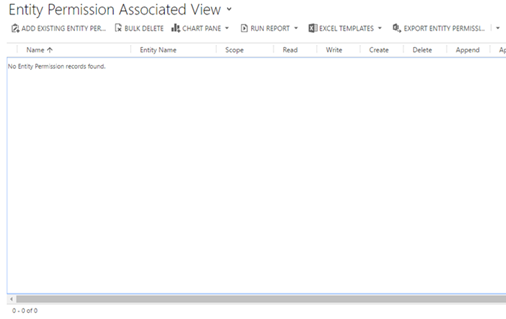
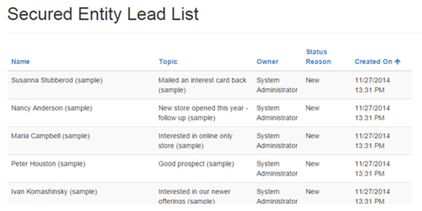
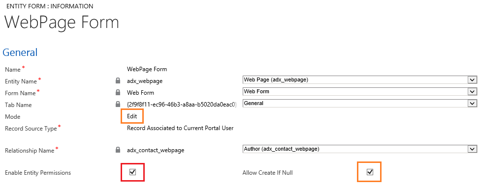
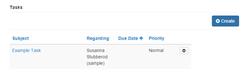

# Add record-based security by using entity permissions for portals
Record-based security in [!INCLUDE[pn-dynamics-crm](../includes/pn-dynamics-crm.md)] portals that applies to individual records is provided by using Entity Permissions. Entity Permissions are added to Web Roles, allowing you to define roles in your organization which logically correspond to the privileges and concepts of record ownership/access that are introduced with Entity permissions. Remember that a given Contact can belong to any number of roles and a given role can contain any number of Entity Permissions. [!INCLUDE[proc-more-information](../includes/proc-more-information.md)] [Create web roles for portals](create-web-roles.md) 

Although permissions to change and access URLs in a portal sitemap is granted via Content Authorization, site managers will also want to secure their custom web applications built with Entity Forms and Entity Lists. [!INCLUDE[proc-more-information](../includes/proc-more-information.md)] [Define entity forms and custom logic within the Dynamics 365 portal](entity-forms-custom-logic.md) and [Add a webpage to render a list of records](#add-a-webpage-to-render-a-list-of-records)  

To secure these features, Entity Permissions allow for granular rights to be granted for arbitrary entities and for record-level security to be enabled via relationship definitions.

## Add entity permissions to a web role
1. Navigate to the Web Role you want to add the permissions to. Web roles for a website can be found in [!INCLUDE[pn-dynamics-crm](../includes/pn-dynamics-crm.md)] in either **Portals** &gt; **Web Roles** or **Portals** &gt; **{your portal}** &gt; **Web Roles**.
2. Select **Add** to add an existing Entity Permission to a web role. 
3. Select **New** to create a new Entity Permission record.

      

When creating a new Entity Permission record, the first step is to Determine the **Entity** that will be secured. The next step is to define **Scope**, as discussed below, and in the case of any scope besides Global, the **Relationships** that define that scope must be specified. Finally, determine the Rights that are being granted to the Role via this permission. Note that rights are cumulative, so if a user is in a role that grants Read, and another that grants read and update, the user will have read and update to any records that overlap between the two roles.

> [!Note]
> Selecting CMS entities like web page and web files is invalid and may have other unintended consequences. The portal will assert security of CMS entities based on content access controls and not entity permissions.

### Global scope

If a Permission record with **Read** permission is granted to a role that has global scope, any contact in that role will have access to all records of the defined Entity in [!INCLUDE[pn-dynamics-crm](../includes/pn-dynamics-crm.md)]. For example, they can see all leads, all accounts, and so on. This permission will be automatically respected by any entity lists; essentially showing all records according to the [!INCLUDE[pn-dynamics-crm](../includes/pn-dynamics-crm.md)] views that have been defined for that list. Further, if a user attempt to access a record via an Entity Form that they do not have access to, they will receive a permission error.

### Contact scope

With Contact scope, a signed-in user in the role for which the permission record is defined will have the rights granted by that permission only for records that are related to that user's contact record via a relationship that is defined in [!INCLUDE[pn-dynamics-crm](../includes/pn-dynamics-crm.md)].

On an entity list, this means a filter will be added to whatever [!INCLUDE[pn-dynamics-crm](../includes/pn-dynamics-crm.md)] views are surfaced by that list, which retrieves only records linked to the current user directly. (Depending on the scenario, this relationship can be thought of as "ownership," "management rights," and so on.)

Entity Forms will only allow the appropriate permission for Read, Create, Write, and so on if this relationship exists when the record is loaded. [!INCLUDE[proc-more-information](../includes/proc-more-information.md)] [Define entity forms and custom logic within the Dynamics 365 portal](entity-forms-custom-logic.md).  

### Account scope

With Account Scope, a signed-in user in the Role for which the permission record is defined will have the rights granted by that permission only for records that are related to that user's parent account record via a relationship that is defined in [!INCLUDE[pn-dynamics-crm](../includes/pn-dynamics-crm.md)].

### Self scope

Self Scope allows you to define the rights a user has to their own Contact (Identity) record. This allows users to use Entity Forms or Web Forms to make changes to their own Contact Record linked with their profile. Note that the default Profile Page has a special built-in form that allows any user to change their basic contact info and opt in or out of marketing lists. If this form is included in your portal (which it is by default), users do not require this permission to use it. However, they will require this permission to use any custom Entity Forms or Web Forms that target their User Contact Record.

### Parental scope

In this most complex case, permissions are granted for an entity that is a relationship away from an entity for which a permission record has already been defined. This permission is actually a child record of the parent Entity Permission.

The Parent Permission Record defines a permission and scope for an entity (probably Global or Contact Scope, although parent is also possible). That entity may be related to contact (in the case of Contact scope) or globally defined. With that permission in place, a Child Permission is created that defines a relationship from another entity to the entity defined in the parent relationship.

Thus, users in a web role who have access to records defined by parent entity permissions will also have rights as defined by the child permission record to records related to the parent record.

### Attributes and relationships

The table below explains the Entity Permission attributes.

| Name                     | Description                                                                                                                                                                                                                                                                                                               |
|--------------------------|---------------------------------------------------------------------------------------------------------------------------------------------------------------------------------------------------------------------------------------------------------------------------------------------------------------------------|
| Name                     | The descriptive name of the record. This field is required.                                                                                                                                                                                                                                                               |
| Entity Name              | The logical name of the entity that is to be secured or that will define the Contact Relationship or Parent Relationship to secure a related entity on a child permission. This field is required.                                                                                                                        |
| Scope (mandatory)                   | <ul><li>**Global**: Grant privileges to the entity record without any requirement for an owner (contact).</li><li>**Contact**: Grant privileges to the entity record that has a direct relationship to an owner (contact).</li><li>**Account**: Grant privileges to the entity record that has a relationship to an account, which serves as the owner, assuming the account is the parent customer of the contact.</li><li>**Parent**: Grant privileges to the entity record through the chain of its parent permissions' relationships.</li></ul>|
| Contact Relationship     | Required only if Scope = Contact. The schema name of the relationship between contact and the entity specified by the Entity Name field.|
| Parent Relationship      | Required only if a Parent Entity Permission is assigned. The schema name of the relationship between the entity specified by the Entity Name field and the entity specified by the Entity Name field on its Parent Entity Permission.                                                                                     |
| Parent Entity Permission | Requires only if Scope = Parent. The parent Entity Permission.                                                                                                                                                                                                                                                            |
| Read                     | Privilege that controls whether the user can read a record.                                                                                                                                                                                                                                                               |
| Write                    | Privilege that controls whether the user can update a record.                                                                                                                                                                                                                                                             |
| Create                   | Privilege that controls whether the user can create a new record. The right to create a record for an entity type does not apply to an individual record, but instead to a class of entities.                                                                                                                             |
| Delete                   | Privilege that controls whether the user can delete a record.                                                                                                                                                                                                                                                             |
| Append                   | Privilege that controls whether the user can attach another record to the specified record.The Append and Append To access rights work in combination. Every time that a user attaches one record to another, the user must have both rights. For example, when you attach a note to a case, you must have the Append access right on the note and the Append To access right on the case for the operation to work.  |
| Append To                | Privilege that controls whether the user can append the record in question to another record.The Append and Append To access rights work in combination. For more information, see the description for Append.|
| | |

## Global permissions for tasks related to leads

In one scenario, one might want to use an entity list and entity forms to surface all leads on the portal to anyone in a custom "Lead Manager" Web Role. On the Lead Edit Form, which is launched whenever a lead row is selected on the list, there will be a subgrid displaying related Task records. These records should be accessible to anyone in the Lead manager role. As the first step, we'll give Global Permissions to leads to anyone in our Lead Manager Role.

This role has a related Entity Permission for the "Lead" entity, with a Global scope.

Users in this role can access all leads via Entity Lists or Forms on the portal.

  

We will now add a Child Permission to the Global Lead Permission. With the Parent permission record open, first go to the **Child Entity Permissions** subgrid, select **New** to open a lookup for entity permissions, select the magnifying glass, and then select **New** to add a new record.

  

Select the entity as Tasks and the **Scope** as Parental. Note that you can then select the parent relationship (**Lead\_Tasks**). This permission implies that a contact that is in a web role with the parent permission will then have global permission to all tasks that are related to leads.

Remember that in order for your list to respect these permissions, you must have enabled Entity Permissions on the list AND there must be actions that will actually allow the users to perform the actions for which their permissions have been granted. Furthermore, Permissions must also be enabled on the [Define entity forms and custom logic within the Dynamics 365 portal](entity-forms-custom-logic.md) record, and that form must be surfacing a page that has a subgrid on it for the entity that you want to enable with child permissions, in this case Tasks. Furthermore, to enable read or create for tasks, you will need to configure those Entity Forms too, and edit the forms to remove the Regrading lookup field from said forms.  

  

This then grants permissions for all tasks that are related to leads. If Tasks are being surfaced on an entity list, a filter is essentially added to the list so that only tasks that are related to a lead will show up in the list. In our example, they are being surfaced with a subgrid on an entity form.

  

## Contact-scoped permissions for tasks

Another example would be if you wanted to allow access to tasks for which a contact is related to the parent Lead for that task. This scenario is nearly identical to the above except that in this case the parent permission has a scope of Contact, instead of global. A relationship must be specified on the parent relationship between the Lead entity and the Contact Entity.

After these permissions are in place, users in the Lead Manager role can access leads that are related to them directly as specified by the contact-scope permission, and Tasks related to those same Leads as specified by the child permission record.

### See also

[Create web roles for portals](create-web-roles.md)  
[Control webpage access for portals](webpage-access-control.md)  
[Configure web roles for a PRM portal](configure-web-roles-partner-portal.md)
