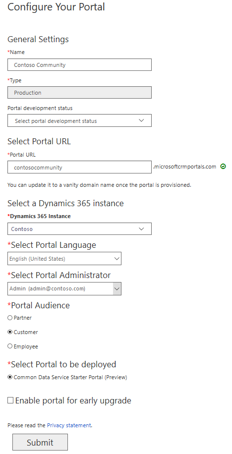
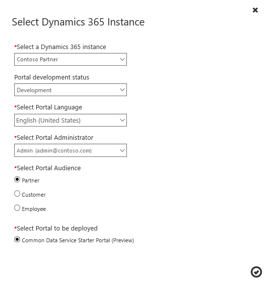

# Common Data Service starter portal (Preview)

[!include[cc-beta-prerelease-disclaimer](../includes/cc-beta-prerelease-disclaimer.md)]

> [!IMPORTANT]
> - [!INCLUDE[cc-preview-features-definition](../includes/cc-preview-features-definition.md)]
> - [!INCLUDE[cc-preview-features-no-ms-support](../includes/cc-preview-features-no-ms-support.md)] 

You can configure your portal to connect to the Common Data Service environment and allow your users to interact with it. This feature brings in the ability to connect a portal to a Common Data Service environment that does not have any [!INCLUDE[pn-dynamics-crm](../includes/pn-dynamics-crm.md)] apps (Sales, Service, or Marketing) preinstalled.

The Common Data Service starter portal comes with the sample data for you to quickly get started. It also has the following built-in page templates:

- Blank page
- Blank page with title
- Landing page
- Page with child links
- Page with side navigation

The following table summarizes the features associated with the Common Data Service starter portal:

| Feature                                | Common Data Service starter portal |
|----------------------------------------|---------------|
| World Ready                            | •             |
| Multi-Language Support                 | •             |
| Portal Administration                  | •             |
| Customization and Extensibility        | •             |
| Theming                                | •             |
| Content Management                     |               |
| Knowledge Management                   |               |
| Support/Case Management                |               |
| Forums                                 |               |
| Faceted Search                         |               |
| Profile Management                     |               |
| Subscribe to Forum Thread              |               |
| Comments                               |               |
| [!INCLUDE[pn-azure-shortest](../includes/pn-azure-shortest.md)] AD Authentication  |                |
| Ideas                                  |               |
| Blogs                                  |               |
| Project Service Automation Integration |               |
| Field Service Integration              |               |
| Partner Onboarding                     |               |
| Portal Base                            | •             |
| Portal Workflows                       | •             |
| Web Notifications                      | •             |
| [!INCLUDE[cc-microsoft](../includes/cc-microsoft.md)] Identity |  •             |
| Identity Workflows                     | •             |
| Web Forms                              | •             |
| Feedback                               | •             |
|||

> [!NOTE]
> The Common Data Service starter portal cannot be used on a [!INCLUDE[pn-dynamics-crm](../includes/pn-dynamics-crm.md)] organization.

## Provision a Common Data Service starter portal

A Common Data Service starter portal is provisioned in the same way as any other portal. The only difference is that you select a Dynamics 365 instance that uses Common Data Service. After selecting the instance, the only portal type you see is **Common Data Service Starter Portal**. This portal type is the same for all portal audiences. For more information on provisioning a portal, see [Provision a portal](provision-portal.md).

After specifying all the required values, the **Configure your portal** page looks as follows:

> [!div class="mx-imgBorder"]
> 

Once the portal is provisioned, a website with the sample pages is available. You can then use them to quickly get started.

## Change the Dynamics 365 for Customer Engagement instance, audience, or type of portal

After your portal is created and provisioned, you can change the Dynamics 365 instance associated with your portal to the one that uses Common Data Service. After selecting the instance, the only portal type you see is **Common Data Service Starter Portal**. This portal type is the same for all portal audiences. For more information on changing the Dynamics 365 instance, see [Change the Dynamics 365 for Customer Engagement instance, audience, or type of portal](change-dynamics-instance.md).

After specifying all the required values, the **Select Dynamics 365 Instance** window looks as follows:

> [!div class="mx-imgBorder"]
> 

### See also

[Provision a portal](provision-portal.md) 
[Change the Dynamics 365 for Customer Engagement instance, audience, or type of portal](change-dynamics-instance.md)

