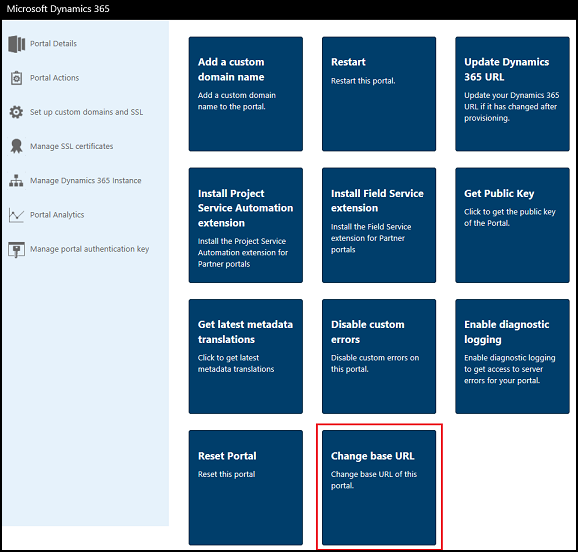
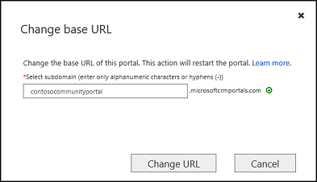
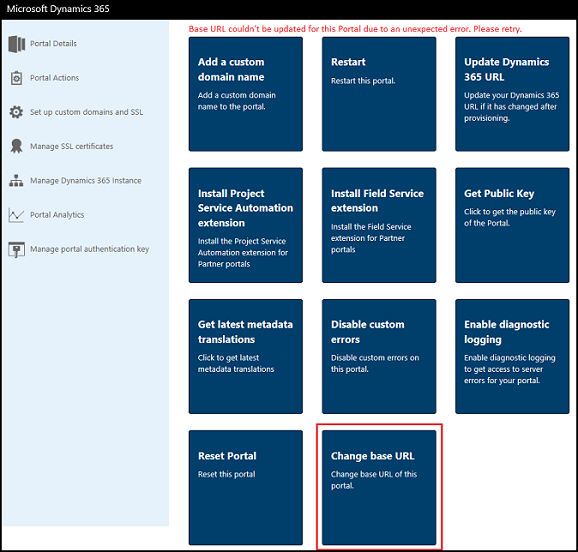

# Change base URL of a portal

You can change the base URL of a portal after it is provisioned. For example, if you choose `contosocommunity.microsoftcrmportals.com` as the base URL while provision the portal, you can later change it to `contosocommunityportal.microsoftcrmportals.com` as per your requirement.

> [!NOTE]
> Once you change the base URL of your portal, the older URL will not be accessible, and it will be made available for other customers to use it for their portal.

1.	Go to the Dynamics 365 Administration Center page and select the **Applications** tab.

2.	Select the name of the portal of which you want to change the base URL, and then select **Manage**.

3.	Go to **Portal Actions** > **Change base URL**. 

    

4.	In the Change base URL window, enter the new base URL for the portal.

    

5.	Select **Change URL** in the confirmation window.

## Troubleshooting

This section provides information about troubleshooting issues while changing base URL of a portal.

### Changing the base URL fails

If changing the base URL of a portal fails, an error is displayed as shown in the below image:

Typically, these are transient errors and you must select **Change base URL** to retry changing the base URL. If the issue persists, contact Microsoft support.
