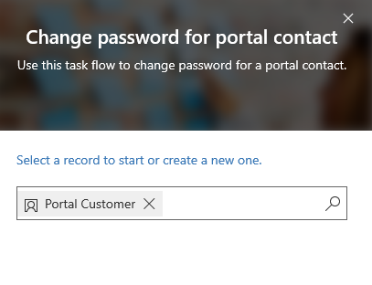
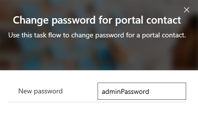
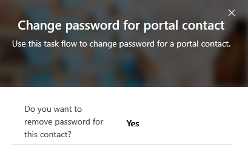

# Configure a contact for use on a portal

After filling out the basic information for a contact in [!INCLUDE[pn-dynamics-crm](../includes/pn-dynamics-crm.md)], (or having a user fill out the sign-up form in a portal), go to the web authentication tab on the portal contact form to configure a contact by using local authentication. For more information about federated authentication options, see [Set authentication identity for a portal](set-authentication-identity.md). To configure a contact for portals by using local authentication, follow these instructions:  

1.  Enter a **username**.
2.  On the command ribbon, go to **More Commands** &gt; **Change Password**.

Complete the change password workflow, and the necessary fields will be automatically configured. When you have done this, your contact will be configured for your portals.

## Change password for a contact in Dynamics 365 Portal app

1.	Select **Task Flow** on the toolbar at the top.

    > [!div class="mx-imgBorder"]
    > 

2.	Select the **Change password for portal contact** task flow.

3.	In the **Change password for portal contact** pane, select or create a contact to change the password, and then select **Next**.

    > [!div class="mx-imgBorder"]
    > 

4.	In the **New password** field, enter a new password, and then select **Next**.

    > [!div class="mx-imgBorder"]
    > 

    If you do not enter a password and select **Next**, you'll be asked whether you want to remove password for the selected contact.

    > [!div class="mx-imgBorder"]
    > 

5.	After making the changes, select **Done**.

### See also
[Invite contacts to your portals](invite-contacts.md)  
[Set authentication identity for a portal](set-authentication-identity.md)  

