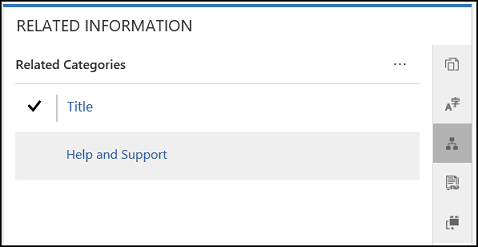

# Configure and manage category for knowledge articles

This section helps you understand how to create a new category for knowledge articles and associate it with an article. You will also learn how to enable ratings for a knowledge article.

## Create a new category for knowledge articles

1. Sign in to Dynamics 365 Portals.

2. Go to **Settings** > **Service Management**. 

3. In the **Knowledge Base Management** section, select **Categories**. 

4. Select **New**. 

5. Enter a name and description for your category. 

6. Choose a parent category. If you want this to be a top-level category, leave this field blank.

## Associate a category with a knowledge article

1. In Customer Service Hub, go to **Service** > **Knowledge Articles**.

2. Open a knowledge article.

3. On the command bar, select **Associate Category**. The Associate Category window appears.

4. In the **Select Category to Associate with** field, select the category you want to associate to the article, and then select **Associate**.

   

> [!NOTE]
> You can also add related articles, related products, and keywords to a knowledge article. For more information on managing knowledge articles, see [manage knowledge articles](../customer-service/customer-service-hub-user-guide-knowledge-article.md).

## Remove a category from an article

1. In Customer Service Hub, open the knowledge article from which you want to remove a category.

2. On the **Summary** tab, under **Related information**, select **Related Categories**.

    

3. Select the category you want to remove.

4. From **More Commands**, select **Remove**.

    

## Delete a knowledge category

1. Sign in to Dynamics 365 Portals.

2. Go to **Settings** > **Service Management**. 

3. In the **Knowledge Base Management** section, select **Categories**. 

4. Choose the category from the list view, and then select **Delete** on the command bar.

>[!Note] 
> Knowledge articles associated with the category will be disassociated after the category is deleted.

## Enable ratings for a knowledge article

1. Sign in to the portal and go to knowledge article.

2. Edit the article from the inline editor.

3. On the **Options** tab, select **Enable Ratings**.

### See also
[Get started with the portal content editor](get-started-portal-content-editor.md)  
[Add dynamic content and create custom templates](custom-templates-dynamic-content.md)  

