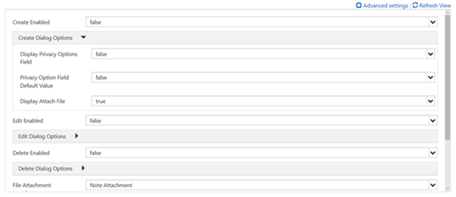
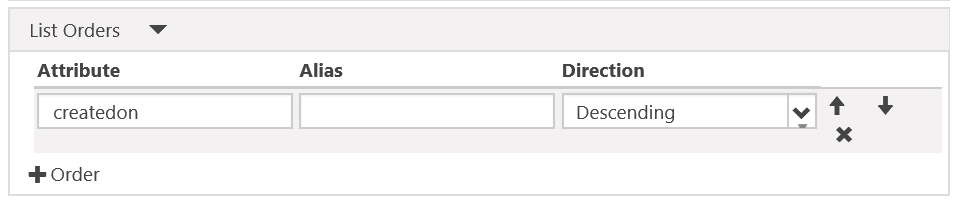

# Notes configuration for web forms for portals

Web Form Notes are configured in an identical fashion to Entity Form Notes. First, Create a Metadata record for the Web Form Step that has notes, and add configuration metadata. This process is described here.

Just like with Subgrids, adding notes to your Managed forms on the portal is easy - just add the notes control to the [!INCLUDE[pn-dynamics-crm](../includes/pn-dynamics-crm.md)] form through the out-of-the-box [!INCLUDE[pn-dynamics-crm](../includes/pn-dynamics-crm.md)] form designer and you’re done. You can configure the behavior of the notes control by using metadata.

> [!Note]                                                           
> Explicit [Add record-based security using entity permissions for portals](assign-entity-permissions.md) are **required** for any notes to appear on the portal. For read and edit, the 'Read' and 'Write' privileges must be granted. For create, two permissions must exist, a permission with the 'Create' and 'Append' privileges must be granted for the note (annotation) entity, the second permission must be assigned to the entity type the note is being attached to with the 'Append To' privilege granted.

To Edit or Add notes, among other things, you must configure the control using a metadata record.

To add Metadata to an Entity form, navigate to **Entity Form Metadata** either using the top drop-down or the subgrid right on the main form of the Entity Form record that you are working with. Then click to add a new record.

When Creating your record, select Type of Notes. You will then be able to add Note configuration:

  

Upon adding the Configuration, the Note control will render with the appropriate options enabled on the portal.

Most settings are shown collapsed to save space by default. Click "" to expand a section and see additional options. Click "" to collapse a section.

## Attributes

| Name                  | Description                                                                                                                                                  |
|-----------------------|--------------------------------------------------------------------------------------------------------------------------------------------------------------|
| **Basic Settings**    |                                                                                                                                                              |
| Create Enabled        | Enables the ability to add new Notes to the entity.                                                                                                          |
| Create Dialog Options | Contains settings for configuring the dialog when **Create Enabled** is true. See Create Dialog Options for more details.                                    |
| Edit Enabled          | Enables the ability to edit existing Notes on the entity.                                                                                                    |
| Edit Dialog Options   | Contains settings for configuring the dialog when **EditEnabled** is true. See Edit Dialog Options for more details.                                         |
| Delete Enabled        | Enables the ability to delete Notes from the entity.                                                                                                         |
| Delete Dialog Options | Contains settings for configuring the dialog when **DeleteEnabled** is true. See Delete Dialog Options for more details.                                     |
| **Advanced Settings** |                                                                                                                                                              |
| List Title            | Overrides the title over the Notes area.                                                                                                                     |
| Add Note Button Label | Overrides the label in the Add Notes button.                                                                                                                 |
| Note Privacy Label    | Overrides the label denoting that a note is Private.                                                                                                         |
| Loading Message       | Overrides the message shown while the list of notes is loading.                                                                                              |
| Error Message         | Overrides the message shown when an error occurs while trying to load the list of notes.                                                                     |
| Access Denied Message | Overrides the message shown when the user does not have sufficient permissions to view the list of notes.                                                    |
| Empty Message         | Overrides the message shown when the current entity does not have any notes that can be viewed.                                                              |
| List Orders           | Allows you to set the order in which notes will be displayed. The List Orders settings allows you to set the following: <ul><li>Attribute: the logical name of the column by which you wish to sort</li><li>Alias: the alias for the attribute in the query</li><li>Direction: Choose Ascending (smallest to largest, or first to last), or Descending (largest to smallest, or last to first).</li></ul>  To add a sorting rule, click "Column" (4) and fill in the details. List Orders will be processed in order from the top of the list having highest priority.|
||

## Create dialog options

| Name                               | Description                                                                                                                                 |
|------------------------------------|---------------------------------------------------------------------------------------------------------------------------------------------|
| **Basic Settings**                 |                                                                                                                                             |
| Display Privacy Options Field      | Enables a checkbox in the Add Note dialog that allows the user to mark a note as Private.                                                   |
| Privacy Option Field Default Value | Specifies the default value for the Display Privacy Options Field checkbox. The default value of this field is "false".                     |
| Display Attach File                | Enables a file upload field in the Add Note dialog, allowing a user to attach a file to a note.                                             |
| Attach File Accept                 | The MIME type accepted by the file upload input.                                                                                            |
| **Advanced Settings**              |                                                                                                                                             |
| Note Field Label                   | Overrides the label for the Note field in the Add Note dialog.                                                                              |
| Note Field Columns                 | Sets the cols value in the Note &lt;textarea&gt;                                                                                            |
| Note Field Rows                    | Sets the rows value in the Note &lt;textarea&gt;                                                                                            |
| Privacy Option Field Label         | Overrides the label for the Privacy Option field (if enabled).                                                                              |
| Attach File Label                  | Overrides the label for the Attach File field (if enabled)                                                                                  |
| Left Column CSS Class              | Adds the CSS class or classes to the left column containing labels on the Add Note dialog.                                                  |
| Right Column CSS Class             | Adds the CSS class or classes to the right column containing field inputs on the Add Note dialog.                                           |
| Title                              | Overrides the HTML text in the header of the Add Note dialog.                                                                               |
| Primary Button Text                | Overrides the HTML that appears in the Primary ("Add Note") button on the dialog.                                                           |
| Dismiss Button SR Text             | Overrides the screen reader text associated with the dialog's dismiss button.                                                               |
| Close Button Text                  | Overrides the HTML that appears in the Close ("Cancel") button on the dialog.                                                               |
| Size                               | Specifies the size of the Add Note dialog. The Options are Default, Large, and Small. For the Add Note dialog, the default size is Default. |
| CSS Class                          | Specify a CSS class or classes that will be applied to the resulting dialog.                                                                |
| Title CSS Class                    | Specify a CSS class or classes that will be applied to the resulting dialog's title bar.                                                    |
| Primary Button CSS Class           | Specify a CSS class or classes that will be applied to the dialog's Primary ("Add Note") button.                                            |
| Close Button CSS Class             | Specify a CSS class or classes that will be applied to the dialog's Close ("Cancel") button.                                                |

## Edit dialog options

| Name                               | Description                                                                                                                                   |
|------------------------------------|-----------------------------------------------------------------------------------------------------------------------------------------------|
| **Basic Settings**                 |                                                                                                                                               |
| Display Privacy Options Field      | Enables a checkbox in the Edit Note dialog that allows the user to mark a note as Private.                                                    |
| Privacy Option Field Default Value | Specifies the default value for the Display Privacy Options Field checkbox. The default value of this field is "false".                       |
| Display Attach File                | Enables a file upload field in the Edit Note dialog, allowing a user to attach a file to a note.                                              |
| Attach File Accept                 | The MIME type accepted by the file upload input.                                                                                              |
| **Advanced Settings**              |                                                                                                                                               |
| Note Field Label                   | Overrides the label for the Note field in the Edit Note dialog.                                                                               |
| Note Field Columns                 | Sets the cols value in the Note &lt;textarea&gt;                                                                                              |
| Note Field Rows                    | Sets the rows value in the Note &lt;textarea&gt;                                                                                              |
| Privacy Option Field Label         | Overrides the label for the Privacy Option field (if enabled).                                                                                |
| Attach File Label                  | Overrides the label for the Attach File field (if enabled)                                                                                    |
| Left Column CSS Class              | Adds the CSS class or classes to the left column containing labels on the Edit Note dialog.                                                   |
| Right Column CSS Class             | Adds the CSS class or classes to the right column containing field inputs on the Edit Note dialog.                                            |
| Title                              | Overrides the HTML text in the header of the Edit Note dialog.                                                                                |
| Primary Button Text                | Overrides the HTML that appears in the Primary ("Update Note") button on the dialog.                                                          |
| Dismiss Button SR Text             | Overrides the screen reader text associated with the dialog's dismiss button.                                                                 |
| Close Button Text                  | Overrides the HTML that appears in the Close ("Cancel") button on the dialog.                                                                 |
| Size                               | Specifies the size of the Edit Note dialog. The Options are Default, Large, and Small. For the Edit Note dialog, the default size is Default. |
| CSS Class                          | Specify a CSS class or classes that will be applied to the resulting dialog.                                                                  |
| Title CSS Class                    | Specify a CSS class or classes that will be applied to the resulting dialog's title bar.                                                      |
| Primary Button CSS Class           | Specify a CSS class or classes that will be applied to the dialog's Primary ("Update Note") button.                                           |
| Close Button CSS Class             | Specify a CSS class or classes that will be applied to the dialog's Close ("Cancel") button.                                                  |

## Delete dialog options

| Name                     | Description                                                                                                                                       |
|--------------------------|---------------------------------------------------------------------------------------------------------------------------------------------------|
| **Basic Settings**       |                                                                                                                                                   |
| Confirmation             | Override the confirmation message to delete the note.                                                                                             |
| **Advanced Settings**    |                                                                                                                                                   |
| Title                    | Overrides the HTML text in the header of the Delete Note dialog.                                                                                  |
| Primary Button Text      | Overrides the HTML that appears in the Primary ("Delete") button on the dialog.                                                                   |
| Dismiss Button SR Text   | Overrides the screen reader text associated with the dialog's dismiss button.                                                                     |
| Close Button Text        | Overrides the HTML that appears in the Close ("Cancel") button on the dialog.                                                                     |
| Size                     | Specifies the size of the Delete Note dialog. The Options are Default, Large, and Small. For the Delete Note dialog, the default size is Default. |
| CSS Class                | Specify a CSS class or classes that will be applied to the resulting dialog.                                                                      |
| Title CSS Class          | Specify a CSS class or classes that will be applied to the resulting dialog's title bar.                                                          |
| Primary Button CSS Class | Specify a CSS class or classes that will be applied to the dialog's Primary ("Delete") button.                                                    |
| Close Button CSS Class   | Specify a CSS class or classes that will be applied to the dialog's Close ("Cancel") button.                                                      |

### See Also

[Configure a [!INCLUDE[pn-dynamics-crm](../includes/pn-dynamics-crm.md)] portal](configure-portal.md)  
[Define entity forms and custom logic within the [!INCLUDE[pn-dynamics-crm](../includes/pn-dynamics-crm.md)] portal](entity-forms-custom-logic.md)  
[Web Form properties for portals](web-form-properties.md)  
[Web Form steps for portals](web-form-steps.md)  
[Web Forms metadata for portals](configure-web-form-metadata.md)  
[Web Form subgrid configuration for portals](configure-web-form-subgrid.md)  
