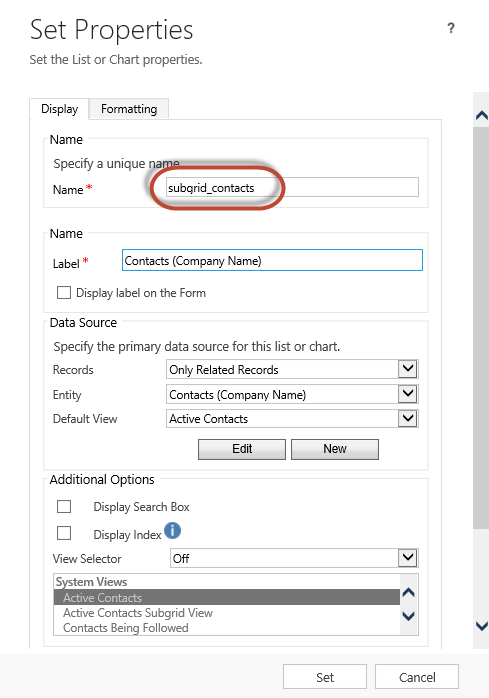

# Configure web form subgrids for portals

Web Form Subgrids are configured in an identical fashion to Entity Form Subgrids. First, Create a Metadata record for the Web Form Step that has a subgrid, and add configuration metadata.

Adding Subgrids to your Managed forms on the portal is easy—just add the subgrid to the [!INCLUDE[pn-dynamics-crm](../includes/pn-dynamics-crm.md)] form that you are managing by using the out-of-the-box [!INCLUDE[pn-dynamics-crm](../includes/pn-dynamics-crm.md)] form designer and you’re done. The grid will use the view that is specified in the [!INCLUDE[pn-dynamics-crm](../includes/pn-dynamics-crm.md)] form designer, show only related records if that option was chosen in [!INCLUDE[pn-dynamics-crm](../includes/pn-dynamics-crm.md)], optionally show a search bar, and even respect [entity permissions for portals](assign-entity-permissions.md). It doesn't get any simpler to display a read-only list of records. To enable actions for the grid— Create, Update, Delete, and so on—you must configure those actions by using metadata configurations.

## Add subgrid metadata to your form

To add Subgrid Metadata to an Entity Form, navigate to **Entity Form Metadata** by using either the top drop-down or the subgrid right on the main form of the [Define entity forms and custom logic within the Dynamics 365 portal](entity-forms-custom-logic.md) record that you are working with.  

To add a new record, click **Add New Entity Form Metadata**.

To edit an existing record, double-click on a record in the grid. Selecting Subgrid as the Type value displays another attribute, "Subgrid Name".

| Name         | Description                                                               |
|--------------|---------------------------------------------------------------------------|
| Subgrid Name | The unique name of the subgrid on the entity's related [!INCLUDE[pn-dynamics-crm](../includes/pn-dynamics-crm.md)] form. |
||

Double clicking on the Sub-Grid in the form editor will display a properties window. This contains a Name field that should be used to assign to the Subgrid Name field on the Entity Form Metadata record.

  

Specifying a valid subgrid name will display the subgrid configuration settings. By default, only **Basic Settings** are shown. Select **Advanced Settings** to show additional settings.

By default, most settings are shown collapsed to save space. Click "" to expand a section and see additional options. Click "" to collapse a section.

## Attributes

| Name                       | Description                                                                                                                                                                                                                                                                                                                                                               |
|----------------------------|---------------------------------------------------------------------------------------------------------------------------------------------------------------------------------------------------------------------------------------------------------------------------------------------------------------------------------------------------------------------------|
| **Basic Settings**         |                                                                                                                                                                                                                                                                                                                                                                           |
| View Actions               | Allows you to add action buttons for actions that are applicable for the entity set and will appear above the subgrid. The available actions are: <ul><li>Create Action</li><li>Download Action</li><li>Associate Action</li></ul> Clicking on one of these options displays a configuration area for that action. See below for details about each action.                                                                                                                                                                                                                                                   |
| Item Actions               | Allows you to add action buttons for actions that are applicable for an individual record and will appear in each row in the subgrid provided the associated privilege has been granted by the [Add record-based security using entity permissions for portals](assign-entity-permissions.md) procedure. The available actions are: <ul><li>Details Action</li><li>Edit Action</li><li>Delete Action</li><li>Workflow Action</li><li>Disassociate Action</li></ul> Clicking on one of these options displays a configuration area for that action. See below for details about each action.                                                                                                                                                                                                                                                   |
| Override Column Attributes | Allows you to override display settings for individual columns in the grid. <ul><li>Attribute: Logical name of the column you wish to override.</li><li>Display Name: New column title to override the default</li><li>Width: Width (in either percent or pixels) of the column to override the default. See also Grid Column Width Style. To override settings on a column, click **Column** and fill in the details.                                                                                                                                                                                                                                                                                             |
| **Advanced Settings**      |                                                                                                                                                                                                                                                                                                                                                                           |
| Loading Message            | Overrides the default HTML message that appears while the subgrid is loading.                                                                                                                                                                                                                                                                                             |
| Error Message              | Overrides the default HTML message that appears when an error occurs while loading the subgrid.                                                                                                                                                                                                                                                                           |
| Access Denied Message      | Overrides the default HTML message that appears when a user does not have sufficient [permissions](assign-entity-permissions.md) to read the entity type associated with the subgrid.                       |
| Empty Message              | Overrides the HTML message that appears when the associated subgrid contains no data.                                                                                                                                                                                                                                                                                     |
| Lookup Dialog              | Controls the settings for the dialog that appears when a user activates the Associate Action.                                                                                                                                                                                                                                                                             |
| Details Form Dialog        | Controls the settings for the dialog that appears when a user activates the Details Action                                                                                                                                                                                                                                                                                |
| Edit Form Dialog           | Controls the settings for the dialog that appears when a user activates the Edit Action                                                                                                                                                                                                                                                                                   |
| Create Form Dialog         | Controls the settings for the dialog that appears when a user activates the Create Action                                                                                                                                                                                                                                                                                 |
| Delete Dialog              | Controls the settings for the dialog that appears when a user activates the Delete Action                                                                                                                                                                                                                                                                                 |
| Error Dialog               | Controls the settings for the dialog that appears when an error occurs during any action.                                                                                                                                                                                                                                                                                 |
| CSS Class                  | Specify a CSS class or classes that will be applied to the HTML element that contains the entire subgrid area, including the grid and action buttons.                                                                                                                                                                                                                     |
| Grid CSS Class             | Specify a CSS class or classes that will be applied to the Subgrid's HTML &lt;table&gt; element.                                                                                                                                                                                                                                                                          |
| Grid Column Width Style    | Configures whether the **Width** values in the Override Column Attributes are specified in Pixels or Percent.                                                                                                                                                                                                                                                             |
||

## Create action

Enabling a **Create Action** renders a button above the Subgrid that, when clicked, pops up a dialog with an [entity form](entity-forms-custom-logic.md) that allows a user to create a new record.  

Create Action Settings

| Name                  | Description                                                                                                                                                                                                                                                 |
|-----------------------|-------------------------------------------------------------------------------------------------------------------------------------------------------------------------------------------------------------------------------------------------------------|
| **Basic Settings**    |                                                                                                                                                                                                                                                             |
| Entity Form           | Specifies the [entity forms and custom logic](entity-forms-custom-logic.md) that will be used to create the new record. The drop-down will list all Entity Forms that are configured for the Subgrid's entity type. **Note**: If the Subgrid's entity type has no Entity Forms, the drop-down will appear empty. If no Entity Form is supplied for the Create Action it will be ignored, and the button will not render on the Subgrid's Entity Form.                                |
| **Advanced Settings** |                                                                                                                                                                                                                                                             |
| Button Label          | Overrides the HTML label displayed in the Create Action button above the subgrid.                                                                                                                                                                           |
| Button Tooltip        | Overrides the tooltip text that appears when the mouse is hovered over the Create Action button.                                                                                                                                                            |

### Create form dialog (advanced) settings

| Name                   | Description                                                                                                                                     |
|------------------------|-------------------------------------------------------------------------------------------------------------------------------------------------|
| Loading Message        | Overrides the message that appears while the dialog is loading                                                                                  |
| Title                  | Overrides the HTML that appears in the title bar of the dialog                                                                                  |
| Dismiss Button Sr Text | Overrides the screen reader text associated with the dialog's dismiss button.                                                                   |
| Size                   | Specifies the size of the Create Form dialog. The Options are Default, Large, and Small. For the Create Form dialog, the default size is Large. |
| CSS Class              | Specify a CSS class or classes that will be applied to the resulting dialog.                                                                    |
| Title CSS Class        | Specify a CSS class or classes that will be applied to the resulting dialog's title bar.                                                        |
||

## Download action

Enabling a **Download Action** renders a button above the Subgrid that, when clicked, downloads the data from the subgrid to an [!INCLUDE[pn-excel-short](../includes/pn-excel-short.md)] (.xlsx) file.

### Download action settings

| Name                  | Description                                                                                        |
|-----------------------|----------------------------------------------------------------------------------------------------|
| **Basic Settings**    |                                                                                                    |
| None                  |                                                                                                    |
| **Advanced Settings** |                                                                                                    |
| Button Label          | Overrides the HTML label displayed in the Download Action button above the subgrid.                |
| Button Tooltip        | Overrides the tooltip text that appears when the mouse is hovered over the Download Action button. |
||

## Associate action

Enabling an **Associate Action** displays a button above the subgrid that, when selected, opens a table of entities that the user can choose to associate to the entity record currently being displayed by the [Define entity forms and custom logic within the Dynamics 365 portal](#define-entity-forms-and-custom-logic-within-the-dynamics-365-portal) provided the 'Append' and 'AppendTo' privilege has been granted by [Add record-based security using entity permissions for portals](assign-entity-permissions.md) for the applicable entity types.  

### Associate action settings

| Name                  | Description                                                                                                                                                                                                                |
|-----------------------|----------------------------------------------------------------------------------------------------------------------------------------------------------------------------------------------------------------------------|
| **Basic Settings**    |                                                                                                                                                                                                                            |
| View                  | Specifies the View (Saved Query) that will be used to find and display the list of eligible entities. **Note**: If the Subgrid's entity type has no Saved Queries, the drop-down will appear empty. If no View is supplied for the Associate Action it will be ignored, and the button will not render on the Subgrid's Entity Form.  |
| **Advanced Settings** |                                                                                                                                                                                                                            |
| Button Label          | Overrides the HTML label displayed in the Associate Action button above the subgrid.                                                                                                                                       |
| Button Tooltip        | Overrides the tooltip text that appears when the mouse is hovered over the Associate Action button.                                                                                                                        |
||

### Lookup dialog (advanced) settings

| Name                     | Description                                                                                                                                 |
|--------------------------|---------------------------------------------------------------------------------------------------------------------------------------------|
| Title                    | Overrides the HTML that appears in the title bar of the dialog                                                                              |
| Primary Button Text      | Overrides the HTML that appears in the Primary ("Add") button on the dialog.                                                                |
| Close Button Text        | Overrides the HTML that appears in the Close ("Cancel") button on the dialog.                                                               |
| Dismiss Button Sr Text   | Overrides the screen reader text associated with the dialog's dismiss button.                                                               |
| Size                     | Specifies the size of the Associate dialog. The Options are Default, Large, and Small. For the Associate dialog, the default size is Large. |
| CSS Class                | Specify a CSS class or classes that will be applied to the resulting dialog.                                                                |
| Title CSS Class          | Specify a CSS class or classes that will be applied to the resulting dialog's title bar.                                                    |
| Primary Button CSS Class | Specify a CSS class or classes that will be applied to the dialog's Primary ("Add") button.                                                 |
| Close Button CSS Class   | Specify a CSS class or classes that will be applied to the dialog's Close ("Cancel") button.                                                |
| Select Records Title     | Overrides the HTML that appears in the title of the Record Selection area.                                                                  |
| Default Error Message    | Overrides the message that appears when an error occurs while associating the selected entity or entities.                                  |
| Grid Options             | Specify settings for the appearance of the entity grid. See below for options.                                                              |
||

### Lookup dialog (advanced) grid options settings

| Name                  | Description                                                                                                              |
|-----------------------|--------------------------------------------------------------------------------------------------------------------------|
| Loading Message       | Overrides the message that appears while the grid of entities is loading.                                                |
| Error Message         | Overrides the message that appears when an error occurs while loading the grid of entities                               |
| Access Denied Message | Overrides the message that appears when a user does not have sufficient entity permissions to view the grid of entities. |
| Empty Message         | Overrides the message that appears when there are no entities that can be associated with the current Entity Form.       |
| CSS Class             | Specify a CSS class or classes that will be applied to the associate grid area.                                          |
| Grid CSS Class        | Specify a CSS class or classes that will be applied to the associate grid's &lt;table&gt; element.                       |
||

## Details action

Enabling a **Details Action** allows a user to view a read-only [entity form](entity-forms-custom-logic.md) that is data-bound to the record of the subgrid's selected row.  

### Details Action settings

| Name                                  | Description                                                                                                                                                                                                                                                                                                  |
|---------------------------------------|--------------------------------------------------------------------------------------------------------------------------------------------------------------------------------------------------------------------------------------------------------------------------------------------------------------|
| **Basic Settings**                    |                                                                                                                                                                                                                                                                                                              |
| Entity Form                           | Specifies the [entity form](entity-forms-custom-logic.md) that will be used to view the details of the selected record. The drop-down will list all Entity Forms that are configured for the Subgrid's entity type.  **Note**: If the Subgrid's entity type has no Entity Forms, the drop-down will appear empty. If no Entity Form is supplied for the Details Action it will be ignored, and the button will not render in the Subgrid.                                                                                              |
| **Advanced Settings**                 |                                                                                                                                                                                                                                                                                                              |
| Record ID Query String Parameter Name | Specifies the name of the query string parameter that will be used to select the entity to view in the selected Entity Form. This should match the value in that Entity Form's Record ID Query String Parameter Name. The default value for this field, both here and in Entity Form configuration, is "id". |
| Button Label                          | Overrides the HTML label for this action displayed in the Subgrid row.                                                                                                                                                                                                                                       |
| Button Tooltip                        | Overrides the tooltip text that appears when the mouse is hovered over the button for this action displayed in the Subgrid row.                                                                                                                                                                              |
||
### Details form dialog (advanced) settings

| Name                   | Description                                                                                                                             |
|------------------------|-----------------------------------------------------------------------------------------------------------------------------------------|
| Loading Message        | Overrides the HTML that appears when the dialog is loading.                                                                             |
| Title                  | Overrides the HTML that appears in the title bar of the dialog.                                                                         |
| Dismiss Button Sr Text | Overrides the screen reader text associated with the dialog's dismiss button.                                                           |
| Size                   | Specifies the size of the Details dialog. The Options are Default, Large, and Small. For the Details dialog, the default size is Large. |
| CSS Class              | Specify a CSS class or classes that will be applied to the resulting dialog.                                                            |
| Title CSS Class        | Specify a CSS class or classes that will be applied to the resulting dialog's title bar.                                                |
||

## Edit action

Enabling an **Edit Action** allows a user to view an editable [entity form](#define-entity-forms-and-custom-logic-within-the-dynamics-365-portal) that is data-bound to the record of the subgrid's selected row, if the 'Write' privilege has been granted by [Add record-based security using entity permissions for portals](assign-entity-permissions.md).  

### Edit action settings

| Name                                  | Description                                                                                                                                                                                                                                                                                                  |
|---------------------------------------|--------------------------------------------------------------------------------------------------------------------------------------------------------------------------------------------------------------------------------------------------------------------------------------------------------------|
| **Basic Settings**                    |                                                                                                                                                                                                                                                                                                              |
| Entity Form                           | Specifies the [entity form](entity-forms-custom-logic.md) that will be used to edit the selected record. The drop-down will list all Entity Forms that are configured for the Subgrid's entity type. **Note**: If the Subgrid's entity type has no Entity Forms, the drop-down will appear empty. If no Entity Form is supplied for the Edit Action it will be ignored, and the button will not render in the Subgrid.                                                                                                 |
| **Advanced Settings**                 |                                                                                                                                                                                                                                                                                                              |
| Record ID Query String Parameter Name | Specifies the name of the query string parameter that will be used to select the entity to edit in the selected Entity Form. This should match the value in that Entity Form's Record ID Query String Parameter Name. The default value for this field, both here and in Entity Form configuration, is "id". |
| Button Label                          | Overrides the HTML label for this action displayed in the Subgrid row.                                                                                                                                                                                                                                       |
| Button Tooltip                        | Overrides the tooltip text that appears when the mouse is hovered over the button for this action displayed in the Subgrid row.                                                                                                                                                                              |
||

### Edit form dialog (advanced) settings

| Name                   | Description                                                                                                                       |
|------------------------|-----------------------------------------------------------------------------------------------------------------------------------|
| Loading Message        | Overrides the HTML that appears when the dialog is loading.                                                                       |
| Title                  | Overrides the HTML that appears in the title bar of the dialog.                                                                   |
| Dismiss Button Sr Text | Overrides the screen reader text associated with the dialog's dismiss button.                                                     |
| Size                   | Specifies the size of the Edit dialog. The Options are Default, Large, and Small. For the Edit dialog, the default size is Large. |
| CSS Class              | Specify a CSS class or classes that will be applied to the resulting dialog.                                                      |
| Title CSS Class        | Specify a CSS class or classes that will be applied to the resulting dialog's title bar.                                          |
||

## Delete action

Enabling a **Delete Action** allows a user to permanently delete the entity represented by a row in the subgrid, if the Delete privilege has been granted by [Add record-based security using entity permissions for portals](assign-entity-permissions.md).  

### Delete action settings

| Name                  | Description                                                                                                                     |
|-----------------------|---------------------------------------------------------------------------------------------------------------------------------|
| **Basic Settings**    |                                                                                                                                 |
| none                  |                                                                                                                                 |
| **Advanced Settings** |                                                                                                                                 |
| Confirmation          | Overrides the confirmation HTML message displayed when the user activates the Delete Action.                                    |
| Button Label          | Overrides the HTML label for this action displayed in the Subgrid row.                                                          |
| Button Tooltip        | Overrides the tooltip text that appears when the mouse is hovered over the button for this action displayed in the Subgrid row. |
||

### Delete dialog (advanced) settings

| Name                     | Description                                                                                                                             |
|--------------------------|-----------------------------------------------------------------------------------------------------------------------------------------|
| Title                    | Overrides the HTML that appears in the title bar of the dialog.                                                                         |
| Primary Button Text      | Overrides the HTML that appears in the Primary ("Delete") button on the dialog.                                                         |
| Close Button Text        | Overrides the HTML that appears in the Close ("Cancel") button on the dialog.                                                           |
| Dismiss Button Sr Text   | Overrides the screen reader text associated with the dialog's dismiss button.                                                           |
| Size                     | Specifies the size of the Delete Dialog. The Options are Default, Large, and Small. For the Delete dialog, the default size is Default. |
| CSS Class                | Specify a CSS class or classes that will be applied to the resulting dialog.                                                            |
| Title CSS Class          | Specify a CSS class or classes that will be applied to the resulting dialog's title bar.                                                |
| Primary Button CSS Class | Specify a CSS class or classes that will be applied to the dialog's Primary ("Delete") button.                                          |
| Close Button CSS Class   | Specify a CSS class or classes that will be applied to the dialog's Close ("Cancel") button.                                            |
||

## Workflow action

Enabling a **Workflow Action** allows a user to run an On-Demand Workflow against the selected record in the subgrid. You may add any number of Workflow Actions to the Subgrid Metadata.

### Workflow action settings

| Name                  | Description                                                                                                                                                                                                     |
|-----------------------|-----------------------------------------------------------------------------------------------------------------------------------------------------------------------------------------------------------------|
| **Basic Settings**    |                                                                                                                                                                                                                 |
| Workflow              | Specifies the On-Demand Workflow that will run when the user activates this action. **Note**: If the Subgrid's entity type has no Workflows, the drop-down will appear empty. If no Workflow is supplied for the Workflow Action it will be ignored, and the button will not render in the subgrid.  |
| Button Label          | Sets the HTML label for this action displayed in the Subgrid row. This setting is required.                                                                                                                     |
| **Advanced Settings** |                                                                                                                                                                                                                 |
| Button Tooltip        | Overrides the tooltip text that appears when the mouse is hovered over the button for this action displayed in the subgrid row.                                                                                 |
||

## Disassociate action

Enabling a **Disassociate Action** allows a user to remove the link between the record represented by the currently viewed [Define entity forms and custom logic within the Dynamics 365 portal](#define-entity-forms-and-custom-logic-within-the-dynamics-365-portal) and the record represented by the selected row in the subgrid, as long as the 'Append' and 'AppendTo' privileges have been granted by [Add record-based security using entity permissions for portals](assign-entity-permissions.md) for the applicable entity types.  

### Disassociate action settings

| Name                  | Description                                                                                                                     |
|-----------------------|---------------------------------------------------------------------------------------------------------------------------------|
| **Basic Settings**    |                                                                                                                                 |
| None                  |                                                                                                                                 |
| **Advanced Settings** |                                                                                                                                 |
| Button Label          | Overrides the HTML label for this action displayed in the Subgrid row.                                                          |
| Button Tooltip        | Overrides the tooltip text that appears when the mouse is hovered over the button for this action displayed in the subgrid row. |
||

### See also

[Configure a Dynamics 365 portal](configure-portal.md)  
[Define entity forms and custom logic within the Dynamics 365 portal](entity-forms-custom-logic.md)  
[Web Form properties for portals](web-form-properties.md)  
[Web Form steps for portals](web-form-steps.md)  
[Web Forms metadata for portals](configure-web-form-metadata.md)  
[Notes configuration for Web Forms for portals](configure-notes.md)  

