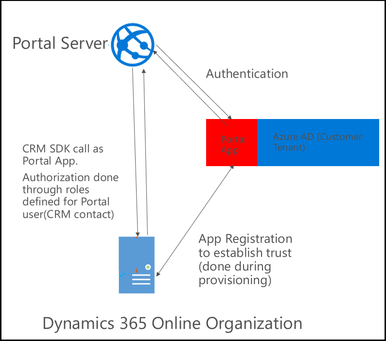
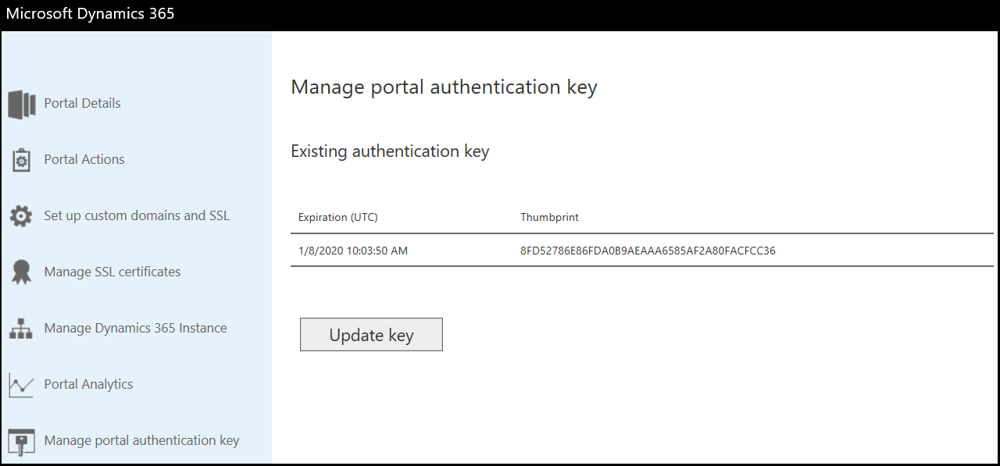
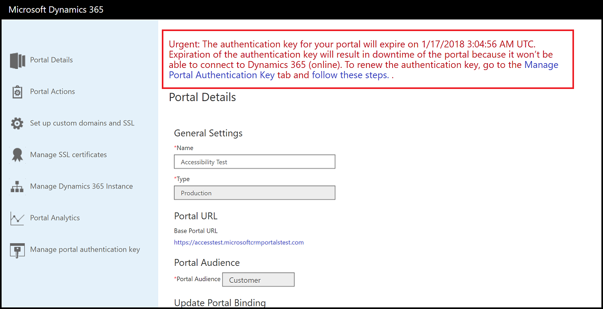

# Connect with Dynamics 365 online organization

A portal connects to [!INCLUDE[pn-dynamics-crm](../includes/pn-dynamics-crm.md)] online organization as an application by using an Azure Active Directory application. The application is created in the same tenant where the portal is available after its provisioning. The application is registered with the [!INCLUDE[pn-dynamics-crm](../includes/pn-dynamics-crm.md)] organization during the portal provisioning process.

Each portal has a separate Azure Active Directory application associated to it irrespective of whether they are connected to same [!INCLUDE[pn-dynamics-crm](../includes/pn-dynamics-crm.md)] organization or not. The default Azure Active Directory authentication provider created for a portal uses the same Azure Active Directory application to integrate Azure Active Directory authentication with the portal. Authorization is enforced by using web roles associated with the user accessing the portal.

You can see the application associated with a portal in Azure Active Directory. The name of this application will be Microsoft CRM Portals. The portal ID will also be available in the **App ID URI** field. The owner of this application would be the user who has provisioned the portal. You should not delete or modify this application, as this can break the portal functionality. You must be an owner of the application to manage a portal from Portal Admin Center.

## Authentication key

For a Portal to connect to [!INCLUDE[pn-dynamics-crm](../includes/pn-dynamics-crm.md)] using Azure Active Directory application, it requires an authentication key connected to the Azure Active Directory application. This key is generated when you provision a portal and the public part of this key is uploaded to Azure Active Directory application automatically.

> [!IMPORTANT]
> The authentication key once created has an expiration of two years. It must be renewed every two years to ensure that your portal is able to connect to the [!INCLUDE[pn-dynamics-crm](../includes/pn-dynamics-crm.md)] organization. If you do not update the key on time, the portal will stop functioning.  

You can see the details of the authentication key on the following screens:

**Portal Admin Center**

1. Go to the [!INCLUDE[pn-dynamics-crm](../includes/pn-dynamics-crm.md)] Administration Center page and select the **Applications** tab.
2. Select the name of the portal you want to see the key, and then select **Manage**.
3. Select **Manage portal authentication key**. The existing authentication key is displayed along with its expiration date and thumbprint.

  

**Portal**

1.	Sign in to portal as administrator.
2.	Navigate to the URL <portal_path>/_services/about. The expiration date of the existing authentication key is displayed. 

  

> [!NOTE]
> To view this information, you  must be signed in to your portal in the same browser session with a user that has all website access permission assigned.

To ensure that you are aware of the authentication key expiration, the notification is shared through the following mechanisms:

**Email**

Emails will be sent to all the users who have signed up for Email notifications for the organizations connected to their portal. More information about signing up for email notification: [Manage email notifications to admins](https://docs.microsoft.com/en-us/dynamics365/customer-engagement/admin/manage-email-notifications)

Email notifications are sent at the following intervals: 
- 90 days 
- 60 days 
- 30 days 
- 15 days 
- 7 days 
- 6 days 
- 5 days 
- 4 days 
- 3 days 
- 2 days 
- 1 day 
- 12 hrs 
- 6 hrs 
- 3 hrs

After expiry (once every day till 1 week after key expires)

> [!NOTE]
> - Intervals are calculated in UTC from the key expiry date.
> - Emails are not guaranteed exactly on the same interval as listed above and can be delayed sometimes as well as some intervals can be missed. Ensure that you check for the key expiration date through the screens as well.

**Portal Admin Center**

A message about key expiration is displayed at the top of the page.

**Portal**

When you navigate to the URL <portal_path>/_services/about, a notification about key expiration is displayed at the bottom of the page.

> [!NOTE]
> You must be signed in to your portal in the same browser session with a user that has all website access permission assigned.

## Renew portal authentication key

You must renew the key every two years to ensure that your portal is able to connect to [!INCLUDE[pn-dynamics-crm](../includes/pn-dynamics-crm.md)] organization.

> [!NOTE]
> To be able to renew the key, you must have permissions to [Manage your Portal](manage-portal.md).

1.	Go to the [!INCLUDE[pn-dynamics-crm](../includes/pn-dynamics-crm.md)] Administration Center page and select the **Applications** tab.
2.	Select the name of the portal you want to update the key, and then select **Manage**.
3.	Select **Manage portal authentication key**. The existing authentication key is displayed along with its expiration date and thumbprint.

  

4.	Select **Update key**.
5.	Select **Update** in the message. The update process starts, and a message is displayed

> [!NOTE]
> - While this process runs in background, the portal will restart once to make the necessary changes.
> - When a key is updated, it is updated for two years from that point of time.
> - This process will take 5-7 minutes approximately.

### Troubleshooting

If the key update has failed, an error is displayed at the top of the page, and the following action is displayed:
- **Retry Authentication Key Update**: Allows you to restart the portal authentication key update process. If the update fails multiple times, contact Microsoft support.