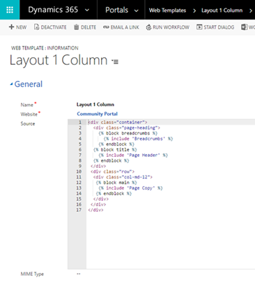
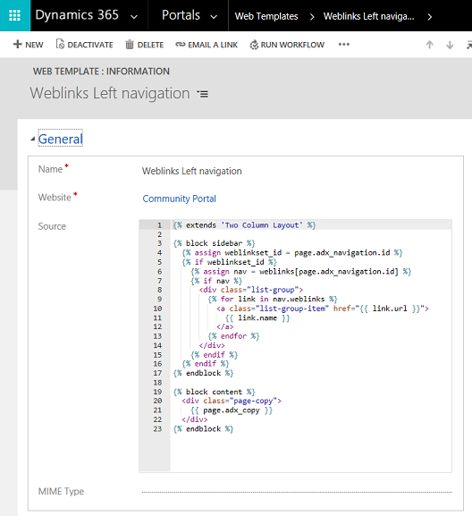
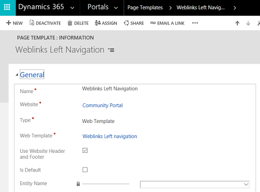
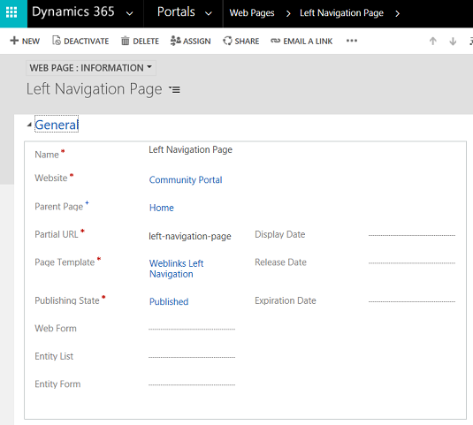

# Create a custom page template by using Liquid and a Web Template page template

[comment]: <> (Need more elaborate description of the steps)
In this example, we'll create a custom page template by using Liquid and a Web Template page template. [!INCLUDE[proc-more-information](../includes/proc-more-information.md)] [Store source content by using web templates](store-content-web-templates.md).  
Our goal is to build a simple two-column template that uses a web link set as left-side navigation, with the page content to the right. Something like this:

  

## Step 1: Create Web Template and write the Liquid template code

First, we'll create our Web Template and write the Liquid template code. We're likely to reuse some common elements of this template in future templates. So, we'll create a common base template that we'll then extend with our specific template. Our base template will provide breadcrumb links and our page title/header, as well as define our one-column layout:

  
> [!TIP]
> Read about template inheritance using the block and extends tags: [Template tags](#template-tags)

## Step 2: Create a new Web Template that extends our base layout template

Use the navigation web link set associated with the current page for our navigation links to create a new Web Template that extends our base layout template.

  

> [!TIP]
> Familiarize yourself on how to load web link sets using the [weblinks](#weblinks) object.

## Step 3: Create a new Web Template page template that uses the Web Template

  

Now, all that's left to do is create a Web Page that uses our page template, and has an associated Web Link Set, and we have our result.

  

### See also

[Create advanced templates for portals](create-advanced-templates.md)  
[Create a custom page template to render an RSS feed](render-rss-custom-page-template.md)  
[Render the entity list associated with the current page](render-entity-list-current-page.md)  
[Render a website header and primary navigation bar](render-site-header-primary-navigation.md)  
[Render up to three levels of page hierarchy by using hybrid navigation](hybrid-navigation-render-page-hierachy.md)  

