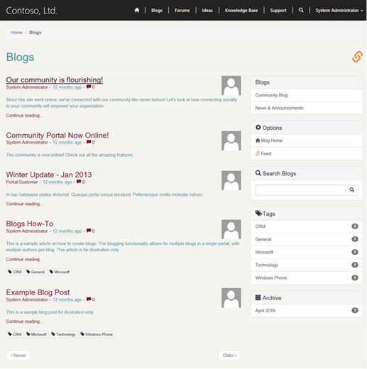

# Create a theme for your portal
When you build portals by using Dynamics 365 Portals, you'll be using the [[!INCLUDE[tn-bootstrap](../includes/tn-bootstrap.md)] front-end framework](https://getbootstrap.com/). By taking advantage of the [!INCLUDE[tn-bootstrap](../includes/tn-bootstrap.md)] ecosystem, you can quickly and easily brand these portals for your organization.  

## Implement portal templates by using [!INCLUDE[tn-bootstrap](../includes/tn-bootstrap.md)]

[!INCLUDE[tn-bootstrap](../includes/tn-bootstrap.md)] is a front-end framework that includes CSS and [!INCLUDE[pn-javascript](../includes/pn-javascript.md)] components for common web application interface elements. It includes styles for [navigation elements](https://getbootstrap.com/components/#nav), [forms](https://getbootstrap.com/css/#forms), [buttons](https://getbootstrap.com/css/#buttons), and a [responsive grid layout system](https://getbootstrap.com/css/#grid) that allows site layouts to dynamically adjust to devices that have different screen sizes, such as phones and tablets. By using the [!INCLUDE[tn-bootstrap](../includes/tn-bootstrap.md)] layout system, you can develop a single site that presents an appropriate interface to all devices your customers might use.

The templates included with Dynamics 365 Portals are implemented by using standard [!INCLUDE[tn-bootstrap](../includes/tn-bootstrap.md)] components with minimal additional custom styles. So when you implement the templates, you can take advantage of [!INCLUDE[tn-bootstrap](../includes/tn-bootstrap.md)] customization options. You can quickly customize the theme (fonts, colors, and so on) in a way that's applied consistently across the portal.

## Customize [!INCLUDE[tn-bootstrap](../includes/tn-bootstrap.md)]

[!INCLUDE[tn-bootstrap](../includes/tn-bootstrap.md)] supports customization through a set of variables. You can set any or all of these variables to custom values and then download a custom version of [!INCLUDE[tn-bootstrap](../includes/tn-bootstrap.md)] that is compiled based on these values.

The power of [!INCLUDE[tn-bootstrap](../includes/tn-bootstrap.md)] variables is that they don't dictate the style of a single element. All styles in the framework are based on and derived from these values. For example, consider the variable @font-size-base. This specifies the size that [!INCLUDE[tn-bootstrap](../includes/tn-bootstrap.md)] assigns to normal body text. However, [!INCLUDE[tn-bootstrap](../includes/tn-bootstrap.md)] also uses this variable to indicate the font size for headings and other elements. The size for an H1 element might be defined as 300 percent of the size of @font-size-base. By setting this one variable, you control the entire typographic scale of your portal in a consistent way. Similarly, the @link-color variable controls the color of hyperlinks. For the color you assign to this value, [!INCLUDE[tn-bootstrap](../includes/tn-bootstrap.md)] will define the hover color for links as 15 percent darker than your custom value.

The standard way to create a custom version of [!INCLUDE[tn-bootstrap](../includes/tn-bootstrap.md)] is [through the official [!INCLUDE[tn-bootstrap](../includes/tn-bootstrap.md)] site](https://getbootstrap.com/customize/#less-variables). However, due to the popularity of [!INCLUDE[tn-bootstrap](../includes/tn-bootstrap.md)], many third-party sites have also been created for this purpose. These sites might provide an easier-to-use interface for [!INCLUDE[tn-bootstrap](../includes/tn-bootstrap.md)] customization or predesigned versions of [!INCLUDE[tn-bootstrap](../includes/tn-bootstrap.md)] for you to download. [The official [!INCLUDE[tn-bootstrap](../includes/tn-bootstrap.md)] customizer](https://getbootstrap.com/customize/) site has more information about [!INCLUDE[tn-bootstrap](../includes/tn-bootstrap.md)] customization.  

When you download a customized version of [!INCLUDE[tn-bootstrap](../includes/tn-bootstrap.md)], it contains the following directory structure.

```
css/ |-- bootstrap.min.css img/
|-- glyphicons-halflings-white.png |-- glyphicons-halflings.png js/ |-- bootstrap.min.js
```

Or, depending on the customizer application used, it might only contain bootstrap.min.css. Regardless, bootstrap.min.css is the file that contains your customizations. The other files are the same for all custom versions of [!INCLUDE[tn-bootstrap](../includes/tn-bootstrap.md)] and are already included in your Dynamics 365 Portals.

## Apply a custom [!INCLUDE[tn-bootstrap](../includes/tn-bootstrap.md)] theme to your website

After you have your custom bootstrap.min.css, you can apply it to your portal in one of two ways. If you are a developer and prefer to work directly with the source code of your application, you can overwrite the version of bootstrap.min.css included in your application source with your custom version. However, we recommend in most cases that you apply your custom [!INCLUDE[tn-bootstrap](../includes/tn-bootstrap.md)] theme without modifying your site code by uploading it as a web file in the Dynamics 365 Portals's content management system.

1. Sign in to your application as a user with content management permissions. [!INCLUDE[proc-more-information](../includes/proc-more-information.md)] [Configure web roles for a PRM portal](configure-web-roles-partner-portal.md)  
2. Go to the **Home** page of your application.
3. Select **Children** &gt;**Edit this file** (the pencil and paper button) for **bootstrap.min.css** from the content editing toolbar (found in the upper-right corner of your browser window).
4. Select your custom bootstrap.min.css file in the **Upload File** field in the Edit This File dialog box that appears.
5. Ensure that the **Partial URL** field is set to bootstrap.min.css. This value indicates to the Dynamics 365 Portals's framework that it should use your custom version of [!INCLUDE[tn-bootstrap](../includes/tn-bootstrap.md)] instead of the default version included.
6. You might also want to select the **Hidden from Sitemap** check box (selected by default), so that this file doesn't appear to users in any navigation elements on the site.
7. Select **Save**.
8. Refresh the page, and your customized styles will appear immediately.

The following screenshot is an example of a customized version of [!INCLUDE[tn-bootstrap](../includes/tn-bootstrap.md)] applied to a community portal.

  

## Additional portal theme options

In addition to a custom [!INCLUDE[tn-bootstrap](../includes/tn-bootstrap.md)] version, Dynamics 365 Portals support uploading your own custom CSS files into the content management system. This lets you apply additional styling to your portal, without having to deploy a new version of its code. To do this, follow the procedure described previously for uploading custom [!INCLUDE[tn-bootstrap](../includes/tn-bootstrap.md)] CSS by using a file that contains your own CSS, and then choose a new partial URL for this web file. As long as the partial URL ends in **.css**, Dynamics 365 Portals will recognize it and apply it to your site.

Along with a customized version of [!INCLUDE[tn-bootstrap](../includes/tn-bootstrap.md)], you can use the content-editing system to add a custom logo and brand to your portal header. With these simple but powerful options, you're only a few minutes away from having your Dynamics 365 Portals's application reflect your brand.

### See also

[Engage with communities by using the community portal](engage-with-communities.md)  
[Configure a portal](configure-portal.md)  
