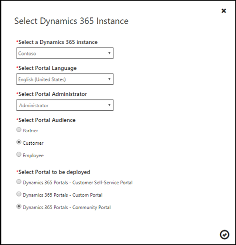

# Create web roles for portals
After a contact has been configured to use the portal, it must be given one or more web roles to perform any special actions or access any protected content on the portal. For example, to access a restricted page, the contact must be assigned to a role to which read for that page is restricted to. To publish new content, the contact must be placed in a role which is given content publishing permissions.

To create a web role:

1. Go to **Portals** > **Web Roles** > **New**.
3. Specify values for the required fields.
4. Select **Save**.

## Attributes and relationships

The table below explains the Web Role attributes used by [!INCLUDE[pn-dynamics-crm](../includes/pn-dynamics-crm.md)] portals.

| Name                     | Description                                                                                                                                                                                                                                     |
|--------------------------|-------------------------------------------------------------------------------------------------------------------------------------------------------------------------------------------------------------------------------------------------|
| Name                     | The descriptive name of the Web Role                                                                                                                                                                                                            |
| Website                  | The associated website                                                                                                                                                                                                                          |
| Description              | An explanation of the Web Role's purpose. Optional.                                                                                                                                                                                             |
| Authenticated Users Role | Boolean. If set to true, this will be the default web role for authenticated users (see below). Only one Web Role with the Authenticated Users Role attribute set to true should exist for a given website. This will be the default web role for authenticated users that have not been assigned a web role. |
| Anonymous Users Role     | Boolean. If set to true, this will be the default web role for unauthenticated users (see below). Only one Web Role with the Anonymous Users Role attribute set to true should exist for a given website. This will be the default web role for unauthenticated users. The Anonymous Users Role will only respect Entity Permissions.| 
|| 

Now that the Web Role has been created, you will be able to configure it to meet your needs via various permissions, rules, and associations.

- **Optional default web role for authenticated users**: By enabling the **Authenticated Users Role**, it will become the default web role for all users. This role is commonly used to provide a predetermined access for users that are not associated to any other roles. Keep in mind that users can have multiple web roles, but there can only be one Authenticated Users web role for authenticated users.
- **Optional default web role for unauthenticated users**: The **Anonymous Users Role** is intended to be used with Entity Permissions. It will not respect any other rules or permissions. By enabling the "Anonymous Users Role" it will become the default web role for all users. There can only be one Anonymous Users web role for unauthenticated users.

## Enable help for [!INCLUDE[pn-dynamics-crm](../includes/pn-dynamics-crm.md)] portals

[!INCLUDE[cc-set-crm-to-use-custom-help](../includes/cc-set-crm-to-use-custom-help.md)]

## Customize [!INCLUDE[pn-dynamics-crm](../includes/pn-dynamics-crm.md)] portal forms, dashboards, and reports
If you want to customize any of the portal forms, dashboards, or reports, you can find more information about customizing [!INCLUDE[pn-microsoftcrm](../includes/pn-microsoftcrm.md)] in the following links:

-   [Customize your [!INCLUDE[pn-dynamics-crm](../includes/pn-dynamics-crm.md)] system](https://technet.microsoft.com/library/dn531158.aspx)  
-   [Create and design forms](https://technet.microsoft.com/library/dn531143.aspx)  
-   [Create and edit dashboards](https://technet.microsoft.com/library/mt147906.aspx)  
-   [Create and edit processes](https://technet.microsoft.com/library/dn531144.aspx)  
-   [Report & Analytics with [!INCLUDE[pn-dynamics-crm](../includes/pn-dynamics-crm.md)]](https://technet.microsoft.com/library/dn531183.aspx)  

## Change the [!INCLUDE[pn-dynamics-crm](../includes/pn-dynamics-crm.md)] instance, audience, or type of portal
After your portal is created and provisioned, you can change the details of your [!INCLUDE[pn-dynamics-crm](../includes/pn-dynamics-crm.md)] instance and portal.

1.  Go to the [!INCLUDE[pn-dynamics-crm](../includes/pn-dynamics-crm.md)] Online Admin center, and then select the **Applications** tab.
2.  Select the name of the portal you want to edit, and then select **Manage**.
3.  Select the **Manage [!INCLUDE[pn-dynamics-crm](../includes/pn-dynamics-crm.md)] Instance** tab. [!INCLUDE[proc-on-this-page](../includes/proc-on-this-page.md)], you can review the [!INCLUDE[pn-dynamics-crm](../includes/pn-dynamics-crm.md)] instance that is currently linked to your portal.
4.  Select **Update [!INCLUDE[pn-dynamics-crm](../includes/pn-dynamics-crm.md)] Instance**. In the dialog box, use the provided fields to change your [!INCLUDE[pn-dynamics-crm](../includes/pn-dynamics-crm.md)] instance, portal language, or your portal administrator. You can also keep the same [!INCLUDE[pn-dynamics-crm](../includes/pn-dynamics-crm.md)] instance, but change the portal audience or type of portal.
5.  Select the  button to confirm your changes.  

  

### See also

[Engage with communities by using the community portal](engage-with-communities.md)  
[Configure a Dynamics 365 portal](configure-portal.md) 
[Control webpage access for portals](webpage-access-control.md)  
[Configure web roles for a PRM portal](configure-web-roles-partner-portal.md) 
[Add record-based security by using entity permissions for portals](assign-entity-permissions.md) 
