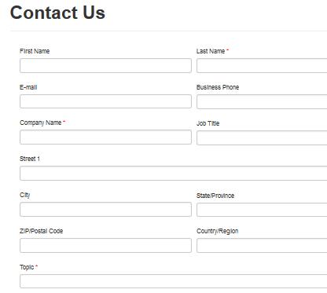

# Define entity forms and custom logic within the [!INCLUDE[pn-dynamics-crm](../includes/pn-dynamics-crm.md)] portal

A data driven configuration to allow end users to add a form to collect data in the portal without the need for a developer to surface the form in the portal. Entity Forms are created in [!INCLUDE[pn-dynamics-crm](../includes/pn-dynamics-crm.md)] and then placed into webpages in the Portal or used in conjunction with Sub-Grids and Entity Lists to build out complete web applications. [!INCLUDE[proc-more-information](../includes/proc-more-information.md)] [Add a webpage to render a list of records](add-webpage-render-list-records.md).  

  

## Add a form to your portal

The Entity Form contains relationships to webpages and additional properties in order to control the initialization of the form within the portal. The relationship to Web Page allows dynamic retrieval of the form definition for a given page node within the [website](#website-1).  

To view existing Entity Forms or to create new Entity Forms, go to **Portals** &gt; **Entity Forms**

When creating a new Entity Form the first step is to decide the **Entity** and **Form Name** that you will be rendering as well as the **mode: Insert, Edit, or Read Only**. The mode selected will determine if you are creating a new record from the portal, editing an existing record, or just displaying info about a record on the portal.

>[!Note]
> An **Entity Form** must be associated with a Web Page for a given [website](#website-1) for the form to be viewable within the site.

The Web Pages associated with the Entity Form can be viewed by clicking the **Web Pages** link listed in the **Related** navigation links in the leftmost menu.

When creating or editing a Web Page, an **Entity Form** can be specified in the lookup field provided on the Web Page form.

The various master pages used by the portal found in the [!INCLUDE[pn-dynamics-crm](../includes/pn-dynamics-crm.md)] portal installation directory contains declarations of the **EntityForm** server control. When rendering the Web Page containing either the Page (~/Pages/Page.aspx) page template or Full Page (~/Pages/FullPage.aspx) page template, the controls will determine if the Entity Form lookup contains a value then the form will be rendered.

## Secure your forms

To secure your forms, you must create entity permissions that determine access and ownership of the records in [!INCLUDE[pn-dynamics-crm](../includes/pn-dynamics-crm.md)] according to Web Roles. If a user lands on an Entity Form and does not have permissions, they will receive an error message. To Enable Permissions for an Entity Form. set **Enable Entity Permissions** to true. [!INCLUDE[proc-more-information](../includes/proc-more-information.md)] [Create web roles for portals](create-web-roles.md).  

## Geolocation configuration for entity form

A managed form can be configured to display a map control to either display an existing location as a pin on a map or to provide the ability for the user to specify a location. See [Add Geolocation](add-geolocation.md).

The form's map control requires additional configuration to tell it what the ids of the various location fields are in order to assign/retrieve values to/from them. The Entity Form record in [!INCLUDE[pn-dynamics-crm](../includes/pn-dynamics-crm.md)] has a configuration section that defines these field mappings that you must be specified. The field names will vary depending on the schema you have created.

 

> [!Note]
> - The address field in a read-only entity form is replaced with the map when Geolocation is enabled.
> - The Geolocation section is not visible in the German Sovereign Cloud environment. If a user has enabled geolocation using a different form, it will not be displayed during rendering on portal.

### See also

[Configure a Dynamics 365 portal](configure-portal.md)  
[Web Form properties for portals](web-form-properties.md)  
[Web Form steps for portals](web-form-steps.md)  
[Web Forms metadata for portals](configure-web-form-metadata.md)  
[Web Form subgrid configuration for portals](configure-web-form-subgrid.md)  
[Notes configuration for Entity Forms and Web Forms for portals](configure-notes.md)