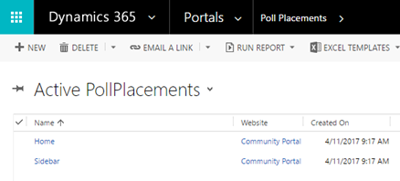
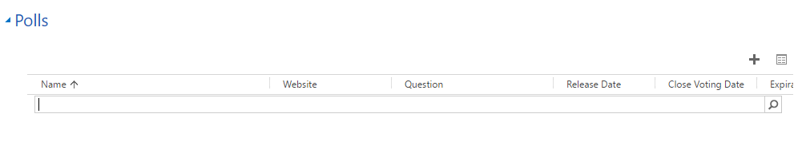
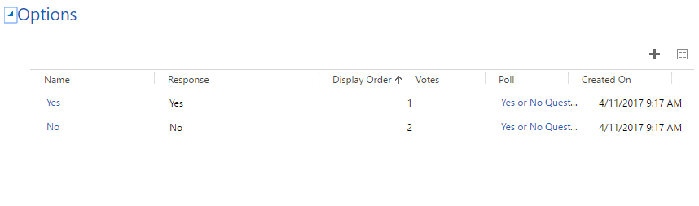
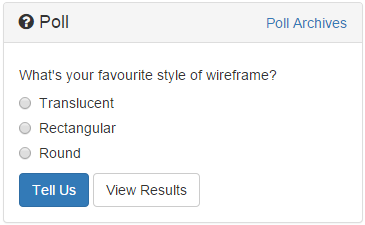
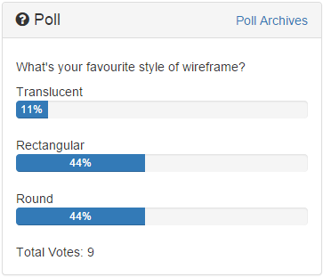
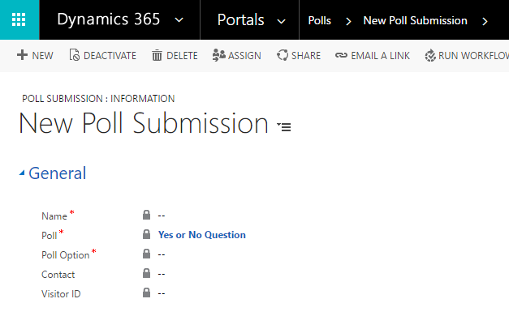

# Gather feedback by using polls on a portal
Polls give your web audiences a quick and easy way to voice their opinion on concise topics and then immediately see feedback from their vote, automatically.

The polls capability of [!INCLUDE[pn-dynamics-crm](../includes/pn-dynamics-crm.md)] portals provide single question or multiple choice response polls on simple topics of interest. Either way, responses are instantly stored and associated with the applicable [!INCLUDE[pn-dynamics-crm](../includes/pn-dynamics-crm.md)] Contact record for immediate review or aggregate reporting. You can use them as simple market research tools and, if you refresh or rotate the polls dynamically, you'll keep your website looking current and topical.

Polls may be placed on the portal via the PollPlacement control. This control works very similarly to the AdPlacement control. If there are any polls associated with the Poll Placement entity that is being rendered by the PollPlacement control, those polls will be rendered. If there is more than one poll for a given placement, the placement will randomly present one of the specified polls.

>[!Note]
> Users may vote anonymously. Duplicate votes are not permitted. Basic information about submissions is tracked in [!INCLUDE[pn-dynamics-crm](../includes/pn-dynamics-crm.md)], and users who sign in to the website will have their submissions linked to the contact entity that tracks that user in [!INCLUDE[pn-dynamics-crm](../includes/pn-dynamics-crm.md)].

## Add a poll to the page

Content managers may use [Template tags](#template-tags) to add a poll to any editable content area:  

``

--OR--

``

> [!Note]
> Example Web Templates are configured in the starter websites**. You may use the template "Random Poll" to display a random Poll from a particular Poll Placement, or the template "Poll Template" to display a specific Poll. You may edit these templates, or create your own based on their example, using [Polls](#polls-1).  

## Create a poll placement

To Create a new poll placement region:

1. Go to **Portals** > **Poll Placements**
2. Click **New**

      

3. Select the associated **Website**, give the placement a **Name**, and optionally select the [web templates](store-content-web-templates.md) that will control how it renders.

4. Once the placement has been created you must associate one or more polls with this placement. In the Polls tab of the Poll Placement, click the Add Poll Record button ("+"). 
5. In the resulting lookup box, select an existing poll record or create a new poll by clicking **New**.

      

## Polls

A poll is a simple yes/no or multiple-choice question that you can display on your portal via Poll Placements. There are many customizable options for the display of polls available for developers, but for content managers adding polls to your website is as easy as choosing a question and series of possible answers (Poll Options). A poll must have related options to function, and must be associated with a Poll Placement to be rendered on the portal.

A new poll can be created in two ways: 
- by navigating to the **Polls** section in the **Portals** area in [!INCLUDE[pn-dynamics-crm](../includes/pn-dynamics-crm.md)], or 
- by clicking the **New** button on the **Look Up Records** window while adding a poll to a poll placement.

## Poll attributes

| Name                | Description                                                                                                                                                                                                                                                                                                                                  |
|---------------------|----------------------------------------------------------------------------------------------------------------------------------------------------------------------------------------------------------------------------------------------------------------------------------------------------------------------------------------------|
| Name                | The descriptive name of the poll.                                                                                                                                                                                                                                                                                                            |
| Website             | The associated [web templates](store-content-web-templates.md).                                                                                                                                                                                                                                                                |  
| Web Template        | The associated [web templates](store-content-web-templates.md) that will be used by default to render the Poll. This field is optional; if it is blank the Poll will be rendered using a default template.                                                                                                                     |  
| Question            | This is the actual Question that is being asked in the poll. The associated Poll Options are the possible answers can be selected for this poll.                                                                                                                                                                                             |
| Submit Button Label | The text that is to be used for the submission button.                                                                                                                                                                                                                                                                                       |
| Release Date        | Controls the date and time after which the Poll will be visible on the portal. If the Poll Placement is rotating through multiple Polls, an unreleased poll will not be shown. If no released polls are associated with a Poll Placement, nothing will appear. This is useful for controlling the release of time-sensitive content.         |
| Expiration Date     | Controls a date/time prior to which the Poll will be visible on the portal.                                                                                                                                                                                                                                                                  |
| Close Voting Date   | Until this date, users who have not yet voted on a poll can vote on the poll.|

>[!Note] 
> - When a user has voted on a poll, they will see a summary of current results for the poll. These results will also be displayed for a poll that is past its closed date, but for which the user has not yet voted. This allows you to continue to reveal the results of polls after you no longer want people to be able to vote on them. 
> - The difference between the close voting date and expiration date is that after the expiration date has passed, the poll will no longer show up on the poll placement (it will not be cycled to). The close Voting date only determines the date past which users cannot vote on the poll.

Now the poll has been created, you must associate one or more poll options with this poll. In the Options tab of the Poll, click the **Add Poll** option ("+")

  

## Poll options

A poll is a question that is being presented to the user. A Poll has two or more possible answers as determined by the content author. These answers are represented in [!INCLUDE[pn-dynamics-crm](../includes/pn-dynamics-crm.md)] by Poll Options, which must be associated with the Poll in question. A new Poll Option is created via the Look Up Records window when adding Poll Options to a Poll, as described above.

## Poll option attributes

| Name          | Description                                                                |
|---------------|----------------------------------------------------------------------------|
| Name          | The descriptive name for the Poll Option.                                  |
| Poll          | The Poll that the option is associated with.                               |
| Answer        | The text to display as an available poll voting option.                    |
| Votes         | The number of votes the poll option has received (read-only).              |
| Display Order | A numeric value that will determine the display order of the poll options. |

## Poll submissions

When a user visits the website, they will be given the opportunity to vote on the poll displayed on the page.

  

Users may vote only one time, after this if the poll is displayed, they will see the results for that poll:

  

The details of the poll voting results are stored in [!INCLUDE[pn-dynamics-crm](../includes/pn-dynamics-crm.md)] as Poll Submissions records. The poll submission entity contains the following information:

  

| Name        | Description                                                                                   |
|-------------|-----------------------------------------------------------------------------------------------|
| Name        | Displays the name of the voter if the user is logged on; otherwise, records the anonymous ID. |
| Poll        | The associated Poll.                                                                          |
| Poll Option | The Poll Option that the user selected.                                                       |
| Contact     | The associated Contact record of the voter if the user is logged on                           |
| Visitor ID  | The anonymous ID of the voter if the user is anonymous.                                       |

### See also

[Configure a Dynamics 365 portal](configure-portal.md)  
[Add a webpage to render a list of records](add-webpage-render-list-records.md)  
[Create and run advertisements on a portal](create-run-advertisement.md)  
[Rate or vote on a webpage or blog post on a portal](rate-webpage-blog-post.md)  
[Redirect to a new URL on a portal](add-redirect-url.md)  

