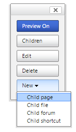
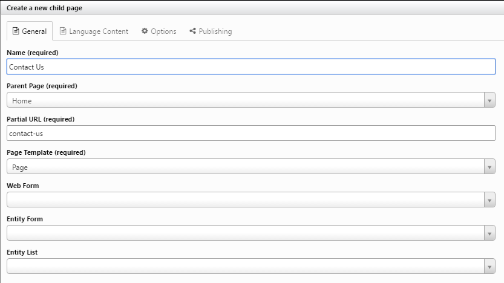
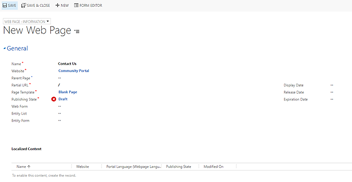
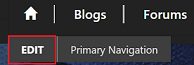
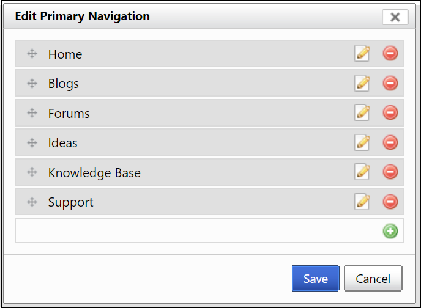
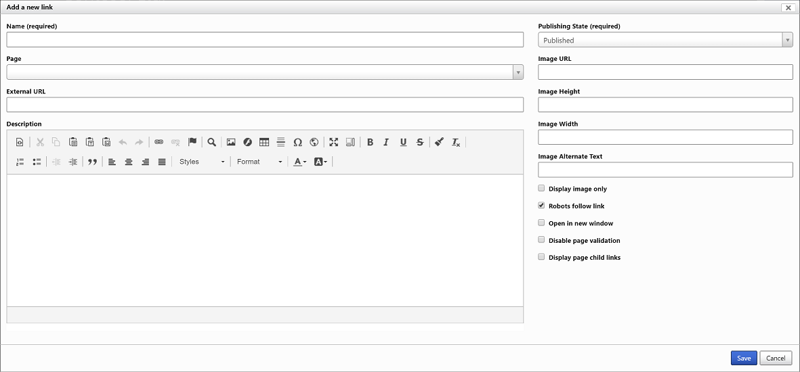
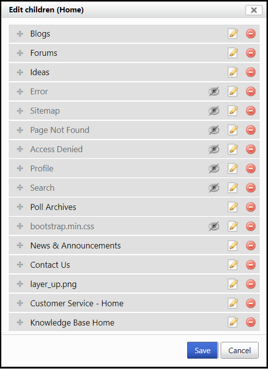
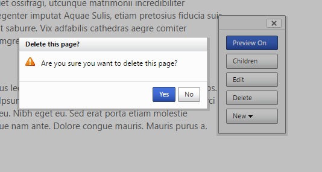

# Get started with the portal content editor

Dynamics 365 Portals offers a powerful suite of editing tools. Users with suitable permissions can add, modify, or delete webpages and their content without having to directly access the databases and web servers that physically contain these entities. [!INCLUDE[proc-more-information](../includes/proc-more-information.md)] [Control webpage access for portals](webpage-access-control.md).

This document assumes that you have permission to perform these tasks. If you do not, ask your portal administrator to arrange this for you. The permissions can be assigned to individual pages, so be sure to specify which pages you will need to edit.

> [!Note]
> If you are using the sample organization, sign in with **administrator** as the username and <strong>pass@word1</strong> as the password.

## Use the portal content editor toolbar

Sign in first. This will enable content editing for users with this permission. A toolbar on the right hand side allows you to edit the page properties. The edit button will appear when the mouse moves over any content that can be managed by the user.

| Option         | Description                                                                                               |
|----------------|-----------------------------------------------------------------------------------------------------------|
| Preview On/Off | When on, published and unpublished content will be visible. When off, only published content can be seen. |
| Edit           | Opens a dialog where one can change the properties for the current page.                                  |
| Delete         | Deletes the current page.                                                                                 |
| New            | Opens a menu where one can chose to create a child page, file, event, forum or shortcut.                  |
| Children       | Opens a dialog containing child records for the current page where one can reorder, edit, or delete them. |
||

## Edit the header and footer

Point to the page header and select the edit button that appears. This will open a rich-text editor. Change the header text and select the disk icon to save the changes. [!INCLUDE[proc-more-information](../includes/proc-more-information.md)] [Customize content by using content snippets](customize-content-snippets.md).  

## Add a new webpage

1. In the portal content editor toolbar, select **New** > **Child page**. 

      

2. In the **Create a new child page** dialog box, enter the properties for the new child page.

      

3. Select **Save** to create the new page. The new page is created as a child of the web page you were on when you selected **New** > **Child page**.

More information: [Create and manage web pages](web-page.md)

After being redirected to the newly created page, point to the large rectangular box under the page title and select the edit button that appears. Add some content, and then select the disk icon to save the changes.

You can also create and translate a web page. Start by [creating a web page](web-page.md) and then change the **Publishing State** from **Draft** to **Published** when it is ready for use on the website. The **Localized Content** section can be filled in after the webpage is created to create the different translations needed.

 

## Edit the primary navigation

Web link sets are groups of links used for navigation based on location on the webpage. Primary Navigation is the web link set that you see at the top of every webpage, and it can be edited in the portal with the system administrator web role.

1.  Point to the primary navigation and select the **Edit** button that appears. 

    

    A dialog box appears with a list of web links that can be reordered or removed, and an option to add new links.

    

2.  To add a new link to the primary navigation, select the row with the green plus icon.

    

3.  Enter the name for the page you just created.

4.  From the **Page** list, choose the page you created.

5.  Select **Save**.

## Manage child pages

On the home page, select **Children** in the portal content editor toolbar. A dialog box appears with a list of all child pages for the page you were on when you selected **Children**. A few pages are displayed with an icon of an eye with a line through it. This icon indicates the page is not visible in the site map, but if published it can still be viewed if linked to directly. As with a web link set, one can reorder, edit or delete the webpages listed.

## Delete a page

Navigate to the page to be deleted, and select **Delete** in the toolbar. Select **Yes** to confirm. When deleting from the toolbar the pages are placed into a deactivated state instead of being deleted. Any child pages of the deleted page will also be deactivated.

  

> [!Note]
> Certain webpages are important to have for a properly functioning website, for instance, a sign-in page or 404 page. Be sure not to delete these pages, because doing so can cause a website to stop functioning properly.

### See also

[How to provision a portal](provision-portal.md)  
[Use the front-side editing engine to publish content](publish-content-editing-engine.md)  
[Customize content by using content snippets](customize-content-snippets.md)  

