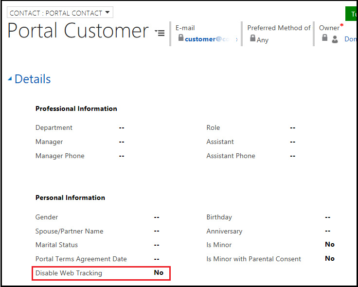

# Implementing General Data Protection Regulations in your Dynamics 365 portals

The General Data Protection Regulation (GDPR) is a legal act of the European Union (EU), which protects data for all individuals within the EU. With GDPR, people can control the use of their personal data in [!INCLUDE[pn-dynamics-crm](../includes/pn-dynamics-crm.md)].

As an administrator, you can configure your portal to meet GDPR standards. For example, minors must have parental consent to use the portal. You can also establish terms and conditions for people who use your portal. Users must agree to the terms and conditions to use the portal.

GDPR allows you to obtain consent from portal users about the use of their personal data, identify minor users, and get parental consent for minors.

## Audit logging

The **Last Successful Sign-in** field in the portal contact record shows when a portal user has last logged in. This date is picked up by a [!INCLUDE[pn-dynamics-crm](../includes/pn-dynamics-crm.md)] audit of the contact record and makes that information available in the standard audit stream. This allows the administrator to see inactive community members and delete their records.

## Identifying minor portal users and obtaining parental consent

Regulations for identifying minors vary by country/region. Because a minor can only access the portal with parental consent, you can configure the portal to identify minors using these fields in the portal contact record:
- **Is Minor**: Indicates that the contact is considered a minor in their jurisdiction. By default, **No** is selected.
- **Is Minor with Parental Consent**: Indicates that the contact is considered a minor in their jurisdiction and has parental consent. By default, **No** is selected.

    

The following site settings control the use of portals by minors and minors without parental consent:

| Name  | Description   |
|-----------------------|------------------------------------------|
| Authentication/Registration/DenyMinors  | Denies use of the portal by minors. By default, it is set to false.                          |
| Authentication/Registration/DenyMinorsWithoutParentalConsent | Denies use of the portal by minors without parental consent. By default, it is set to false. |
|||

If a portal user is determined to be a minor and the portal is configured to block minors, an appropriate message appears and content is not shown.

If a portal user is determined to be a minor without parental consent, and the portal is configured to block minors without parental consent, an appropriate message appears and content is not shown.

The following content snippets control messages that appear when the portal is used by minors and minors without parental consent. You can change the message according to your requirements.

| Name                                                        | Type | Value                                                                    |
|-------------------------------------------------------------|------|--------------------------------------------------------------------------|
| Account/Signin/MinorNotAllowedHeading                       | Text | Age Requirements                                                         |
| Account/Signin/MinorNotAllowedCopy                          | HTML | The use of this portal is not suitable for use by minors and is not allowed. |
| Account/Signin/MinorWithoutParentalConsentNotAllowedHeading | Text | Parental Consent                                                         |
| Account/Signin/MinorWithoutParentalConsentNotAllowedCopy    | HTML | The use of this portal by minors requires parental consent.              |
|||

When someone registers using an external provider and the portal is configured to block minors or minors without parental consent, the contact record is not created and the user is not authenticated.

## Agreeing to terms and conditions

According to the GDPR, portal users must agree to the terms and conditions to allow marketing, profiling, or access to private information. As an administrator, you can publish your own terms and conditions to get consent of the portal user before they are authenticated to the site.

The following content snippets control the display of terms and conditions on the screen. You can change the text according to your requirements.

| Name                                           | Type | Value                                 |
|------------------------------------------------|------|---------------------------------------|
| Account/Signin/TermsAndConditionsHeading       | Text | Terms and Conditions                  |
| Account/Signin/TermsAndConditionsCopy          | HTML |                                       |
| Account/Signin/TermsAndConditionsAgreementText | Text | I agree to these terms and conditions |
| Account/Signin/TermsAndConditionsButtonText    | Text | Continue                              |
|||

The `Account/Signin/TermsAndConditionsCopy` content snippet is empty by default. A portal administrator must enter the terms and conditions in this content snippet.

The following site settings control the terms publication date and whether the terms should be displayed on the portal:

| Name  | Description |
|------------|---------------|
| Authentication/Registration/TermsPublicationDate  | A date/time value in GMT format to represent the effective date of the current published terms and conditions. If the terms agreement is enabled, portal users that have not accepted the terms after this date will be asked to accept them the next time they sign in. If the date is not provided, and the terms agreement is enabled, the terms will be presented every time portal users sign in.   **Note**: If you want a portal user to agree to the terms and conditions every time they sign in, do not provide a value for this site setting.|
| Authentication/Registration/TermsAgreementEnabled | A true or false value. If set to true, the portal will display the terms and conditions of the site. Users must agree to the terms and conditions before they are considered authenticated and can use the site. By default, it is set to false.        |
|||

The following field is added in the portal contact record to store the date and time a portal user agreed to the terms and conditions:
- **Portal Terms Agreement Date**: Indicates the date and time that the person agreed to the portal terms and conditions.

    

## Integrating with Dynamics 365 for Customer Insights

[!INCLUDE[pn-dynamics-crm](../includes/pn-dynamics-crm.md)] for Customer Insights (DCI) is a cloud-based SaaS service that allows organizations of all sizes to bring together data from multiple sources and generate knowledge and insights to build a holistic 360-degree view of their customers.

As a portal administrator, you can enable a portal to send a user's activity data to your DCI instance. More information: [View activity of a user on a portal](view-user-activity.md)

If a portal user is determined to be a minor or a minor with parental consent, the user’s activity is not sent to DCI. As an administrator, you can configure your portal to send the user’s activity to DCI using the following field in the portal contact record:
- **Disable Web Tracking**: Indicates that the contact has opted out of web tracking. By default, **No** is selected.

    

> [!NOTE]
> You must configure DCI and enable [portal interaction tracking](view-user-activity.md) if the **Disable Web Tracking** field is set to **No**. You must also place this field on the profile form to use this feature.

## Migrating identity providers to Azure AD B2C

The portal supports a configurable security system that lets our customers support multiple authentication systems. The portal includes its own local credentials in addition to federating with external identity providers using standard protocols such as OIDC, SAML, and WS-Federation. Going forward, we recommended that you use only Azure AD B2C identity provider for authentication and that you deprecate other identity providers.

### Marking an identity provider as deprecate

You can configure your portal to mark other identity providers as deprecated and allow users to migrate to Azure AD B2C identity provider. 

The following site settings are used to control the deprecation of identity providers:

| Name  | Description  |
|--------|--------|
| Authentication/Registration/LocalLoginDeprecated | A true or false value. If set to true, the local account will be marked as deprecated. The portal user will be required to migrate to a non-deprecated account. By default, it is set to false. |
| Authentication/[protocol]/[provider]/Deprecated  | A true or false value. If set to true, the specific account will be marked as deprecated. The portal user will be required to migrate to a non-deprecated account. By default, it is set to false. |
|||

When a portal user tries to sign in, and you have marked at least one identity provider as deprecated, the deprecated account is shown on the page. In the following example, a Microsoft account is marked as deprecated.

The text on the screen for legacy authentication provider can be changed by using the following content snippet:

| Name                                               | Type | Value                         |
|----------------------------------------------------|------|-------------------------------|
| Account/Signin/SignInExternalDeprecatedFormHeading | Text | Sign in with a legacy account |
|||

> [!NOTE]
> The deprecated identity providers are not shown when a user registers or redeems an invitation for a portal.

### Migrating a deprecated identity provider to a new identity provider

If a portal user signs in with a deprecated identity provider, the account migration screen displays a message to sign in with a non-deprecated identity provider. When the user signs in with the non-deprecated identity provider, the user account is associated with the new provider.

The message on the screen for account migration can be changed using the following content snippets:

| Name                                         | Type | Value                                                                                                                                                                                                                |
|----------------------------------------------|------|----------------------------------------------------------------------------------------------------------------------------------------------------------------------------------------------------------------------|
| Account/Conversion/PageTitle                 | Text | Account Migration                                                                                                                                                                                                    |
| Account/Conversion/PageCopy                  | HTML | You have signed in with an account that is no longer supported. To continue using this portal, you must migrate to a different account. Select the button below to sign in with a new or existing supported account. |
| Account/Conversion/SignInExternalFormHeading | Text | Sign in with a supported account.                                                                                                                                                                                     |
|||

The portal allows multiple identities to be associated with a single contact record. When multiple providers are deprecated, a portal user must consent to the terms and conditions multiple times. Whenever a user signs in with a deprecated identity provider, the account migration process is initiated for each deprecated provider and the contact record is associated with the non-deprecated provider after account migration.

For example:  The portal supports Microsoft account (MSA), Google, and Facebook as identity providers for authentication. If you mark Google and Facebook as deprecated providers, and a portal user only has Google and Facebook as identity providers for authentication, the user will receive the account migration message when they try to sign in using either of these two providers. When the user signs in using MSA, MSA is added to the user’s contact record. The user now has only MSA as the supported authentication identity provider.

When a portal user selects a new identity provider and the identity is already associated with another contact record, an error message appears. You can configure the error message using the following content snippets:

| Name                                                     | Type | Value                                                                                                                               |
|----------------------------------------------------------|------|-------------------------------------------------------------------------------------------------------------------------------------|
| Account/Signin/AccountConversionIdentityUsedErrorHeading | Text | Account Conversion Error                                                                                                            |
| Account/Signin/AccountConversionIdentityUsedErrorText    | HTML | This account already exists. Close your browser, restart the process, and select a different account on the Account Migration page. |
|||

### Disabling local login

You can configure a portal to disable local login by using the `Authentication/Registration/LocalLoginDeprecated` site setting. If someone tries to sign in using local credentials, the account migration screen appears along with the instruction to sign in with a non-deprecated identity provider. When the account is migrated, local credentials for the user are disabled.

> [!NOTE]
> If you mark local login as deprecated, the user will not be able to register for a new account.

The following field is added in the portal contact record to indicate if the local login is disabled for a user:
- **Local Login Disabled**: Indicates that the contact can no longer sign in to the portal using the local account. By default, it is set to **No**. This field is set to **Yes** if a user’s account is migrated to a non-deprecated identity provider and local login is disabled.

    
