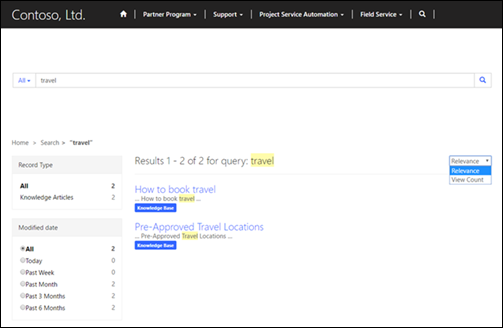

# Use faceted search to improve portal search

Portal content may be searched by using filters based on characteristics of the content. The filters implemented by faceted portal search allow customers to find the content they want more quickly than a traditional search.

## Enable or disable faceted search

Out-of-the-box faceted search is enabled in your portals. To control or enable it, follow these steps:

1. Sign in to [!INCLUDE[pn-dynamics-crm](../includes/pn-dynamics-crm.md)] and go to **Portals** &gt; **Website** &gt; **Site Settings**.
2. Select the **Search/FacetedView** site setting. 
3. Change the **Value** to **True** to enable or **False** to disable faceted search.

To disable a single piece of the faceted view:
1. Sign in to [!INCLUDE[pn-dynamics-crm](../includes/pn-dynamics-crm.md)] and go to **Portals** &gt; **Web Templates**.
2. Select the view to disable (that is, Knowledge Management – Top Rated Articles)
3. Select **Deactivate** at the top of the page.

## Group entities as part of a record type for faceted view

The site setting **Search/RecordTypeFacetsEntities** allows you to group similar entities together so users have logical ways of filtering search results. For example, instead of having separate options for forums, forum posts, and forum threads, these entities are grouped under the Forums record type.

In [!INCLUDE[pn-dynamics-crm](../includes/pn-dynamics-crm.md)], go to **Portals** &gt; **Websites** &gt; **Site Settings** and open the **Search/RecordTypeFacetsEntities** site setting. 

Notice that the different entities are preceded by the word **Forums:**. This is because the first value is the name with they are grouped as. This word will be translated based on the language that is being used on the portal.

## Use faceted search to improve knowledge search results

Faceted search enables portals to have search filters on the leftmost side allowing you to choose between items like forums, blogs, and knowledge articles. More filters are added for specific search types. For example, knowledge articles can be filtered by Record Type, Modified Date, Rating, and Products to help customers find the content they need. The rightmost side also has a drop-down box that sorts results based on the customer’s choice of Relevance or View Count (specific to knowledge articles). Below is a screen capture with an example of some of the available filters.

