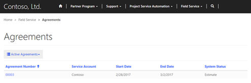
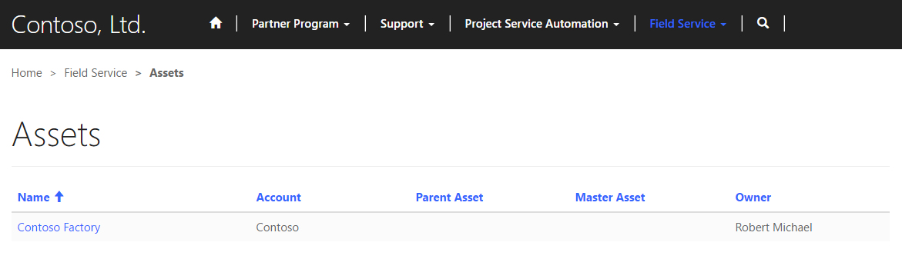
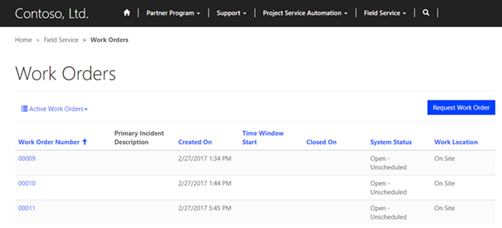
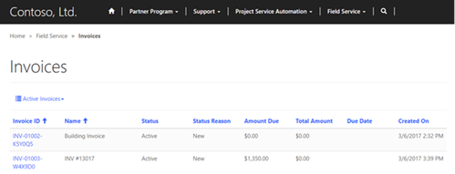

# Field Service integration

The Partner Field Service solution for Dynamics 365 can now be installed on a Partner Portal (Field Service for CRM and Partner Portal Solutions must be installed first). With this solution installed, customers and partners will be able to view various parts of the Field Service section of Dynamics 365 on the Partner Portal. Some of the available entities that can be viewed are assets, work orders, and invoices.

## View agreements on the partner portal

Customers can view Active and Expired Agreements on the portal that are connected to their account on the partner portal if they have the correct web role and the agreement is properly created. By assigning the FS Customer Approver or FS Customer Reviewer web role to the customer, they will be able to view agreements on the partner portal. To create/edit an agreement to be visible on the portal, navigate in Dynamics 365 to **Field Service** &gt; **Service Delivery** &gt; **Agreements**. From here select an agreement or create a new one with the **+ New** button at the top of the page. Fill in the **Service Account** field with the account the customer is connected to and select the **Expose to Customer** checkbox (both under the **General** tab). After all of this is done, a customer can sign in to the portal and navigate to **Field Service** &gt; **Agreements** and change the filer to **All Agreements**. Now the customer can view the agreements created in Dynamics 365. The page will show basic details and the customer can click on an agreement to view the specific agreement details.

  

## View assets on the partner portal

Customers can view existing assets on the portal that are connected to their account on the partner portal if they have the correct web role and the asset is properly created. By assigning the FS Customer Approver or FS Customer Reviewer web role to the customer, they will be able to view assets on the partner portal. To create/edit an asset to be visible on the portal, navigate in Dynamics 365 to **Field Service** &gt; **Service Delivery** &gt; **Customer Assets**. From here select an asset or create a new one with the **+ New** button at the top. Set **Account** to the account the customer is connected to and select the **Expose to Customer** checkbox. The customer can then sign in to the portal and navigate to **Field Service** &gt; **Assets** to see the assets created in Dynamics 365. The customer will be able to see each asset connected to their account with what parent and/or master assets the asset is connected to.  

## View work orders for field service on the partner portal

Customers can view active and inactive work orders on the portal that are connected to their account on the partner portal if they have the correct web role and the work order is properly created. By assigning the FS Customer Approver or FS Customer Review web role to the customer, they will have the correct web role to view work orders on the partner portal. To make a work order viewable in a portal it must be defined as viewable in Dynamics 365. Go to **Field Service** &gt; **Work Order & Schedule** &gt; **Work Orders**. Click on the work order to edit or click the **+ New** button to create a new one. Fill in the **Service Account** with the account the customer is connected to and select the **Expose to Customer** checkbox to allow a customer to view it on the portal. After signing in to the portal, the customer can navigate to **Field Service** &gt; **Work Orders** and see the work orders that are connected to their account.

  

## View invoices for field service on the partner portal

Customers can view active and inactive invoices that are connected to their account on the partner portal if they have the correct web role and the work order has been properly created. By assigning the FS Customer Approver or FS Customer Review web role to the customer, they will have the correct web role to view invoices on the partner portal. To make an invoice viewable in a portal, it must be defined as viewable in Dynamics 365. Go to **Field Service** &gt; **Service Delivery** &gt; **Invoices**. Select the invoice to edit it, or click the **+ New** button to create a new one. Be sure that the invoice is on the **Invoice** section of the drop-down menu on the top left side of the page. Fill in the necessary details for the invoice and ensure the **Expose to Customer** checkbox has been selected. After signing in to the portal and going to **Field Service** &gt; **Invoices**, the customer will be able to view the invoice.  

## Automatically distribute opportunities to preferred partners

You can automatically distribute opportunities to partners based on a set of criteria that determines the best partner for the job. The built-in metrics for opportunity assignment first determine which partners are available to take on this opportunity. This table shows the factors that are used to decide whether a partner is available.

| Capacity            | A partner’s capacity is the maximum number of opportunities that partner can take on at once. This value can be adjusted from the account details page for each partner.                                                            
                                                                                                                                                                                                                                       
  |  > [!Note]                                                                                                                          |   > Capacity includes opportunities that are in progress, as well as those that have not yet been accepted by a partner. It does not include internal opportunities created by that partner.                                        
  |------------------------------------------------------------------------------------------------------------------------------------------------------------------------------------------|                                         
  |  |                                         |
|---------------------|-------------------------------------------------------------------------------------------------------------------------------------------------------------------------------------------------------------------------------------|
| Estimated revenue   | You can set a minimum and maximum range for estimated revenue on the account details page for each partner. If the estimated revenue for an opportunity falls within this range, the partner will be available for assignment.      |
| Territory           | Territories are geographic regions that are assigned to a partner account. If the address of the customer associated with the opportunity is within a territory covered by a partner, the partner will be available for assignment. |
| Lead type           | The lead type entity can be used to categorize opportunities. You can assign which lead types each partner is able to work on.                                                                                                      |
| Associated products | If the products associated with an opportunity are all covered by a partner, they will be available for assignment. If any of the products are not covered by a partner, they will not be available for assignment.                 |

## Partner ranking metrics

After the available partners have been identified, the opportunity is distributed to a partner based on a ranking system. This system takes the following factors into account.

| Distance              | The distance between the address of the partner and the address of the customer account that is associated with the opportunity.     |
|-----------------------|--------------------------------------------------------------------------------------------------------------------------------------|
| Win rate              | The percentage of distributed opportunities historically won by the partner.                                                         |
| Return rate           | The percentage of distributed opportunities historically lost (returned) by the partner.                                             |
| Feedback rate         | The percentage of delivered opportunities that received feedback from customers.                                                     |
| Stall rate            | The percentage of distributed opportunities that have been accepted by the partner, but have not progressed through workflow stages. |
| Touch rate            | The percentage of distributed opportunities that were promptly accepted or declined and were not allowed to expire after delivery.   |
| Average time to close | The average length of time, in days, that the partner takes to close opportunities.                                                  |

## Partner ranking weights

The metrics used to rank partners for opportunity distribution are weighted to determine how they affect partner ranking. These weights can be adjusted using site settings, and affect how heavily a metric is used to rank partners. A setting of zero (0) will cause that metric to be disregarded when ranking partners for opportunity distribution.

|  **Note **                                                                                    |  
|----------------------------------------------------------------------------------------------------------------------------------------------------|
| A positive weight means that a higher number for this metric is more desirable, and a negative weight means that a lower number is more desirable. |

The range of accepted values for each metric’s site setting is as follows.

| **Description**       | **Setting name**                    | **Value range**      |
|-----------------------|-------------------------------------|----------------------|
| Distance              | distribution/weights/distance       | Negative, 0 to -0.01 |
| Win rate              | distribution/weights/winrate        | Positive, 0 to 5     |
| Return rate           | distribution/weights/returnrate     | Negative, 0 to -5    |
| Feedback rate         | distribution/weights/feedbackrate   | Positive, 0 to 5     |
| Stall rate            | distribution/weights/stallrate      | Negative, 0 to -5    |
| Touch rate            | distribution/weights/touchrate      | Positive, 0 to 5     |
| Average time to close | distribution/weights/avgtimetoclose | Negative, 0 to -0.5  |

### See Also

[Create a partner account on PRM portal](#create-a-partner-account-on-a-partner-relationship-management-prm-portal)  

