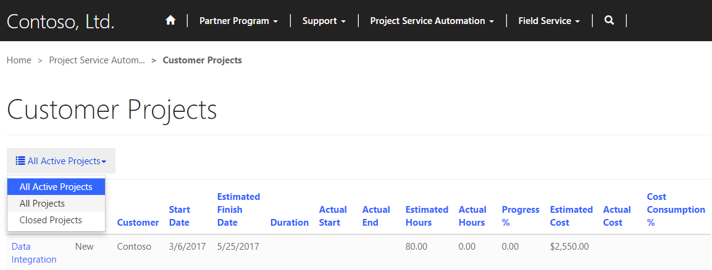
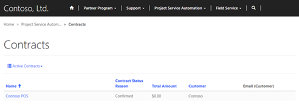
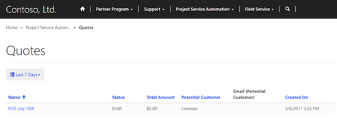
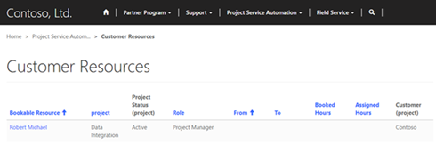

# Project Service Automation integration

Applies To: Dynamics 365 (online), Dynamics CRM Online

The Project Service Automation (PSA) solution for Dynamics 365 can now be installed on a Partner Portal (PSA for Dynamics 365 and Partner Portal Solutions must be installed first). With this solution installed customers and partners will be able to view projects and confirmed bookable resources. Customers will also be able to approve quotes, view invoices, and view contract/order forms.

## View projects on the partner portal

Both Customers and Partners can view projects pertaining to them on the Partner Portal. Customers can view Active and Closed Projects associated with their organization. Partners can view projects when a Bookable Resource from their organization is associated with the projected. In both cases the User must have an appropriate PSA-specific Web Roles (PSA Customer Approver/Reviewer or PSA Partner Approver/Reviewer). After logging in to the portal, the customer or partner can view the project by going to **Customer Projects**. From here they can see basic information for each project and choose to view by Active Projects, Closed Projects, or All Projects.

  

## View and approve project quotes on the partner portal

Customers can view and approve project quotes created in Dynamics 365 that are associated with their organization. After logging into the portal, the customer navigates to **Project Service Automation** &gt; **Quotes** then change the filer to **Last 7 Days**. From here the customer will be shown pending quotes along with basic details like Status and Total Amount. The Customer can now click on a quote for more detailed information and the ability to approve or reject the quote with the **Approve Quote** or **Reject Quote** buttons near the bottom of the project.

## View project invoices on the partner portal

Customers can view final versions of Project Invoices on the partner portal after the invoice has been approved in Dynamics 365 and the **Visible to customer** checkbox has been selected. To view an invoice, the customer must sign in to the partner portal and navigate to **Partner Service Automation** &gt; **Invoices.** Here a customer will be presented with basic information and can click on an invoice for more details.  

## View project contracts and order forms on the partner portal

Customers can view final versions of Project Contracts or Orders on the partner portal after a project contract has been opened in Dynamics 365 with the **Visible to customer** checkbox selected on the contract. After signing in to the partner portal, the customer navigates to **Project Service Automation** &gt; **Contracts**. Here customers can see a sorted list of contracts with some basic information, or select a contract for more details.  

  

## View confirmed, bookable resources by project and role on the partner portal

Both Customers and Partners can view bookable resources on the partner portal following the same process. After signing in to the partner portal, they must navigate to **Project Service Automation** &gt; **Customer Resources**. Here Customers and Partners can see list of resources with their role, booked hours, and other basic information. By selecting a resource, they will be able to see what tasks that resource has been assigned to.  

