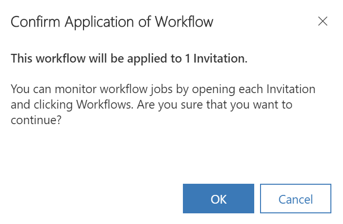
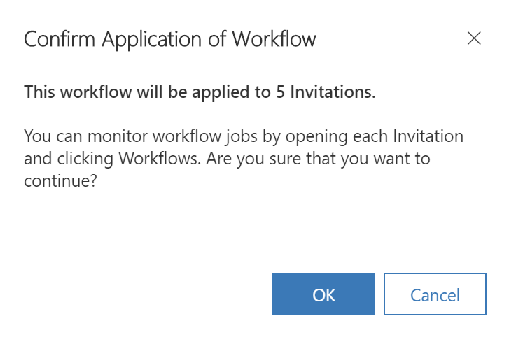

# Invite contacts to your portals

Use the [!INCLUDE[pn-dynamics-crm](../includes/pn-dynamics-crm.md)] portals invitation feature to invite contacts to your portal through automated email(s) created in your [!INCLUDE[pn-dynamics-crm](../includes/pn-dynamics-crm.md)] system. The people you invite receive an email, fully customizable by you, with a link to your portal and an invitation code. This code can be used to gain special access configured by you. With this feature you have the ability to:

- Send Single or Group Invitations
-   Specify an expiry date if desired
-   Specify a user or portal contact as the inviter if desired
-   Automatically assign the invited contact(s) to an account upon invite redemption
-   Automatically execute a workflow upon invite redemption
-   Automatically assign the invited contact(s) to a Web Role(s) upon redemption

Invitation redemption can be accomplished using any of our many authentication options. For documentation regarding portal authentication, see [Set authentication identity for a portal](set-authentication-identity.md) and choose the model applicable to your portal version and configuration. The user will adopt any settings provided by the administrator upon redemption. An Invite Redemption Activity will be created for the Invite and Contact.

Invitations are sent via the **Send Invitation** workflow. By default, the workflow creates an email with a generic message and sends it to the invited Contact's primary email address. The **Send Invitation** workflow contains an email template that will need to be edited to contain a specific message for your portal and the correct hyperlink to your portal's **Invite Redemption Page**.

To edit the **Send Invitation** workflow email template, locate it and deactivate it. After it is deactivated, edit the email template to send the message you want and provide a link to the **Invite Redemption Page** of your portal.

> [!NOTE]
> The invitation is sent only to the primary email (emailaddress1) of the contact. The invitation will not be sent to the secondary email (emailaddress2) or alternate email (emailaddress3) of the contact record.

## Create and configure invitations in web client

To create an invitation record within [!INCLUDE[pn-dynamics-crm](../includes/pn-dynamics-crm.md)], select the **Create Invitation** button in the command bar. The button is available when a single contact is selected in a Contact view and when viewing a contact record. Selecting the button will open a new invitation form for the contact. Invitations can also be created via the Invitations view by selecting **+New**. After the Invitation record has been created, the **Run Workflow** button will appear enabling you to send the invitation to the contact(s). The invitation will not be sent to the contact(s) until the **Send Invitation** workflow is initiated.

## Create invitations in Dynamics 365 Portal app

1.	Go to **Portals** > **Contacts**.

2.	Select a contact or open the contact record to be invited.

3.	On the command bar, select **Create Invitation**.

4.	On the **Invitation** page, enter appropriate values in the fields. More information: [Invitation attributes](#invitation-attributes)

5.	Select **Save**.

6.	On the command bar, select **Flow** > **Send Invitation**.

    > [!div class="mx-imgBorder"]
    > 

7.	In the confirmation window, select **OK**. The invitation will be sent to the selected contact.

    > [!div class="mx-imgBorder"]
    > 

### Send multiple invitations

You can create invitations for your contacts and then send all invitations at once.

1.	Create invitations for the required contacts and then go to **Portals** > **Invitations**.

2.	Select the created invitations.

3.	On the command bar, select **Flow** > **Send Invitation**.

    > [!div class="mx-imgBorder"]
    > 

4.	In the confirmation window, select **OK**. The invitations will be sent to the selected contacts.

    > [!div class="mx-imgBorder"]
    > 

## Invitation attributes

The table below explains the attributes of the **Invitation** page:

|  Name    |    Description    |
|-------|------------|
|                 Name                  |                                                                                                      A descriptive name for helping recognize the invitation.                                                                                                      |
|                 Type                  |                                             **Single** or **Group**. Single will allow only one contact to be invited and only one redemption. Group allows multiple contacts to be invited and multiple redemptions.                                              |
|             Owner/Sender              | The [!INCLUDE[pn-dynamics-crm](../includes/pn-dynamics-crm.md)] user that will be the sender of the email when the invitation is sent. This can be overridden in the **Send Invitation** workflow if the created email already contains someone in the from field. |
|            Invitation Code            |                                                                 A unique code for the invitation that only the invitee will know. This is automatically generated when creating a new invitation.                                                                  |
|              Expiry Date              |                                                                                     The date that represents when the invitation will become invalid for redemption. Optional.                                                                                     |
|                Inviter                |                                                                                               Can be used when a contact is the sender of the invitation. Optional.                                                                                                |
|          Invited Contact(s)           |                                                                                                             The contact(s) to be invited to a portal.                                                                                                              |
|           Assign to Account           |                                                                        An account record to be associated as the redeeming contact's parent customer when the invite is redeemed. Optional.                                                                        |
| Execute Workflow on Redeeming Contact |                                                         A workflow process to be executed when the invite is redeemed. The workflow will be passed the redeeming contact as the primary entity. Optional.                                                          |
|          Assign to Web Roles          |                                                                               A set of web roles to be associated with the redeeming contact when the invite is redeemed. Optional.                                                                                |
|          Redeemed Contact(s)          |                                                                                                   The contact(s) that have successfully redeemed the invitation.                                                                                                   |
|      Maximum Redemptions Allowed      |                                                                                   The number of times the invitation can be redeemed. Available for Group type invitations only.                                                                                   |
|                                       |                                                                                                                                                                                                                                                                    |

### See also

[Configure a contact for use on a portal](configure-contacts.md)  
[Set authentication identity for a portal](set-authentication-identity.md)  
