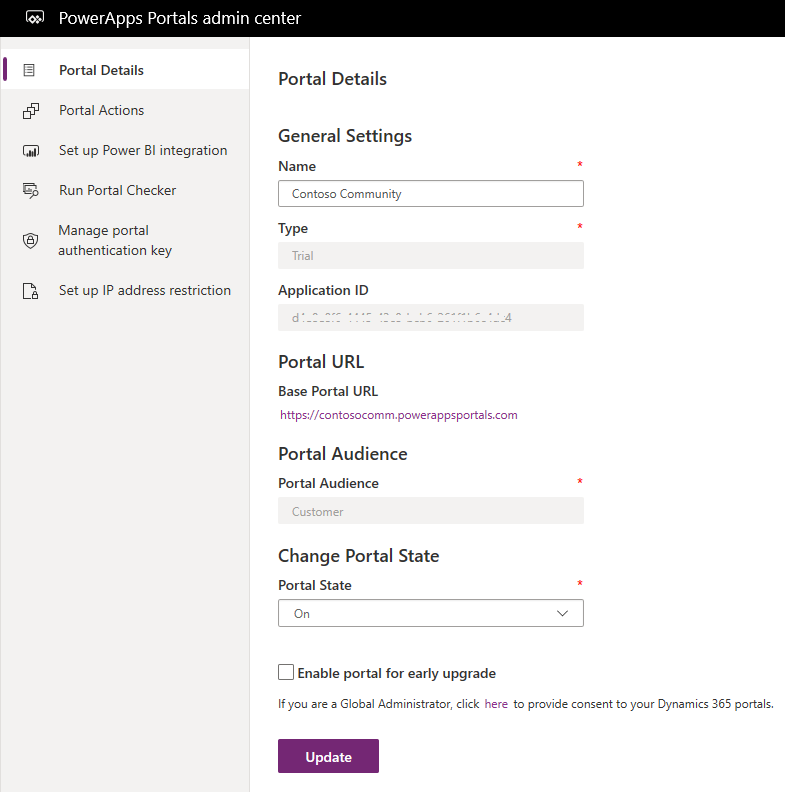

# Administer your portal

After provisioning a portal, you can perform various actions such as setting up a custom domain and importing metadata translations. This section provides you the information about all the tasks required to manage your portal.

To manage an existing portal, you must be assigned any one of the following roles:
- Office 365 Global Administrator 
- Service Administrator. [!include] [Use the service admin role to manage your tenant](https://technet.microsoft.com/library/mt793847.aspx)  
- System Administrator of the Common Data Service environment selected for the portal

If you haven't been assigned any of the above-mentioned roles, the following message is displayed: You need to be a global administrator, service administrator, or system administrator for this organization in order to manage this portal.

If you are not a global administrator and you try to manage a portal that has already been provisioned, or you resubmit the provisioning if it failed, you must be the owner of the Azure Active Directory (Azure AD) application connected to your portal.

### To add yourself as an owner of the Azure AD application

1. Go to the Power Apps Portals admin center and open the **Portal Details** tab.

2. Copy the value from the **Application ID** field.

    > [!div class=mx-imgBorder]
    > 

3. Go to Azure AD associated with your tenant. [!include] [Take over an unmanaged directory as administrator in Azure Active Directory](https://docs.microsoft.com/azure/active-directory/active-directory-manage-o365-subscription)

4. In Azure AD, search for the app registration by using the application ID you copied. You might need to switch from **My apps** to **All apps**.

5. Add users or groups as owners of this app registration. [!include] [Managing access to apps](https://docs.microsoft.com/azure/active-directory/active-directory-managing-access-to-apps)

    > [!Note]
    > This task can be performed either by a global administrator of your organization or the existing owner of this application.

6. After you've added yourself as an owner, reopen the Power Apps Portals admin center page.

## Link your portal to a custom domain

A custom domain can help your customers find your support resources more easily and enhance your brand. Only one custom domain name can be added to a portal. After you've provisioned your portal and acquired your domain name, you'll need an SSL certificate to set up a custom host name. You can use the purchased SSL certificate for your domain to link your portal to a custom domain by using a wizard.

1. Go to the [!INCLUDE[pn-crm-online-admin-center](../includes/pn-crm-online-admin-center.md)] page, and then select the **Applications** tab.

2. Select the name of the portal for which you want to set up a custom domain, and then select **Manage**.

3. Go to **Portal Actions** > **Add a Custom Domain Name**. A wizard opens to choose the SSL certificate.

4. On the **Choose a SSL certificate** page, select one of the following options:
   - **Upload a new certificate**: Select this option to upload the .pfx file if you have not yet uploaded it to the organization. Select the upload button underneath **File** to select the .pfx file. After selecting the file, enter the password for your SSL certificate in the **Password** field.
   - **Use an existing certificate**: Select this option to choose the correct certificate from the drop-down list.

     > [!Note]
     > The SSL certificate must meet all the following requirements:
     > - Signed by a trusted certificate authority
     > - Exported as a password-protected PFX file
     > - Contains private key at least 2048 bits long
     > - Contains all intermediate certificates in the certificate chain
     > - Must be SHA2 enabled; SHA1 support is being removed from popular browsers

5. Select **Next**.

6. On the **Choose a host name** page, select one of the following options:
    - **Add a new host name**: Select this option to create a new custom domain. Enter the domain name you want in the **Domain Name** field.
    - **Use an existing host name**: Select this option to choose a host name from the drop-down list. 
   
   > [!Note]
   > - You can only have one custom domain name for a portal. 
   > - To create a custom host name, you will need to create a CNAME with your domain provider that points your domain to the URL of your portal. If you have just added a CNAME with your domain provider, it will take some time to propagate to all DNS servers. If the name is not propagated and you add it here, the following error message will appear: Please add a CNAME record to this domain name. Retry after some time passes.

7. Review the information you have entered, and then select **Next** to begin creating the SSL Binding. You should see the message Custom Domain name has been successfully configured for this Portal. You can now go to {Custom Domain Name} to access this portal. {Custom Domain Name} will be a hyperlink to the Custom Portal URL that was just configured.

8. Select **Finish** to close the wizard.

    > [!Note]
    > If you want to change your existing custom domain name, you must upload a new SSL certificate and follow the steps in the wizard as mentioned [here](#link-your-portal-to-a-custom-domain).
    
## Import metadata translation
When you provision a portal, the portal-related solutions are installed on the organization. During the installation of solutions, the solution metadata translations (for example, field name, form name, and view name) are installed only for the languages currently activated in the organization. If you activate a new language in the future, the metadata will not be installed automatically for the newly activated language. To get the metadata translation for the newly activated language, you must import the metadata translation from the [!INCLUDE[pn-crm-online-admin-center](../includes/pn-crm-online-admin-center.md)] page.

### To import metadata translation

1.	Go to the [!INCLUDE[pn-crm-online-admin-center](../includes/pn-crm-online-admin-center.md)] page, and then select the **Applications** tab.
2.	Select the name of the portal into which you want to import metadata translation, and then select **Manage**.
3.	Go to **Portal Actions** > **Get latest metadata translations**. A confirmation window is displayed asking whether to update the portal solutions.
4.	Select **Update**. The portal solutions will be updated with the latest metadata translation.

> [!Note]
> - If the latest version of a portal package is available, it isn't updated. The portal solutions are updated in the same version. To upgrade your portal solutions based on the latest available packages, you need to access the Solution Admin center.
> - If a user has modified any data in Common Data Service, the existing data will not be overwritten during the update.
> - If the portal solutions are being installed, the solution update cannot be triggered.
